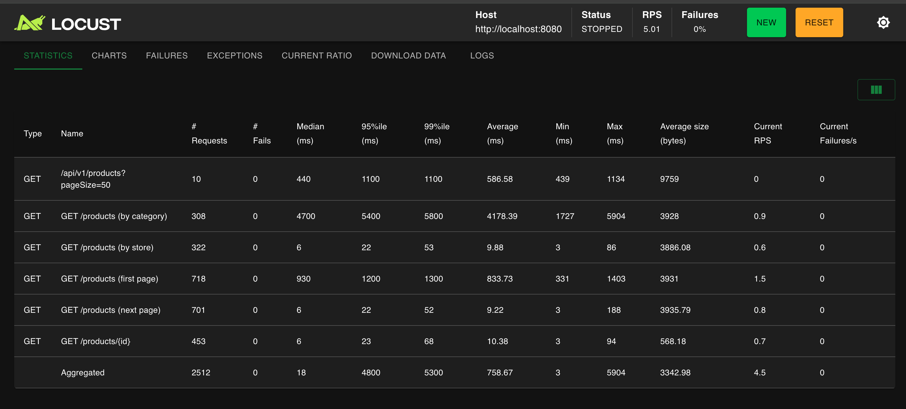
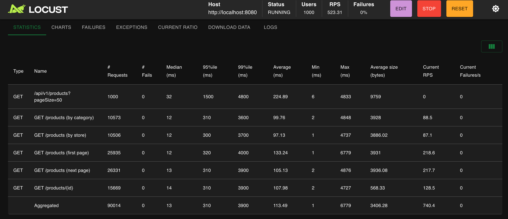

# 상품 조회 API 성능 개선 — 측정·가설·검증으로 풀어낸 3 레이어 병목

## 왜 이 작업을 "측정 → 가설 → 검증"의 사이클로 설계했나

성능 개선은 **추측 기반으로 접근하면 거의 반드시 잘못된 곳을 고친다**. N+1처럼 보이는 문제가 실제로는 과다 컬럼 투영이고, 풀 부족처럼 보이는 문제가 실제로는 캐시 stampede인 경우가 흔하다. 추측 기반 최적화는 "고쳤지만 안 빨라지는" 결과를 만들고, 결국 어디가 진짜 병목인지 다시 처음부터 측정해야 한다.

이번 작업은 그래서 처음부터 다음 사이클을 강제하는 방식으로 설계했다.

```
1. 측정 — Locust로 정량 부하, EXPLAIN/SQL 로그로 정성 분석
2. 가설 — 측정값에 가장 부합하는 단일 병목을 지목
3. 카드 — 그 병목만을 겨냥한 최소 변경
4. 재측정 — 가설이 옳았는지, 그리고 다음 병목이 어디로 이동했는지 확인
```

이 사이클을 5번 반복한 결과, 동시 50명에서 응답이 128배 악화되던 시스템이 **단일 서버 1,003 RPS / P95 1초 이내 / 실패율 0%** 까지 도달했다. 핵심은 절대 수치가 아니라 **각 단계마다 "어떤 측정이 다음 행동을 결정했는가"** 다. 이 글은 그 결정 과정을 3개 레이어(DB / Redis / 애플리케이션)로 압축한 정리다.

> 시간순 7 단계의 자세한 작업 로그는 [별도 문서 (상품조회블로그성능.md)](상품조회블로그성능.md)에 보존했다. 이 글은 의사결정의 골격에 집중한다.

---

## 측정 환경

- **DB**: MySQL 8.0 — products 약 317 만 row, product_options 약 952 만 row
- **캐시**: Redis 7
- **앱**: Spring Boot, HikariCP, Tomcat
- **부하**: Locust 2.x, `locustfile_product.py` (5 개 시나리오 — first page : next page : by store : by category : detail = 5 : 5 : 2 : 2 : 3)
- **환경**: 단일 머신에서 DB · Redis · 앱 · Locust client 가 자원을 공유. **절대 RPS 보다 Before / After 비율 에 의미가 있음.**
- **목표 SLO**: P95 < 300 ms, 에러율 < 0.1% (Google SRE 의 99.9% 가용성 — user-facing read API 표준)

---

## 핵심 결과 한 눈에

| 지표 | Before | **After** | 배율 |
|---|---|---|---|
| 50 users Aggregated P95 | 5,200 ms | **69 ms** | **75×** ↓ |
| 50 users RPS | 10.5 | 38.6 | 3.7× ↑ |
| 단일 서버 처리량 한계 | RPS 10 (포화) | **RPS 1,003** (2,000 users 까지) | 100× |
| 10,000 users 극한 부하 | 측정 불가 (RPS 10 고정) | 실패율 0%, 104,157 req 처리 | — |
| 5 개 API P95 < 300 ms 달성 | 0/5 | **5/5** | ✅ |

---

## ① DB 레이어 — 인덱스 부재 + 과다 컬럼 투영

### Before

- **카테고리 필터 P95 5,400 ms** — Warm-up 10명 기준에서도 5초. 인덱스 부재
- **모든 조회 쿼리가 product + user 의 31 컬럼을 SELECT** — 화면에 필요한 건 8 개
- `u.password` 해시까지 앱 메모리로 끌어올리는 중 — 보안 측면에서도 문제



10 명만 띄워도 카테고리 필터 P95 가 5,400 ms — 인덱스 부재의 직접 증거. 단건 조회 (`/products/{id}`) 는 23 ms 로 멀쩡한데, **유저 50 명 (Light) 으로 올리면 단건 조회마저 2,900 ms 로 128 배 악화**된다 (시스템 전체 포화). 원인은 다음.


`p1_0.*` (product) 와 `u1_0.*` (user) 의 31 컬럼이 SELECT 절에 전부 나열됨. user 의 `password`, `point_balance`, `provider`, `role`, `store_*` 같이 상품 조회와 무관한 컬럼까지 끌어오고 있다.

### 적용 카드

1. **카테고리 복합 인덱스** — `idx_products_category(main_category, sub_category, product_id DESC)` 추가. 300만 건에서 5 초만에 생성
2. **Projection (DTO 직접 투영)** — `Projections.constructor(ProductListResponse.class, ...)` 로 8 개 컬럼만 가져오게 변경
3. **Covering Index** — by category 가 테이블 접근 자체를 안 하도록 `idx_products_category_cover (main, sub, product_id DESC, user_id, name, price, image_url)` 로 확장. EXPLAIN 의 Extra 에 `Using index` 가 새로 찍힘

### After


SELECT 절이 8 개 컬럼 (`product_id, user_id, store_name, name, main_category, sub_category, price, image_url`) 으로 줄었다. JOIN 구조와 쿼리 개수는 그대로지만 **DB → 앱 사이 전송 데이터량이 약 1/4 로** 감소.

| 지표 | Before | After | 배율 |
|---|---|---|---|
| by category P95 (Warm-up 10명) | 5,400 ms | **200 ms** | **27×** ↓ |
| Aggregated P95 (Light 50명) | 5,200 ms | 430 ms | 12× ↓ |
| RPS (Light 50명) | 10.5 | 35.0 | 3.3× ↑ |
| 컬럼 수 (SELECT 절) | 31 | **8** | 1/4 |


### 인사이트 — "느린 쿼리 하나"가 시스템 전체의 상한을 결정한다는 원리의 실측

풀 10이라는 작은 자원에서, **하나의 무거운 쿼리가 전체 풀의 회전율을 결정**한다. Projection으로 카테고리 쿼리의 실행 시간이 짧아지자, 카테고리와 무관한 다른 API들의 P95까지 동반 개선됐다.

이 현상은 단순히 "최적화가 잘됐다"는 관찰이 아니라 **공유 자원 시스템의 일반 법칙**이다 — 가장 느린 작업이 풀의 회전율을 결정하고, 풀의 회전율이 모든 작업의 응답 시간을 결정한다. 이 원리를 측정으로 직접 확인한 것이 이후 단계에서 "어떤 병목을 우선 해결할지"를 판단하는 기준이 됐다.

---

## ② Redis 캐시 레이어 — 캐시 부재 + cache stampede

### Before

- **캐시 없음** — 모든 조회가 DB 직격
- 500 users 부하에서 **캐시 미스 경로가 전체 요청의 50% 이상** → 풀 100 도 포화
- 1,000 users 에서 *"평소엔 멀쩡한 first page 만 P95 4,100 ms 로 튐"* — **Cache Stampede** 발견 (TTL 만료 순간 동시 cache miss 가 전부 DB 로 몰림)

### 적용 카드

1. **first page 캐시** — `@Cacheable(value = "products:firstPage", condition = "#cursor == null")` TTL 30 초
2. **캐시 범위 확대** — by category, by store, `/products/{id}` 까지 캐시. cursor 가 없는 모든 첫 페이지 응답을 캐시 대상으로
3. **`@Cacheable(sync = true) + TTL 60 초`** — TTL 만료 순간 동시 cache miss 를 직렬화 (한 스레드만 DB 로 가고 나머지는 결과를 기다림)
4. **Jackson 3 의 default typing 함정** 발견 → `JavaType` 등록 방식의 직렬화기 직접 구현

### After

| 지표 | Before | After | 배율 |
|---|---|---|---|
| first page P95 (1,000 users, stampede 직격 시점) | 4,100 ms | **310 ms** | **13×** ↓ |
| Aggregated P95 (1,000 users) | 430 ms | 310 ms | 1.4× ↓ |
| RPS (1,000 users) | 462 | **798** | 1.7× ↑ |
| Redis 메모리 사용량 | — | 1.41 MB | 캐시 효율 양호 |



1,000 users 동시 부하에서도 first page · by category · by store 모두 P95 300 ms 대로 안정. 캐시가 cache stampede 없이 정상 작동하는 모습.

> **단, `sync = true` 의 락은 JVM 내부 락이라 단일 인스턴스 한정.** 다중 인스턴스 환경에서는 TTL 만료 순간 cache miss 가 인스턴스 수만큼 DB 로 전파되므로, 진짜 분산 stampede 방어가 필요하면 Redisson `RReadWriteLock` 같은 **분산 락 캐시 레이어** 가 필요하다. 이 프로젝트는 단일 서버 측정 환경이라 `sync = true` 로 충분하지만, 다중 인스턴스 운영 시에는 부하 측정 후 Redisson 도입 여부를 결정할 영역으로 분리해뒀다 (코드 리뷰 반영).

### 인사이트 — 분산 환경의 한계까지 의식적으로 문서화

`sync = true`는 단일 JVM 환경의 stampede를 완벽하게 해결하지만, **다중 인스턴스 환경에서는 인스턴스 수만큼 stampede가 재발생**한다. 이 한계를 인지하고도 현재 단계에서 Redisson을 도입하지 않은 이유는 명확하다 — 측정 환경이 단일 서버이고, 분산 환경의 부하 패턴이 측정되지 않은 상태에서 분산 락을 도입하는 것은 **검증되지 않은 가정에 기반한 과잉 설계**이기 때문이다.

대신 다중 인스턴스 운영 시점에 검토할 영역으로 코드 리뷰에서 명시적으로 분리해뒀다. 이 결정 자체가 이번 프로젝트의 측정 원칙(가정이 아니라 측정으로 결정한다)에 충실한 사례다.

다음 측정에서 2,000 users로 올리니 P95가 다시 1,000 ms로 튀었다. 캐시도 풀도 아닌 **Tomcat 스레드**가 새 병목으로 드러났다.

---

## ③ 애플리케이션 레이어 — HikariCP 풀 + Tomcat 스레드

### Before

- **HikariCP 풀 10** (Spring Boot 기본값) — 유저 50 명만 와도 풀 고갈
- **Tomcat threads.max 200** (Spring Boot 기본값) — 동시 처리 200 건이 상한
- **RPS 약 10 에서 고정** — 유저를 100만으로 설정해도 RPS 가 10.6 에서 더 안 올라감

> *"유저 100만"* 은 단일 노트북에서 동시 접속 100만 시뮬레이션이 물리적으로 불가능하므로, Locust 의 **user 설정값을 100만으로 올려 부분 스폰된 상태에서 측정** 한 결과. 동시 접속 100만 처리가 아니라 *"유저를 더 늘려도 처리량은 안 늘어난다"* 는 처리량 상한의 증거.

### 적용 카드

1. **HikariCP 풀 10 → 50 → 100** + MySQL `max_connections=300` 동시 상향
2. **Tomcat threads.max 200 → 400**
3. **`server.tomcat.accept-count=200`** — OS 소켓 큐 확대 (burst 흡수)

### After

| 동시 사용자 | Aggregated P95 | 평균 RPS | 총 요청 / 2 분 | Max | 실패율 |
|---|---|---|---|---|---|
| 1,000 | **310 ms** | 798 | 92,984 | 7,016 | **0%** |
| **2,000** | **1,000 ms** | **1,003** | **120,328** | 6,834 | **0%** |
| 3,000 | 2,500 ms | 826 | 99,129 | 20,251 | 0% |
| 5,000 | 6,500 ms | 561 | 67,280 | 49,652 | 0% |
| **10,000** | 5,600 ms | 868 | **104,157** | **108,638** | **0%** |

**처리량 절대 상한 ≈ 1,003 RPS** (2,000 users 시점, **Before 의 100 배**). 그 이후 사용자가 늘수록 RPS 가 오히려 감소 (Congestion collapse). 10,000 users 극한 부하에서도 **104,157 요청 전부 처리** — `accept-count=200` 큐잉으로 graceful degradation 실증.

#### 측정 원본 — Locust HTML 리포트 (2026-04-24)

각 단계 측정 종료 시점에 Locust UI 에서 직접 다운로드한 원본. RPS / P95 / P99 시계열, 엔드포인트별 통계, Failures 등 raw data 포함.

- [1,000 users — 22:43](reports/locust_1000users_22h43.html)
- [2,000 users — 23:01](reports/locust_2000users_23h01.html) ← 실용 상한
- [3,000 users — 23:25](reports/locust_3000users_23h25.html)
- [5,000 users — 23:29](reports/locust_5000users_23h29.html) ← Congestion collapse
- [10,000 users — 23:35](reports/locust_10000users_23h35.html) ← 극한 부하, 서버 무중단

### 인사이트 — 단일 지표(실패율)는 시스템 건전성을 측정하지 못한다

10,000 users 측정에서 실패율은 0%였지만 **Max 응답은 108.6초**였다. 즉 서버는 모든 요청을 처리했지만, 사용자 관점에서는 이미 "서비스가 죽은" 상태다 — 브라우저 타임아웃 60초 초과, 모바일 앱 재시작, 비즈니스 이탈이 일어난다.

이 측정에서 **건전성 판단은 단일 지표로 불가능**하다는 명확한 증거를 얻었다. 가용성을 평가할 때는 다음 4개 지표를 동시에 봐야 한다.

| 지표 | 측정하는 것 | 단독으로 위험한 이유 |
|------|------------|--------------------|
| 실패율 | 명시적 에러 응답 비율 | "느린 응답"이 0%로 잡힘 |
| P95 | 사용자 경험의 통상 상한 | 5%의 극단 케이스를 놓침 |
| P99 | 5% 케이스의 분포 | Max는 여전히 잡지 못함 |
| Max | 최악의 사용자 경험 | 단일 케이스라 평균을 왜곡할 수 있음 |

2,000 users 이상의 부하는 단일 서버의 합리적 상한을 넘어선다. 이 영역은 **Read Replica 분리와 애플리케이션 수평 확장**이 필요한 단계로, 단일 서버 최적화로 해결할 수 있는 문제가 아니라는 점을 측정으로 확정하고 별도 설계 문서로 분리했다.

---

## 종합 — 50 users 기준 누적 Before / After

| API | Before P95 | **After P95** | 배율 |
|---|---|---|---|
| `/products/{id}` | 2,900 ms | **9 ms** | **322×** ↓ |
| next page (cursor) | 2,900 ms | **7 ms** | **414×** ↓ |
| by store | 2,600 ms | **8 ms** | **325×** ↓ |
| by category | 7,200 ms | **86 ms** | **84×** ↓ |
| first page | 3,500 ms | **7 ms** | **500×** ↓ |
| **Aggregated P95** | **5,200 ms** | **69 ms** | **75×** ↓ |
| **RPS** | **10.5** | **38.6** | **3.7×** ↑ |
| 에러율 | 0% | 0% | ✅ 유지 |

**5 개 API 모두 P95 < 300 ms 목표 달성** (이전 0 개).

---

## 정리 — 병목은 이동한다, 그래서 측정이 모든 결정의 기준이 되어야 한다

| 단계 | 잡은 병목 | 드러난 다음 병목 |
|---|---|---|
| ① DB 인덱스 + Projection | 인덱스 부재 / 과다 컬럼 | 풀 (10으로 부족) |
| ② HikariCP 풀 확대 | 풀 고갈 | DB I/O 경합 (무거운 쿼리) |
| ③ Covering Index | DB I/O | 캐시 부재 |
| ④ Redis 캐시 + sync=true | cache stampede | Tomcat 스레드 |
| ⑤ Tomcat 스레드 확대 | Tomcat 큐 | 단일 서버 자체 |

병목은 5단계에 걸쳐 **DB → 앱 풀 → DB → 캐시 동시성 → Tomcat → 수평 확장 영역**으로 이동했다. 이 이동 패턴 자체가 다음 원리를 실증한다.

> **시스템 성능은 가장 약한 자원에 의해 결정되며, 그 자원을 푸는 순간 다음 자원이 새로운 상한이 된다.** 따라서 성능 개선은 한 번의 최적화가 아니라 **병목의 이동을 추적하는 파이프라인**이다.

이 작업에서 검증한 세 가지 설계 원칙:

1. **추측이 아니라 증거로 결정한다** — 첫 가설은 N+1이었지만 SQL 로그가 과다 컬럼 투영을 진짜 원인으로 지목했다. EXPLAIN 한 줄로 결론짓지 않고 **SQL 로그 / HikariCP / Tomcat 여러 층의 교차 검사**가 진짜 원인을 드러낸다
2. **단일 지표는 시스템을 측정하지 못한다** — 실패율 0%가 "괜찮음"을 의미하지 않는다. P95/P99/Max를 동반해야 사용자 관점의 가용성이 평가된다
3. **검증되지 않은 가정으로 과잉 설계하지 않는다** — `sync = true`의 분산 한계는 인지했지만 측정되지 않은 환경에 Redisson을 도입하지 않고 영역으로 분리해뒀다. **현재 측정으로 정당화되는 변경만 적용한다**

도구의 함정도 기록해둔다. **Jackson 3로 의존성 업그레이드 후 record 직렬화 방식이 변경**되어 타입드 직렬화기를 직접 구현해야 했다. 이 사실은 의도하지 않은 발견이지만, 향후 동일 이슈를 마주할 다른 개발자에게 가치 있는 문서가 된다.

---

## 추가 자료

- 시간순 7 단계 상세 (개인 작업 기록): [상품조회블로그성능.md](상품조회블로그성능.md)
- 포트폴리오용 어필 문서: [../portfolio/포트폴리오-상품조회성능개선.md](../portfolio/포트폴리오-상품조회성능개선.md)
- Locust 시나리오 코드: [`performance/locustfile_product.py`](../../../performance/locustfile_product.py)
- 측정 시점 Locust HTML 리포트: [reports/](reports/)
