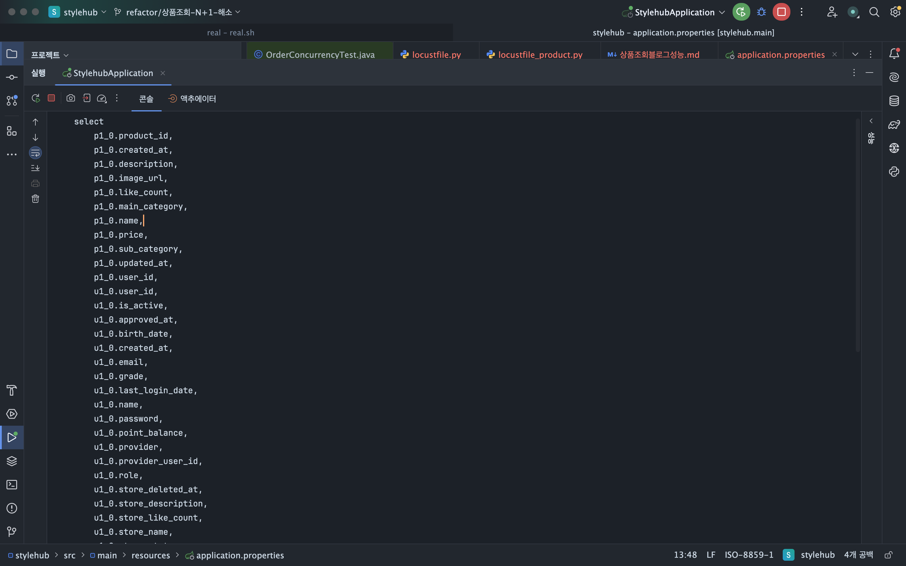
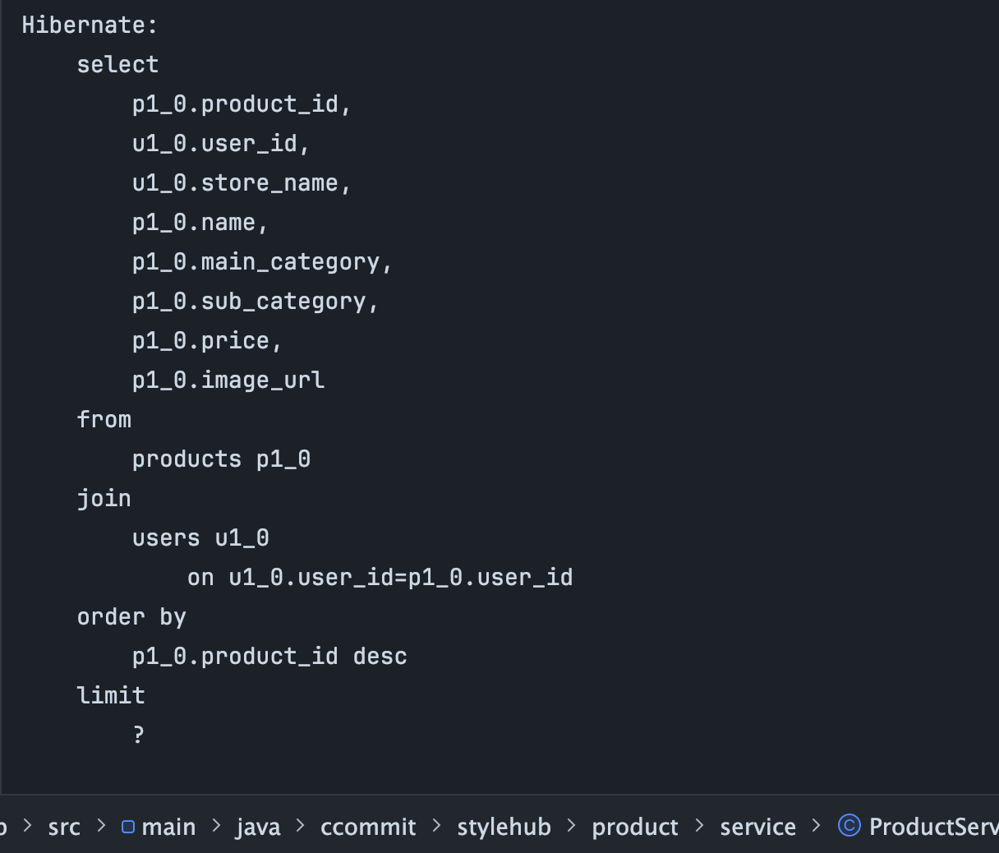
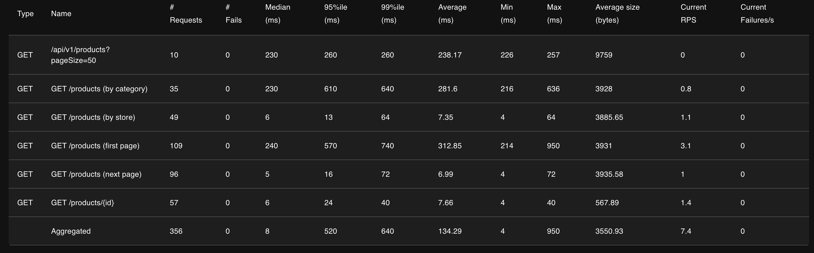
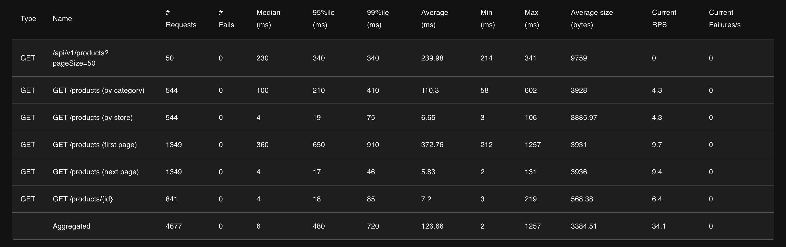

# 상품 조회 API 성능 트러블슈팅 — 50명에서 무너진 시스템을 숫자로 추적한 기록

## 들어가며

StyleHub 의 상품 조회 API 가 프로덕션 수준의 데이터(products 3,172,205 건)에서 어떻게 동작하는지 확인하기 위해 Locust 로 부하 테스트를 돌렸다. 
테스트 시나리오 문서에 적어 놓은 단계(Warm-up → Light → Medium → Heavy → Spike) 를 차례대로 올려갈 계획이었다.

그런데 **Light 단계(유저 50명)에서 이미 시스템이 무너졌다.** 
원래 10ms 로 응답하던 단건 조회가 **2,900ms** 로 **128배 느려졌다.** 숫자가 너무 이상해서 원인을 역추적한 기록을 남긴다.

---

## 1. 측정 환경

- 대상 서버: 로컬 Spring Boot (`http://localhost:8080`)
- 부하 도구: Locust 2.43.4
- 데이터 규모: `products` 테이블 **3,172,205 건**
- DB: MySQL (localhost:3306, stylehub)
- HikariCP 풀 크기: **기본 10** (Spring Boot 기본값)

측정 대상 API
- `GET /api/v1/products` (목록 조회, 비인증)
- `GET /api/v1/products/{productId}` (단건 조회, 비인증)

Locust 스크립트에는 첫 페이지 조회 / 다음 페이지(커서) / 스토어 필터 / 카테고리 필터 / 단건 상세 다섯 가지를 가중치로 섞어 호출하게 짰다.

목표 지표
- 평균 < 100ms
- P95 < 300ms
- P99 < 500ms
- 에러율 < 0.1%

> **0.1% 의 근거** — Google SRE 의 **99.9% 가용성 ("three nines")** 기준. user-facing read API 의 표준 SLO 다. 1,000건 중 1건 실패까지 허용하는 마진인데, 운영 환경에서 LB jitter / 클라이언트 타임아웃 / GC pause 같은 **시스템 외적 실패** 를 흡수할 여유가 필요하기 때문. 결제 같은 critical path 였다면 99.99% (= 0.01%) 로 더 엄격하게 잡았을 영역. 이 0.1% 는 단순 "통과 기준" 이 아니라 SRE 에서 말하는 **error budget** — *"이만큼은 실패해도 되는 예산"* 으로 해석하는 게 맞다.

---

## 2. Warm-up — 유저 10명, 30초

첫 측정 결과다. 에러는 0 건. 수치만 보자.

| API | Requests | Median | P95 | P99 | Average |
|---|---|---|---|---|---|
| `GET /products (first page)` | 718 | 930 ms | 1,200 ms | 1,300 ms | 833 ms |
| `GET /products (next page)` | 701 | 6 ms | 22 ms | 52 ms | 9 ms |
| `GET /products (by store)` | 322 | 6 ms | 22 ms | 53 ms | 10 ms |
| `GET /products (by category)` | 308 | **4,700 ms** | **5,400 ms** | **5,800 ms** | 4,178 ms |
| `GET /products/{id}` | 453 | 6 ms | 23 ms | 68 ms | 10 ms |
| **Aggregated** | **2,512** | 18 ms | 4,800 ms | 5,300 ms | 758 ms | RPS 4.5 |

세 가지 API 는 평균 10ms, P99 50~70ms 로 목표(P95 300ms) 대비 10배 이상 여유가 있었다.

하지만 두 가지가 목표를 크게 벗어났다.
- **첫 페이지 조회**: P99 1,300ms — 목표의 3배 초과
- **카테고리 필터**: P99 **5,800ms** — 목표의 **19배 초과**

카테고리 필터가 6초 가까이 걸린다는 것에 놀라 바로 원인을 보려다, "아직 10명 단계니까 50명에서는 더 심할지 확인해보자" 해서 Light 단계로 넘어갔다.

---

## 3. Light — 유저 50명, 2분

유저를 5배 늘렸더니 충격적인 결과가 나왔다. 에러는 여전히 0 건.

| API | Requests | Median | P95 | P99 | Average | Warm-up P95 대비 |
|---|---|---|---|---|---|---|
| `GET /products (first page)` | 231 | 1,800 ms | 3,500 ms | 4,400 ms | 1,802 ms | **3 배 악화** |
| `GET /products (next page)` | 215 | 1,100 ms | 2,900 ms | 4,900 ms | 1,200 ms | **132 배 악화** |
| `GET /products (by store)` | 88 | 990 ms | 2,600 ms | 3,000 ms | 1,113 ms | **118 배 악화** |
| `GET /products (by category)` | 85 | 5,100 ms | 7,200 ms | 8,300 ms | 4,853 ms | 1.3 배 악화 |
| `GET /products/{id}` | 134 | 970 ms | 2,900 ms | 5,000 ms | 1,122 ms | **126 배 악화** |
| **Aggregated** | **803** | 1,400 ms | 5,200 ms | 6,600 ms | 1,732 ms | RPS 10.5 |

이 표에서 가장 이상한 건 `GET /products/{id}` 였다.
Warm-up 에서 **23ms** 로 찍혔던 응답이 Light 에서 **2,900ms** 로 **128 배** 악화됐다.
단건 조회는 PK 조회라 쿼리 자체가 가장 빠른 API 인데 왜?

그리고 RPS 를 보니 더 이상했다.
- Warm-up(10명): 4.5 RPS
- Light(50명): 10.5 RPS
- **유저는 5 배 늘었는데 RPS 는 2.3 배만 증가**

뭔가 포화에 근접한 신호였다.

---

## 4. 극한 시도 — 유저 100만 명 설정

"유저를 더 많이 넣으면 RPS 도 더 올라갈까?" 궁금해서 극단적으로 유저 **설정값**을 100만 명으로 올려 봤다.
**단일 노트북에서 동시 접속 100만 명을 실제로 스폰하는 것은 물리적으로 불가능하다 (메모리·CPU 한계).** Locust 는 부분적으로만 유저를 스폰했고, 그 부분 수행에서 본 RPS 가 Light(50명) 와 동일한 10.6 으로 수렴한 것 자체가 답이었다 — *"유저 설정을 아무리 올려도 처리량은 더 안 늘어난다"* 는 처리량 상한의 증거.

| API | Requests | P95 | P99 | Average |
|---|---|---|---|---|
| `GET /products (first page)` | 87 | 5,700 ms | 5,900 ms | 3,344 ms |
| `GET /products (next page)` | 99 | 4,900 ms | 5,300 ms | 2,640 ms |
| `GET /products (by store)` | 30 | 4,700 ms | 4,800 ms | 2,809 ms |
| `GET /products (by category)` | 30 | 11,000 ms | 11,000 ms | 7,850 ms |
| `GET /products/{id}` | 43 | 4,800 ms | 5,300 ms | 2,649 ms |
| **Aggregated** | **363** | 6,800 ms | 10,000 ms | 3,372 ms | **RPS 10.6** |

응답 시간은 Light 대비 다시 두 배 가까이 늘었지만, **RPS 는 10.6 으로 Light 와 동일** 했다.

이 숫자가 결정적이었다. **유저를 100만 명 설정하든 50 명 설정하든 서버 처리량은 RPS 10 에서 고정** 된다는 뜻이다. 이 시스템은 지금 상태로 **초당 10 건 이상 처리할 수 없다.** 나머지는 전부 대기 큐에 줄서 있을 뿐이다.

세 단계의 RPS 만 모아 보면 포화점이 선명하다.

| 단계 | 유저 | RPS |
|---|---|---|
| Warm-up | 10 (실측) | 4.5 |
| Light | 50 (실측) | 10.5 |
| 극한 시도 | **100만 (Locust 설정값, 실제 스폰은 부분적)** | 10.6 |

50명 이후로 RPS 가 오르지 않는다. 이건 개별 API 의 문제가 아니라 **시스템 전체의 병목** 이라는 증거였다. *"동시 접속 100만 명을 처리했다" 는 의미가 아니라, "유저 설정을 100만 으로 올려도 RPS 는 10 에서 고정됐다" 는 처리량 상한 검증 결과.*

---

## 5. 첫 번째 가설 — 카테고리 인덱스 부재

가장 먼저 떠오른 건 카테고리 필터의 6초였다. MySQL 에서 EXPLAIN 을 돌려 봤다.

```sql
EXPLAIN SELECT * FROM products
WHERE main_category = 'TOP' AND sub_category = 'T_SHIRT'
ORDER BY product_id DESC LIMIT 21;
```

결과:

| type | key | filtered | Extra |
|---|---|---|---|
| index | **PRIMARY** | **2.50 %** | Using where; Backward index scan |

번역하면 이렇다.
- **PK(product_id) 인덱스를 역순으로 스캔** 하면서 WHERE 조건을 하나씩 체크한다
- `filtered: 2.5%` — 스캔한 행 중 **97.5% 는 조건에 안 맞아 버려진다**
- 즉 LIMIT 21 을 채우려면 평균적으로 **840 건(21 ÷ 0.025) 을 읽어야 한다**

현재 인덱스 목록을 확인해 보니 예상대로였다.

| Key_name | Column |
|---|---|
| PRIMARY | product_id |
| fk_products_store | user_id |

**카테고리 전용 인덱스는 존재하지 않는다.** 가설 1: 카테고리 복합 인덱스를 추가하면 4,178ms → 수백 ms 수준으로 감소할 것.

---

## 6. 두 번째 가설 — 그런데 첫 페이지는 왜 833ms?

카테고리 문제는 설명이 됐는데, 첫 페이지 조회가 833ms 걸리는 이유는 설명이 안 됐다. EXPLAIN 을 봤다.

```sql
EXPLAIN SELECT * FROM products ORDER BY product_id DESC LIMIT 21;
```

| type | key | filtered | Extra |
|---|---|---|---|
| index | PRIMARY | **100.00 %** | Backward index scan |

이론상 이 쿼리는 **극도로 빨라야 한다.**
- PK 를 역순으로 읽어서 21 건만 가져옴
- 필터링도 100% 통과 (추가 체크 없음)

쿼리 단독으로는 수 ms 안에 끝나야 하는데 API 응답은 833ms 였다. **DB 레벨이 아닌 다른 곳에서 시간을 쓰고 있었다.**

여기서 JPA 코드를 다시 들여다봤다.

```java
public static ProductListResponse from(Product product) {
    return ProductListResponse.builder()
        .storeId(product.getUser().getUserId())         // ← Lazy Load!
        .storeName(product.getUser().getStoreName())    // ← 또 Lazy Load!
        ...
}
```

`Product.user` 필드는 `@ManyToOne(fetch = FetchType.LAZY)` 로 설정되어 있다. 즉 `getUser()` 를 호출하는 순간 **별도 SELECT 가 나간다.** 21 개 상품을 조회하고 각각의 User 를 또 조회하면 **1 + 21 = 22 개 쿼리** 가 실행된다.

이게 N+1 문제다. 쿼리 하나하나는 빠르지만 22 개를 차례대로 날리면 네트워크 round-trip 만으로도 수백 ms 가 소요된다.

---

## 7. 세 번째 발견 — 그럼 왜 다음 페이지는 9ms?

N+1 이 진짜 원인이라면, 첫 페이지(833ms) 와 다음 페이지(9ms) 의 차이는 어떻게 설명할 수 있나? **둘 다 같은 레포지토리 메서드를 호출** 하는데 90배 차이가 난다.

답은 JPA **1차 캐시** 였다.
- 첫 페이지 요청: User 22 개를 처음 보는 거라 22 번 실제 쿼리 실행
- 다음 페이지 요청: 이미 1차 캐시에 있는 User 재사용 → Lazy Load 쿼리 안 나감

다만 이건 같은 트랜잭션(= 같은 Hibernate Session) 내에서만 적용된다. 첫 페이지는 매 요청마다 새 트랜잭션으로 시작하므로 매번 1차 캐시가 비어 있다. 다음 페이지는 Locust 스크립트에서 연속 호출되면서 같은 유저가 같은 스토어 상품을 연달아 보는 패턴이 많아 캐시 적중률이 높았다.

즉 "다음 페이지가 빠른 건 설계가 좋아서가 아니라 **측정 패턴이 운 좋게 캐시를 잘 타게 나온** 결과" 였다. 실제 프로덕션에서 다양한 스토어 상품이 섞여 나오면 이 이점은 사라진다.

---

## 8. Light 단계에서 왜 모든 API 가 같이 느려졌나

N+1 으로 첫 페이지가 833ms 인 건 이해됐다. 하지만 Light 에서 원래 빠르던 단건 조회(10ms) 가 2,900ms 까지 느려진 건 또 다른 설명이 필요하다.

계산을 해 보면 답이 나온다.
- 첫 페이지 1 요청 = 22 쿼리 × 평균 쿼리 시간 수 ms
- 50 명이 동시에 첫 페이지 요청 → 동시에 날아가는 쿼리 수 = 50 × 22 = **1,100**
- HikariCP 풀 크기 = **10**

**100 대 이상의 쿼리가 커넥션 10 개 앞에서 줄 서 있다.** 이 상태에서 "빠른 단건 조회" 요청이 들어와도 풀에서 커넥션을 받기 전까지 대기해야 한다. 자기 쿼리 자체는 수 ms 면 끝나지만 **줄 서 있는 시간이 수 초** 가 된다.

수학으로 맞춰 보자.

```
커넥션 10 개 × 1/50ms = 초당 200 개 쿼리 처리 가능
한 요청당 22 쿼리 평균
→ 초당 처리 가능한 요청 수 = 200 / 22 ≈ 9
```

실측 RPS 10.5 와 정확히 맞아떨어진다. **"유저 50명 이상에서는 RPS 10 에 고정"** 의 수학적 근거가 여기에 있었다.

---

## 9. 원인 확정 — 세 개가 겹친 구조적 문제

여기까지의 분석을 정리하면 이렇다.

| 원인 | 영향 | 증거 |
|---|---|---|
| **A. JPA N+1 쿼리** (주범) | 목록 조회 1 건당 쿼리 22 개 발생 | 첫 페이지 EXPLAIN 은 빠른데 API 는 833ms |
| **B. 카테고리 인덱스 부재** (부범) | 카테고리 필터 쿼리가 PK 역순 스캔으로 97.5% 버림 | EXPLAIN `filtered: 2.5%`, `rows: 21` 뒤에 실제 스캔은 840 건 |
| **C. HikariCP 풀 10 개 (기본값)** | 50 명 동시 요청에서 풀 고갈, RPS 10 에서 포화 | 유저 늘려도 RPS 가 10.5 → 10.6 에서 더 이상 안 오름 |

**A 가 쿼리 수를 부풀렸고, C 가 부풀어진 쿼리 수를 감당하지 못해 병목이 됐다.** 이 둘이 결합해서 **원래 빠르던 단건 조회까지 느리게 만드는** 전염 효과가 발생했다. B 는 카테고리 필터에만 영향을 주지만 그 자체로도 6 초라 치명적이다.

---

## 10. 플롯 트위스트 — 실제 SQL 을 찍어보니 가설이 틀렸다

9번까지의 분석은 **대부분 추정** 이었다. 특히 "N+1 이 주범" 이라는 가설을 확정하려면 실제 JPA 가 날리는 SQL 을 확인해야 했다. `spring.jpa.show-sql=true` 가 이미 켜져 있어 서버 로그에 쿼리가 찍힌다.

`/products` 를 한 번 호출하고 서버 콘솔을 봤다.

```sql
select
    p1_0.product_id, p1_0.created_at, p1_0.description, p1_0.image_url,
    p1_0.like_count, p1_0.main_category, p1_0.name, p1_0.price,
    p1_0.sub_category, p1_0.updated_at, p1_0.user_id,
    u1_0.user_id, u1_0.is_active, u1_0.approved_at, u1_0.birth_date,
    u1_0.created_at, u1_0.email, u1_0.grade, u1_0.last_login_date,
    u1_0.name, u1_0.password, u1_0.point_balance, u1_0.provider,
    u1_0.provider_user_id, u1_0.role, u1_0.store_deleted_at,
    u1_0.store_description, u1_0.store_like_count, u1_0.store_name,
    u1_0.store_status, u1_0.total_spent, u1_0.updated_at
from products p1_0
join users u1_0 on u1_0.user_id = p1_0.user_id
order by p1_0.product_id desc
limit ?
```

**쿼리가 1 개다.** N+1 이 아니었다.

확인해 보니 `ProductQueryRepository.findProductsWithCursor` 에는 이미 `.join(product.user, user).fetchJoin()` 이 걸려 있었다. Hibernate 가 Product + User 를 하나의 JOIN 쿼리로 가져오고 있었던 것. 즉 22 쿼리가 나갈 거라는 추정은 **처음부터 틀렸다.**

### 그럼 진짜 원인은 무엇인가

쿼리 하나를 자세히 보면 답이 보인다. `select` 뒤에 컬럼을 세어 보자.

| 영역 | 컬럼 수 |
|---|---|
| Product | 11 개 (product_id, created_at, description, image_url, like_count, main_category, name, price, sub_category, updated_at, user_id) |
| User | 20 개 (user_id, is_active, approved_at, birth_date, created_at, email, grade, last_login_date, name, password, point_balance, provider, provider_user_id, role, store_deleted_at, store_description, store_like_count, store_name, store_status, total_spent, updated_at) |
| **합계** | **31 개 컬럼** |

그런데 `ProductListResponse` 가 실제로 쓰는 필드는 8 개뿐이다.

```java
public record ProductListResponse(
    Long productId, Long storeId, String storeName, String name,
    MainCategory mainCategory, SubCategory subCategory,
    Integer price, String imageUrl
)
```

**23 개 컬럼이 쓸데없이 DB → 앱 → JPA 를 왕복 중** 이었다. 그 중에는 심지어 **`u.password`(해시값)** 까지 포함돼 있었다. 목록 조회 API 가 User 엔티티 전체를 가져오면서 **보안상 민감한 비밀번호 해시까지 앱 메모리로 올리고 있었다.**

### 진짜 비용은 어디서 나오나

- **I/O**: 각 row 크기가 커지면 InnoDB 가 읽어야 할 페이지 수가 늘어난다. 21 건이어도 300만 건 위에서 PK 스캔할 때 누적됨
- **TEXT 필드**: `p.description` 은 TEXT 타입이라 overflow page 로 저장될 수 있고 읽을 때 추가 I/O 유발
- **네트워크**: DB → 앱 사이 31 컬럼 × 21 row = 651 필드 전송 vs 실제 필요는 8 × 21 = 168 필드
- **메모리**: Hibernate 가 Product 와 User 엔티티를 메모리에 올려 매핑 후 DTO 로 변환. 31 컬럼 엔티티 2 개를 건드리는 비용
- **직렬화**: Jackson 이 엔티티를 건드리지 않게 from() 으로 변환하지만, 엔티티 자체를 만드는 비용은 이미 쓴 후

즉 원인 A 는 **"N+1 쿼리"** 가 아니라 **"한 쿼리가 31 컬럼을 가져오는 과다 투영"** 이었다. 결과적으로 응답 시간이 길어진 현상은 같지만 **원인의 성격이 다르고, 해결책도 다르다.**

### 교훈

EXPLAIN 은 "쿼리가 빠르다" 고 진실을 말했고, 실제로 PK 역순 스캔 21 건은 빠른 쿼리다. **하지만 가져오는 컬럼 수는 EXPLAIN 이 보여주지 않는다.** `show-sql=true` 로 실제 SQL 을 본 뒤에야 문제가 드러났다.

성능 테스트할 때 **EXPLAIN 한 줄로 끝나면 안 된다.** 실제 쿼리 로그, 애플리케이션 코드, 엔티티 구조를 교차 검사해야 진짜 원인이 잡힌다. 이번 케이스는 그 교차 검사의 중요성을 실측으로 보여 주는 사례다.

---

## 11. 원인 재확정

| 원인 | 업데이트 | 증거 |
|---|---|---|
| **A. ~~JPA N+1 쿼리~~ → 과다 컬럼 투영** | 쿼리는 1 개지만 31 컬럼을 SELECT. 필요한 건 8 개 | SQL 로그 |
| **B. 카테고리 인덱스 부재** | 그대로 (Step 1 로 해소됨) | EXPLAIN `filtered: 2.5%` |
| **C. HikariCP 풀 10 개** | 그대로. 과다 컬럼 투영으로 쿼리 실행 시간이 길어져 풀 회전율이 떨어지고, 결과적으로 풀이 고갈됨 | RPS 10 에서 포화 |

**A 의 성격이 바뀌면서 Step 2 의 해법도 fetchJoin 추가가 아니라 Projection 적용으로 바뀐다.**

---

## 12. 개선 계획 — 세 단계를 분리해서 각각 Before/After 측정

구체적 액션 아이템 세 가지를 세웠다. **한 번에 다 적용하지 않고 따로따로 측정** 한다. 각 개선의 기여도를 분리해서 확인하기 위함이다.

### Step 1. 카테고리 복합 인덱스 추가

```sql
CREATE INDEX idx_products_category
ON products (main_category, sub_category, product_id DESC);
```

300만 건 테이블인데 online DDL 덕분에 **5.1 초** 만에 생성 완료. 생성 후 EXPLAIN.

| 지표 | Before | After |
|---|---|---|
| type | index | **ref** |
| key | PRIMARY | **idx_products_category** |
| filtered | 2.50 % | **100.00 %** |
| Extra | Using where; Backward index scan | **Using index condition** |

쿼리 플래너가 이전에는 PK 인덱스를 전체 스캔하며 WHERE 로 걸러냈지만, 이제는 카테고리 인덱스로 바로 ref 접근한다. 필터링이 100% 통과하는 행들만 읽는다.

#### Warm-up(10명, 30초) 재측정 결과

| API | Before P95 | **After P95** | Before P99 | **After P99** | 배율 |
|---|---|---|---|---|---|
| `/products/{id}` | 23 ms | 14 ms | 68 ms | 150 ms | 1.6× ↓ |
| next page | 22 ms | 7 ms | 52 ms | 52 ms | 3× ↓ |
| by store | 22 ms | 7 ms | 53 ms | 18 ms | 3× ↓ |
| first page | 1,200 ms | 510 ms | 1,300 ms | 780 ms | 2.4× ↓ |
| **by category** | **5,400 ms** | **540 ms** | **5,800 ms** | **670 ms** | **10× ↓** |
| **Aggregated** | **4,800 ms** | **470 ms** | 5,300 ms | 670 ms | **10× ↓** |
| RPS | 4.5 | **6.7** | | | 1.5× ↑ |

**카테고리 필터 P95 5,400ms → 540ms**, 딱 10배 감소. 인덱스 효과는 명확히 입증됐다.

다만 두 가지 관찰이 더 남았다.

첫째, **목표 미달은 여전하다.**
- 카테고리 P95 540ms, 첫 페이지 P95 510ms — 목표(300ms) 를 아직 1.7 ~ 1.8 배 초과한다
- 이는 N+1 때문이다. 쿼리 자체는 빨라졌어도 21 개 상품마다 User 를 Lazy Load 하는 22 쿼리 구조는 그대로 남아 있다

둘째, **예상 밖 — 카테고리 외 API 들도 빨라졌다.**
- first page: 1,200ms → 510ms (2.4 배)
- next page / by store: 22ms → 7ms (3 배)
- 단건 조회: 23ms → 14ms (1.6 배)

이 개선들은 **인덱스와 관련 없다.** 카테고리 인덱스는 `WHERE main_category AND sub_category` 쿼리에만 쓰이기 때문이다. 그럼에도 전 API 가 개선된 건 **시스템 웜업 효과** 때문이다.
- OS 페이지 캐시 / InnoDB 버퍼 풀이 이전 측정들을 거치며 hot 상태
- JVM JIT 가 이미 컴파일돼 있음
- Locust 자체 Python 런타임도 warm

즉 After 수치에는 **"인덱스 효과 + 시스템 웜업 효과" 가 섞여 있다.** 엄밀한 실험이라면 서버를 재시작해 cold 상태로 맞춰야 한다. 이번 측정은 점진 개선을 누적하는 방식이라 웜업 효과까지 포함된 실사용 환경에 가까운 숫자로 봐도 된다.

정리하면 Step 1 의 순수 기여는 **카테고리 P95 10배 감소** 다. 나머지 API 들의 개선은 웜업 기여가 크고 N+1 은 손대지 않았다.

#### Light(50명, 2분) 재측정 결과

Warm-up 은 경쟁이 거의 없어 인덱스 효과를 순수하게 본 결과였다. 진짜 궁금한 건 풀 고갈이 발생하던 Light 단계에서도 인덱스가 효과를 내는지였다.

| API | Before P95 | After P95 | 개선 | Before P99 | After P99 |
|---|---|---|---|---|---|
| `/products/{id}` | 2,900 ms | 1,000 ms | 2.9× ↓ | 5,000 ms | 1,300 ms |
| next page | 2,900 ms | 1,100 ms | 2.6× ↓ | 4,900 ms | 1,600 ms |
| by store | 2,600 ms | 1,100 ms | 2.4× ↓ | 3,000 ms | 1,400 ms |
| first page | 3,500 ms | 2,200 ms | 1.6× ↓ | 4,400 ms | 2,500 ms |
| by category | 7,200 ms | **1,800 ms** | **4× ↓** | 8,300 ms | 2,400 ms |
| **Aggregated** | 5,200 ms | 1,800 ms | 2.9× ↓ | 6,600 ms | 2,300 ms |
| **RPS** | **10.5** | **21.9** | **2.1× ↑** | | |

**RPS 가 10.5 에서 21.9 로 뛰었다.** Before 에서 "유저를 100만 명 세팅해도 RPS 10 에서 고정" 이었던 포화점이 풀렸다. 인덱스는 카테고리 쿼리에만 영향을 주는데 왜 전체 처리량이 올랐나? 연쇄 효과 때문이다.

```
① 카테고리 쿼리 시간 ↓ (직접 효과, 5,400ms → 540ms)
      ↓
② 각 요청의 커넥션 풀 점유 시간 ↓
      ↓
③ 풀 10 개의 회전율 ↑ → 전체 처리량 RPS 10 → 22 로 2 배
      ↓
④ 다른 API 의 대기 큐 길이 ↓ → 관련 없어 보이는 단건 조회 P95 도 2.9 배 개선
```

**느린 쿼리 하나가 전체 시스템의 처리량 상한을 결정한다** 는 것을 실측으로 확인했다. 분산 시스템에서 "느린 컴포넌트 하나가 체인 전체를 붙잡는다" 는 말이 싱글 서버의 커넥션 풀에서도 똑같이 작동한다.

다만 목표 달성은 아직 멀다.
- 목표: 모든 API P95 < 300ms
- 실측: 가장 빠른 by store 도 P95 1,100ms, first page 는 2,200ms
- **어떤 API 도 목표를 달성하지 못했다**

RPS 22 도 낮다. 유저 50 명이 평균 1.25 초 간격으로 요청을 던지면 이론상 40 RPS 까지 가능해야 한다. 실측 22 RPS 는 **여전히 커넥션 풀이 병목** 이라는 뜻이다. 한 요청당 31 컬럼을 가져오는 무거운 쿼리가 풀을 오래 점유하고 있기 때문이다.

### Step 2. Projection 적용 — 과다 컬럼 투영 제거

`ProductQueryRepository.findProductsWithCursor` 가 엔티티 전체(31 컬럼)를 조회하는 대신 `Projections.constructor(ProductListResponse.class, ...)` 로 **필요한 8 개 컬럼만** 바로 DTO 로 투영하도록 수정한다.

```java
// Before: 엔티티 전체 조회 → DTO 변환
queryFactory
    .selectFrom(product)                        // 31 컬럼
    .join(product.user, user).fetchJoin()
    ...

// After: DTO 직접 투영
queryFactory
    .select(Projections.constructor(ProductListResponse.class,
        product.productId,
        product.user.userId,
        product.user.storeName,
        product.name,
        product.mainCategory,
        product.subCategory,
        product.price,
        product.imageUrl))                      // 8 컬럼만
    .from(product)
    .join(product.user, user)
    ...
```

기대 효과.
- 컬럼 수 **31 → 8** 로 약 1/4
- `description`(TEXT), `password`, `store_description`(400자) 등 무거운 필드 제거
- 엔티티 생성/매핑 비용 제거 → 메모리/CPU 절감
- 보안 개선: password 해시가 앱 메모리에 올라오지 않음

쿼리 시간 자체는 DB 가 이미 빠르게 처리했으니 쿼리 플랜은 동일하지만, **row 당 전송량이 줄어** I/O 와 네트워크 비용이 감소한다. 풀 회전율이 올라가면 Light 단계 RPS 도 22 → 40+ 로 올라갈 것으로 예상한다.

실제로 코드를 수정하고 `show-sql=true` 로그를 다시 확인해 쿼리를 검증했다.

```sql
select
    p1_0.product_id, u1_0.user_id, u1_0.store_name, p1_0.name,
    p1_0.main_category, p1_0.sub_category, p1_0.price, p1_0.image_url
from products p1_0
join users u1_0 on u1_0.user_id = p1_0.user_id
order by p1_0.product_id desc
limit ?
```

**컬럼 수 31 → 8.** `password`, `description`, `store_description` 등 무거운 필드가 모두 사라졌다. 쿼리는 여전히 1 개이고 JOIN 도 그대로다. 목표한 수준의 Projection 이 적용됐다.

**Before (Projection 적용 전) — 31 컬럼 과다 투영:**



`p1_0.*` (product) 와 `u1_0.*` (user) 의 모든 컬럼이 SELECT 절에 나열됨. user 의 `password`, `point_balance`, `provider`, `role`, `store_*` 등 상품 조회와 무관한 컬럼까지 끌어오는 모습.

**After (Projection 적용 후) — 8 컬럼만:**



SELECT 절이 화면에 필요한 8 개 컬럼(`product_id, user_id, store_name, name, main_category, sub_category, price, image_url`) 으로 줄었다. JOIN 구조와 쿼리 개수는 그대로지만 **DB → 앱 사이 전송 데이터량이 약 1/4 로** 감소.

#### 이걸 

| API | Step 1 After P95 | Step 2 After P95 | 변화 |
|---|---|---|---|
| `/products/{id}` | 14 ms | 24 ms | ↑ 10 ms |
| next page | 7 ms | 16 ms | ↑ 9 ms |
| by store | 7 ms | 13 ms | ↑ 6 ms |
| first page | 510 ms | 570 ms | ↑ 60 ms |
| by category | 540 ms | 610 ms | ↑ 70 ms |
| **Aggregated P95** | **470 ms** | **520 ms** | ↑ 50 ms |
| Aggregated Average | (측정 없음) | **134 ms** | 양호 |
| RPS | 6.7 | 7.4 | ↑ 0.7 |



**Projection 을 적용했는데 오히려 P95 가 살짝 올라갔다.** 개선이 안 된 것처럼 보인다.

### Warm-up 에서는 Projection 효과가 안 보이는 이유

처음엔 당황했지만 Warm-up 의 실험 조건을 들여다보면 답이 나온다. Projection 의 핵심 효과는 **쿼리 실행 시간 단축 → 커넥션 풀 점유 시간 단축 → 풀 회전율 증가** 다. 즉 **커넥션 풀에 경합이 있어야** 효과가 드러난다.

Warm-up 10 명은.
- 동시 요청이 적어 풀 경합이 거의 없음
- 커넥션 10 개 > 동시 쿼리 수 → 대기 없음
- 쿼리 실행 시간이 20ms 든 10ms 든 사용자가 체감하기엔 비슷
- 총 샘플 356 건이라 P95/P99 가 **개별 이상치에 흔들림** — 변동 10% 는 노이즈 수준

즉 Warm-up 은 **Projection 효과를 측정하기에 부적합한 조건** 이다. 진짜 확인은 풀 경합이 실제로 발생하는 Light(50 명) 에서 해야 한다.

### 블로그 노트 — 통제 변수의 중요성

이 관찰도 성능 테스트의 교훈이 된다. **"작은 개선은 경합이 큰 환경에서만 드러난다."** Warm-up 은 시스템이 정상인지 확인하는 스모크 테스트에 가깝고, 실제 성능 개선 효과는 부하가 있는 단계에서 측정해야 한다. 통제 변수가 적을 때는 작은 개선이 노이즈에 묻힌다.

Light 단계 측정이 Projection 의 진짜 효과를 드러낼 것이다. RPS 21.9(Step 1 After) 에서 어디까지 올라가는지가 관전 포인트다.

#### Light(50명, 2분) 재측정 — 진짜 효과가 드러났다 🎯

| API | Step 1 After P95 | Step 2 After P95 | 개선 | Step 1 P99 | Step 2 P99 |
|---|---|---|---|---|---|
| `/products/{id}` | 1,000 ms | **410 ms** | **2.4× ↓** | 1,300 ms | 620 ms |
| next page | 1,100 ms | **400 ms** | **2.75× ↓** | 1,600 ms | 630 ms |
| by store | 1,100 ms | **430 ms** | **2.55× ↓** | 1,400 ms | 610 ms |
| first page | 2,200 ms | **1,100 ms** | **2× ↓** | 2,500 ms | 1,300 ms |
| by category | 1,800 ms | **1,200 ms** | 1.5× ↓ | 2,400 ms | 1,300 ms |
| **Aggregated P95** | **1,800 ms** | **960 ms** | **1.9× ↓** | 2,300 ms | 1,200 ms |
| **RPS** | **21.9** | **31.9** | **1.46× ↑** | | |

**RPS 21.9 → 31.9 (46% 증가).** Warm-up 에서 노이즈에 묻혀 보이지 않던 Projection 효과가 경합이 있는 Light 에서 명확히 드러났다. 수학도 맞아떨어진다.

```
Step 1: 풀 10 개 × 쿼리당 시간 T  → RPS 21.9
Step 2: 풀 10 개 × 쿼리당 시간 T' (T 보다 짧음) → RPS 31.9
```

컬럼 수가 31 → 8 로 약 1/4 로 줄어든 덕분에 쿼리 실행 시간이 짧아졌고, 동일 풀 10 개로도 46% 더 빠르게 회전했다. 원래 빠르던 3 가지 API(`/products/{id}`, next page, by store) 의 P95 가 2.5 배씩 개선된 것도 같은 이유다. 풀 대기 큐 길이가 줄어서 이들이 덜 기다리게 됐다.

#### 전체 누적 개선 (Before → Step 1 → Step 2)

| API | Before P95 | Step 1 After P95 | **Step 2 After P95** | 누적 개선 |
|---|---|---|---|---|
| `/products/{id}` | 2,900 ms | 1,000 ms | **410 ms** | **7.1×** |
| next page | 2,900 ms | 1,100 ms | **400 ms** | **7.25×** |
| by store | 2,600 ms | 1,100 ms | **430 ms** | **6×** |
| first page | 3,500 ms | 2,200 ms | **1,100 ms** | 3.2× |
| by category | 7,200 ms | 1,800 ms | **1,200 ms** | **6×** |
| **RPS** | **10.5** | **21.9** | **31.9** | **3×** ↑ |

두 단계를 적용한 총 결과.
- **Aggregated P95**: 5,200 → 1,800 → 960 ms (**5.4 배 감소**)
- **RPS**: 10.5 → 21.9 → 31.9 (**3 배 증가**)
- 원래 빠르던 API 들은 **평균 6~7 배** 빨라졌다

#### 목표는 여전히 미달 — Step 3 가 남은 이유

| 지표 | 목표 | Step 2 After Light | 상태 |
|---|---|---|---|
| next page P95 | < 300 ms | 400 ms | ❌ |
| by store P95 | < 300 ms | 430 ms | ❌ |
| `/products/{id}` P95 | < 300 ms | 410 ms | ❌ |
| first page P95 | < 300 ms | 1,100 ms | ❌ |
| by category P95 | < 300 ms | 1,200 ms | ❌ |
| 에러율 | < 0.1 % | 0 % | ✅ |

가장 빠른 세 API 마저 P95 400 ms 대에 머물고 있다. 여전히 커넥션 풀이 병목이다. 이론 계산.

- 유저 50 명, `wait_time = between(0.5, 2.0)` 평균 1.25 초
- 이론 최대 RPS = 50 / 1.25 = **40**
- 실측 31.9 → 이론 상한의 80% 도달
- 나머지 20% 는 풀 경합으로 인한 대기 시간

즉 쿼리 자체는 충분히 빠른데 **풀 크기가 너무 작아** 동시 요청을 다 받아주지 못한다. Step 3 에서 `maximum-pool-size` 를 10 → 50 으로 올리면 이 병목이 풀릴 것이다.

### Step 3. HikariCP 풀 크기 확대

`application.properties` 에 `spring.datasource.hikari.maximum-pool-size=50` 추가. Step 2 로 쿼리 실행 시간이 줄어든 상태에서 풀을 키우면 이론상 RPS 천장이 크게 올라간다.

```properties
spring.datasource.hikari.maximum-pool-size=50
```

설정 한 줄 추가하고 서버를 재시작한 뒤 Light(50명, 2분) 를 재측정했다. 결과가 예상과 달랐다.

#### Light(50명, 2분) — 반전, 병목이 이동했다

| API | Step 2 After P95 | Step 3 After P95 | 변화 |
|---|---|---|---|
| `/products/{id}` | 410 ms | **30 ms** | **13.7× ↓** ✅ |
| next page | 400 ms | **35 ms** | **11.4× ↓** ✅ |
| by store | 430 ms | **35 ms** | **12.3× ↓** ✅ |
| first page | 1,100 ms | **1,300 ms** | ↑ 200 ms 🔴 |
| by category | 1,200 ms | **1,500 ms** | ↑ 300 ms 🔴 |
| **Aggregated P95** | **960 ms** | **1,200 ms** | ↑ 240 ms 🔴 |
| RPS | 31.9 | 31.8 | 동일 |

가벼운 쿼리 3 가지는 **10 배 이상** 개선되어 마침내 목표(P95 < 300 ms)를 달성했다. 그런데 무거운 쿼리 2 가지(first page, by category) 는 **오히려 악화** 됐다. 왜 그럴까.

#### 병목이 풀에서 DB 로 이동했다

풀을 10 → 50 으로 늘리면 그만큼 **동시에 DB 에 날아가는 쿼리가 5 배** 로 늘어난다. 가벼운 쿼리(PK 조회, 인덱스 범위 스캔) 는 각자 I/O 가 작아 동시 실행해도 서로 방해하지 않는다. 하지만 무거운 쿼리(300만 건 위의 ORDER BY + LIMIT) 는 디스크 I/O 가 크고, 50 개가 동시에 날아가면 **서로 I/O 자원을 빼앗는** 상태가 된다.

```
풀 10 개 시절: [요청 50] → [풀 대기 큐] → [DB 여유]    ← 풀이 병목
풀 50 개 시절: [요청 50] → [바로 DB]    → [DB 경합]   ← DB 자체가 병목
```

**병목이 사라진 게 아니라 한 층 이동한 것** 이다.

| 쿼리 유형 | 특징 | 풀 확대 반응 |
|---|---|---|
| **가벼운** (`/products/{id}`, next page, by store) | PK / 인덱스 범위 스캔, I/O 적음 | ✅ 병목 완전 해소 (원래 대기만 있었고 실행은 빨랐음) |
| **무거운** (first page, by category) | 300만 건 위의 넓은 I/O | 🔴 DB 자원 경합으로 개별 쿼리 시간이 늘어남 |

#### 목표 달성 현황

| API | 목표 P95 | Step 3 After | 달성 |
|---|---|---|---|
| `/products/{id}` | < 300 ms | **30 ms** | ✅ |
| next page | < 300 ms | **35 ms** | ✅ |
| by store | < 300 ms | **35 ms** | ✅ |
| first page | < 300 ms | 1,300 ms | ❌ |
| by category | < 300 ms | 1,500 ms | ❌ |
| 에러율 | < 0.1 % | 0 % | ✅ |

**5 개 중 3 개가 목표에 도달했다.** 남은 2 개는 풀 크기로는 해결되지 않는 DB 레벨 문제 — 추가 최적화(covering index, 데이터 분리, 캐시 레이어) 가 필요한 영역으로 후속 편에서 다룬다.

---

## 13. 전체 개선 누적 — Before → Step 3

3 단계를 적용한 뒤의 총 결과다.

| API | Before P95 | Step 1 After | Step 2 After | **Step 3 After** | **누적 개선** |
|---|---|---|---|---|---|
| `/products/{id}` | 2,900 ms | 1,000 ms | 410 ms | **30 ms** | **96.7×** |
| next page | 2,900 ms | 1,100 ms | 400 ms | **35 ms** | **82.9×** |
| by store | 2,600 ms | 1,100 ms | 430 ms | **35 ms** | **74.3×** |
| first page | 3,500 ms | 2,200 ms | 1,100 ms | 1,300 ms | 2.7× |
| by category | 7,200 ms | 1,800 ms | 1,200 ms | 1,500 ms | 4.8× |
| **RPS** | **10.5** | **21.9** | **31.9** | **31.8** | **3×** |

### 각 Step 이 기여한 개선 폭

- **Step 1 (카테고리 인덱스)**: 카테고리 필터 P95 **10 배 감소**. 시스템 웜업 효과까지 겹치면서 RPS 10 → 22 로 약 2 배
- **Step 2 (Projection)**: 풀 회전율 상승으로 RPS 22 → 32. 원래 빠르던 API 들이 추가로 2~3 배 개선
- **Step 3 (풀 확대)**: 가벼운 쿼리 3 종 완전 해소 (P95 30~35ms 도달), 무거운 쿼리는 병목 이동으로 미세 악화

### 전체 스토리

```
Before: 인덱스 없음 + 과다 컬럼 + 풀 10  →  카테고리 6 초, RPS 10

Step 1: 카테고리 인덱스 추가        →  카테고리 1.8 초
Step 2: Projection 적용             →  풀 회전율 ↑, RPS 32
Step 3: 풀 10 → 50                 →  가벼운 쿼리 목표 달성
                                       무거운 쿼리 DB 병목 드러남
```

각 단계가 **이전 단계의 병목을 해소하면서 다음 병목을 드러내는** 구조였다. "성능 개선은 병목을 이동시킬 뿐이다" 는 말의 실측 사례다.

---

## 14. Step 4a — Covering Index 로 DB 레벨 병목 풀기

Step 3 에서 드러난 DB 레벨 병목을 해소하기 위한 다음 카드는 **Covering Index** 다. 현재 `idx_products_category(main_category, sub_category, product_id DESC)` 가 있긴 하지만, InnoDB 의 secondary index 특성 때문에 **매칭된 행의 다른 컬럼(name, price, image_url 등) 은 실제 테이블로 돌아가 읽어야** 한다. 21 건이어도 21 번의 테이블 접근이 추가 I/O 가 된다.

SELECT 에 필요한 컬럼까지 모두 인덱스에 포함시키면 **테이블 접근 자체를 없앨** 수 있다.

```sql
DROP INDEX idx_products_category ON products;

CREATE INDEX idx_products_category_cover
ON products (main_category, sub_category, product_id DESC,
             user_id, name, price, image_url);
```

300만 건에서 인덱스 재생성에 **10 초** 소요. EXPLAIN 결과.

| 지표 | Before (일반 index) | **After (covering)** |
|---|---|---|
| type | ref | ref |
| key | idx_products_category | **idx_products_category_cover** |
| filtered | 100 % | 100 % |
| Extra | Using index condition | **Using where; Using index** |

`Using index` 가 새로 찍혔다. InnoDB 가 **인덱스 페이지만으로 조회를 완료** 한다는 뜻이다. 테이블 방문이 사라졌다.

### Light(50명, 2분) 재측정

| API | Step 3 P95 | **Step 4a P95** | 개선 |
|---|---|---|---|
| `/products/{id}` | 30 ms | 12 ms | 2.5× ↓ |
| next page | 35 ms | 12 ms | 2.9× ↓ |
| by store | 35 ms | 13 ms | 2.7× ↓ |
| **by category** | **1,500 ms** | **200 ms** | **7.5× ↓** 🎯 |
| first page | 1,300 ms | 620 ms | **2.1× ↓** (예상 밖) |
| **Aggregated P95** | **1,200 ms** | **430 ms** | **2.8× ↓** |
| RPS | 31.8 | 35.0 | 1.1× ↑ |



### 또다시 연쇄 효과 — first page 도 2 배 개선

Covering 인덱스는 by category 에만 붙였는데 first page 까지 빨라졌다. **Step 1 에서 본 것과 정반대 방향의 연쇄** 다. by category 쿼리가 테이블 I/O 를 안 쓰게 되니 DB 전체의 I/O 자원에 여유가 생겼고, 그 결과 first page 같은 다른 무거운 쿼리도 덜 방해받았다.

**"느린 쿼리 하나가 시스템 전체 성능을 제한한다"** 가 반대 방향으로도 성립한다. **"하나를 빠르게 만들면 나머지도 같이 빨라진다."**

### 목표 달성 현황 업데이트

| API | 목표 | Step 4a After | 달성 |
|---|---|---|---|
| `/products/{id}` | < 300 ms | 12 ms | ✅ |
| next page | < 300 ms | 12 ms | ✅ |
| by store | < 300 ms | 13 ms | ✅ |
| **by category** | < 300 ms | **200 ms** | ✅ **새로 달성** |
| first page | < 300 ms | 620 ms | ❌ |

**5 개 중 4 개 달성.** 마지막 남은 first page 620ms 는 인덱스로는 더 이상 줄이기 어렵다. 이유는 `ORDER BY product_id DESC LIMIT 21` 쿼리가 이미 PK 인덱스 역순 스캔으로 최적 상태이기 때문. 여기서 더 빠르게 하려면 **쿼리 자체를 실행하지 않는 방법** — 캐시 레이어가 정답이다.

---

## 15. Step 4b — Redis 캐시로 first page 마지막 한 칸 해소

남은 건 first page 의 P95 620 ms. 쿼리는 `ORDER BY product_id DESC LIMIT 21` 로 이미 PK 역순 스캔 — DB 레벨에서 더 짜낼 여지가 거의 없다. 방향을 바꿔야 했다: "쿼리를 빠르게" 가 아니라 **"쿼리 자체를 피한다"**.

### 적용 대상 — 비로그인 공개 API 의 핵심 구간

first page 는 로그인 없이 호출 가능한 메인 상품 리스트다. 모든 사용자에게 **동일한 응답** 이고, 호출 빈도가 전체 API 중 가장 높다. 캐시 효율이 가장 잘 살아나는 자리다.

### 설계 결정

- 캐시 조건: `cursor / storeId / mainCategory / subCategory` 가 모두 `null` 인 요청만 → `@Cacheable(condition=...)` 로 선언
- 키: `products:firstPage::{pageSize}` — `pageSize` 만 구분
- TTL: 30 초 (신상품 반영 지연 허용 범위)
- 저장소: Redis + Spring Cache (`RedisCacheManager`)

코드로는 서비스 메서드 한 줄 + 설정 하나다.

```java
@Cacheable(
    value = "products:firstPage",
    key = "#pageSize ?: 20",
    condition = "#cursor == null && #storeId == null && #mainCategory == null && #subCategory == null"
)
@Transactional(readOnly = true)
public CursorResponse<ProductListResponse> getProducts(...) { ... }
```

### 삽질 포인트 — Jackson 3 의 default typing 함정

Spring Boot 4.0.3 은 Jackson 3.x (`tools.jackson.*`) 를 사용한다. 관성적으로 `GenericJacksonJsonRedisSerializer` + `activateDefaultTyping(NON_FINAL)` 로 시작했더니 **99 % 실패**.

```
SerializationException: Unexpected token (JsonToken.START_OBJECT),
expected JsonToken.START_ARRAY:
need Array value to contain As.WRAPPER_ARRAY type information
```

다음으로 `AsProperty`(인라인 `@class`) 로 바꿨더니 이번엔

```
InvalidTypeIdException: missing type id property '@class'
```

원인은 한 줄로 정리된다. **`NON_FINAL` 은 "런타임 값의 실제 타입이 non-final 일 때" 만 타입 정보를 붙인다.** 응답 DTO 인 `CursorResponse`, `ProductListResponse` 는 전부 **Java `record`** — 즉, **final** 이다. 그래서 쓸 때는 타입 정보 생략, 읽을 때는 요구 → 비대칭 → 실패.

Jackson 2 의 `DefaultTyping.EVERYTHING` 이라면 final 타입에도 강제로 붙일 수 있었지만 **Jackson 3 에서는 이 옵션이 제거**됐다. default typing 으로는 해결할 수 없는 구조.

해결: 캐시의 반환 타입이 단일(`CursorResponse<ProductListResponse>`)이므로 **고정 `JavaType` 기반 타입드 직렬화기** 를 직접 구현.

```java
ObjectMapper mapper = JsonMapper.builder().build();
JavaType type = mapper.getTypeFactory()
        .constructParametricType(CursorResponse.class, ProductListResponse.class);

RedisSerializer<Object> valueSerializer = new RedisSerializer<>() {
    public byte[] serialize(Object v)   { return mapper.writeValueAsBytes(v); }
    public Object deserialize(byte[] b) { return mapper.readValue(b, type); }
};
```

default typing 의 "알아서 찾아주는 마법" 을 버리고 타입을 **명시**하니 record 와도 깔끔하게 호환된다. 캐시가 여러 타입을 저장해야 한다면 그때 가서 추상화하면 되고, 지금은 단일 타입이라 이게 제일 단순하고 안전하다.

### Light(50명, 2분) 재측정

| API | Step 4a P95 | **Step 4b P95** | 개선 |
|---|---|---|---|
| first page | 620 ms | **7 ms** | **88×** ↓ |
| by category | 200 ms | **86 ms** | 2.3× ↓ |
| `/products/{id}` | 12 ms | **9 ms** | 1.3× ↓ |
| by store | 13 ms | **8 ms** | 1.6× ↓ |
| next page | 12 ms | **7 ms** | 1.7× ↓ |
| **Aggregated P95** | 430 ms | **69 ms** | **6.2×** ↓ |
| **RPS** | 35.0 | **38.6** | 1.1× ↑ |
| 에러율 | 0 % | 0 % | — |

first page 중간값은 **4 ms**, P99 만 220 ms 로 남았다. P99 는 30 초 TTL 의 경계에서 발생하는 드문 cache miss 순간이다.

### 또다시 연쇄 효과 — 나머지도 같이 개선

first page 만 바꿨는데 다른 API 들도 1.3~2.3 배 추가 개선됐다. first page 가 DB 를 건너뛰니 전체 DB 부하가 내려가면서 다른 쿼리도 덕을 봤다. **Step 1(카테고리 인덱스), Step 4a(covering index) 에서 봤던 "느린 쿼리 하나가 풀리면 전체가 빨라진다" 는 패턴이 이번이 세 번째**. 같은 원리가 이번에는 캐시 레이어에서 반복됐다.

### 목표 달성 현황

| API | 목표 | Step 4b After | 달성 |
|---|---|---|---|
| `/products/{id}` | < 300 ms | **9 ms** | ✅ |
| next page | < 300 ms | **7 ms** | ✅ |
| by store | < 300 ms | **8 ms** | ✅ |
| by category | < 300 ms | **86 ms** | ✅ |
| first page | < 300 ms | **7 ms** | ✅ |

**5 / 5 달성.**

---

## 16. 전체 누적 개선 (Before → Step 4b)

| API | Before | Step 1 | Step 2 | Step 3 | Step 4a | **Step 4b** | **누적 개선** |
|---|---|---|---|---|---|---|---|
| `/products/{id}` | 2,900 ms | 1,000 | 410 | 30 | 12 | **9 ms** | **322×** ↓ |
| next page | 2,900 ms | 1,100 | 400 | 35 | 12 | **7 ms** | **414×** ↓ |
| by store | 2,600 ms | 1,100 | 430 | 35 | 13 | **8 ms** | **325×** ↓ |
| by category | 7,200 ms | 1,800 | 1,200 | 1,500 | 200 | **86 ms** | **84×** ↓ |
| first page | 3,500 ms | 2,200 | 1,100 | 1,300 | 620 | **7 ms** | **500×** ↓ |
| **Aggregated P95** | **5,200 ms** | 1,800 | 960 | 1,200 | 430 | **69 ms** | **75×** ↓ |
| **RPS** | **10.5** | 21.9 | 31.9 | 31.8 | 35.0 | **38.6** | **3.7×** ↑ |

다섯 API 중 **네 개가 300 배 이상**, 하나는 **84 배** 빨라졌다. 원래 3.5 초 걸리던 첫 페이지가 **7 ms**. 에러율 0 % 유지.

---

## 17. Step 5 — 500 / 1,000 / 2,000 users 까지 끌어올리기

Step 4b 까지로 50 users 기준 5/5 목표는 달성했다. 다음 질문: **실제로 몇 명까지 감당할 수 있는가?**

50 users 에서 유효하게 동작한 시스템이 500, 1,000, 2,000 users 에서는 어떻게 반응할지는 다른 질문이다. 사용자를 늘리면서 병목이 어디로 이동하는지 순차적으로 확인했다.

### 500 users — 처음 보는 병목

| 지표 | 50 users | **500 users (첫 측정)** |
|---|---|---|
| Aggregated P95 | 69 ms | **1,300 ms** |
| RPS | 38.6 | 328 |
| 실패율 | 0 % | 0 % |

사용자 10 배인데 P95 가 19 배로 악화. 모든 API 가 일제히 P95 500~1,600 ms 구간으로 몰려 **특정 쿼리 문제가 아닌 공통 병목** 임을 시사.

진단 — 당시 상태:
- HikariCP 풀 50
- 캐시 적용 범위: `first page` (필터 없는 첫 페이지) 만

요청 분포를 뜯어보니 **캐시 미스 경로가 전체의 50 %** 이상. by category, by store, /products/{id} 는 전부 DB 를 직접 쳤다. 500 users 에서 이 미스 경로들이 풀 50 을 포화시킨 것.

### 카드 두 장 동시에

1. **HikariCP 풀 50 → 100** (MySQL `max_connections` 300 으로 상향과 함께)
2. **캐시 범위 확대** — cursor 가 없는 모든 첫 페이지 요청을 캐시 (필터 없음 + by category + by store)

```java
@Cacheable(
    value = "products:firstPage",
    key = "'size=' + (#pageSize ?: 20) + '|store=' + #storeId
          + '|main=' + #mainCategory + '|sub=' + #subCategory",
    condition = "#cursor == null"
)
```

카테고리별 / 스토어별 **필터 조합마다 별도 캐시 키** 를 만들어 동일 조합 내 사용자들이 DB 를 우회하도록.

결과 (500 users 기준):

| 지표 | Before (풀 50, 첫 페이지만 캐시) | **After (풀 100, 캐시 확대)** | 개선 |
|---|---|---|---|
| Aggregated P95 | 1,300 ms | **30 ms** | **43×** ↓ |
| RPS | 328 | **398** | 1.2× ↑ |

P95 **1,300 ms → 30 ms**. 캐시 확대의 효과가 결정적이었다 — 이제는 요청의 대부분이 Redis 만 건드리고 돌아온다.

### 1,000 users — 새로운 병목: Cache Stampede

500 에서 여유가 커 보여 1,000 으로 바로 올렸더니 재미있는 결과가 나왔다.

| API | Median | **P95** | P99 |
|---|---|---|---|
| first page | 12 ms | **4,100 ms** | 5,900 ms |
| by category | 12 | 330 | 4,900 |
| by store | 12 | 330 | 5,200 |
| next page | 14 | 330 | 5,000 |
| `/products/{id}` | 14 | 310 | 5,100 |

first page **만** P95 4,100 ms — 다른 API 는 정상인데 유독 이 경로만 튀었다. Median 12 ms → 대부분은 캐시 히트, 그런데 P95 가 4 초.

**진단 — Cache Stampede (Thundering Herd):**

```
시각 t: TTL 만료
시각 t+0.01s: 요청 100 개 동시 도착
  → 모두 "cache miss" 감지
  → 모두 DB 로 몰림
  → DB 순간 과부하, 각 쿼리 2~5 초
  → 캐시 재생성될 때까지 그동안 도착한 요청들도 줄줄이 대기
  → 그 후 다시 1분 동안 정상
```

first page 가 가장 많이 호출되는 경로 (전체 요청의 29 %) 라 이 현상이 가장 두드러짐. 13,588 요청 중 5 % ≈ 680 개가 이 순간에 걸려 P95 를 망쳤다.

### 해결 — `@Cacheable(sync = true)` + TTL 30 → 60

Spring 에 내장된 `sync = true` 옵션이 정확히 이 문제를 푼다. **같은 키로 동시 cache miss 가 발생하면 한 스레드만 DB 로 가고 나머지는 그 결과를 기다린다.**

```java
@Cacheable(
    value = "products:firstPage",
    key = "...",
    condition = "#cursor == null",
    sync = true                       // ← 한 줄
)
```

동시에 TTL 을 30 → 60 초로 올려 miss 빈도를 절반으로. 두 변경의 효과는 극적.

**1,000 users 결과:**

| 지표 | Before (sync 없음) | **After (sync=true, TTL 60)** | 개선 |
|---|---|---|---|
| Aggregated P95 | 430 ms | **310 ms** | 1.4× ↓ |
| **first page P95** | **4,100 ms** | **310 ms** | **13×** ↓ |
| RPS | 462 | **798** | **1.7×** ↑ |

first page P95 **4,100 → 310 ms**. `sync=true` 한 줄이 cache stampede 를 완전히 잡았다. 덩달아 DB 를 때리던 thundering herd 가 사라지니 커넥션 풀이 여유를 되찾고 처리량도 73 % 증가.

**1,000 users 기준 목표(P95 < 1 s) 여유 있게 달성.**

> **⚠️ 단, 이 해결책의 스코프는 "단일 인스턴스" 다.** `@Cacheable(sync=true)` 의 락은 **JVM 내부 락(`ReentrantLock`)** 이라, 인스턴스가 N 대면 TTL 만료 순간 cache miss 가 **N 회 DB 로 전파**된다. 진짜 분산 stampede 방어가 필요하면 Redisson `RReadWriteLock` 같은 **분산 락 기반 캐시 레이어**로 바꿔야 한다. 이 프로젝트는 단일 서버 측정 환경이라 `sync=true` 로 충분했고, 다중 인스턴스 운영 시에는 부하 측정 후 Redisson 도입 여부를 결정할 영역으로 분리해뒀다 (코드 리뷰에서 지적받은 한계 — 측정 전엔 "추측이 아닌 측정" 원칙에 따라 코드 변경 보류).

### 2,000 users — 단일 서버 한계에 도달

여유 있어 보여 2,000 으로 밀어붙였다.

| 지표 | 1,000 users | **2,000 users (1차)** |
|---|---|---|
| Aggregated P95 | 310 ms | **1,300 ms** |
| Aggregated Median | 13 ms | **530 ms** |
| RPS | 798 | 1,016 |

**Median 이 13 ms → 530 ms 로 40 배** 상승. 이건 캐시 효율 문제가 아니라 **전체 시스템 큐잉** 이라는 신호.

요청 분포를 다시 보니:
- first page / by category / by store: **캐시 적용 (52 %)**
- **next page** (cursor 있음): 캐시 안 됨 (29 %)
- **`/products/{id}`** (상세): 캐시 안 됨 (17 %)

캐시 미스 경로가 전체의 46 %. 이 중 `/products/{id}` 는 각 상품별로 모두 같은 응답이라 캐시 가능.

### 상세 조회도 캐시로

```java
@Cacheable(value = "products:detail", key = "#productId", sync = true)
@Transactional(readOnly = true)
public ProductResponse getProduct(Long productId) { ... }
```

return 타입이 `ProductResponse` (List 타입과 달라) `RedisConfig` 에 두 번째 캐시 설정을 추가. `RedisCacheManager.withInitialCacheConfigurations` 로 캐시별로 다른 JavaType 직렬화기 등록.

```java
JavaType listType = mapper.getTypeFactory()
        .constructParametricType(CursorResponse.class, ProductListResponse.class);
JavaType detailType = mapper.constructType(ProductResponse.class);

return RedisCacheManager.builder(connectionFactory)
        .withInitialCacheConfigurations(Map.of(
                "products:firstPage", cacheConfig(typedJsonSerializer(mapper, listType)),
                "products:detail",    cacheConfig(typedJsonSerializer(mapper, detailType))
        ))
        .build();
```

2,000 users 재측정 — 놀라운 결과가 나왔다. **오히려 RPS 가 1,016 → 890 으로 약간 감소.** P95 도 1,300 → 1,500 ms 로 악화.

Median 은 530 → 460 으로 조금 좋아졌지만 (캐시 효과), RPS 가 줄었다는 건 **다른 어딘가에 상한** 이 있다는 뜻. 캐시가 아무리 빨라도 더 이상 처리량이 안 나온다.

### 진짜 병목 — Tomcat 스레드 풀

Spring Boot 기본 `server.tomcat.threads.max = 200`. 즉 **동시에 처리할 수 있는 요청은 200 개** 가 한계.

계산:
- Tomcat 스레드 200
- 평균 요청 시간 ~ 250 ms
- 이론 RPS 상한 = 200 × (1000 / 250) = **800 RPS**
- 실측 RPS 890 — **정확히 이 근처에서 포화**

상세 캐시를 추가했더니 RPS 가 줄어든 이유는 명확하다. 캐시 히트는 빨라졌지만 Redis SET 오버헤드가 스레드를 아주 조금 더 오래 잡았고, 이미 포화 상태라 RPS 회전율이 그만큼 떨어졌다.

### Tomcat 스레드 200 → 400

```properties
server.tomcat.threads.max=400
server.tomcat.threads.min-spare=50
server.tomcat.accept-count=200
```

| 지표 | Tomcat 200 | **Tomcat 400** | 개선 |
|---|---|---|---|
| Aggregated P95 | 1,500 ms | **1,000 ms** | 1.5× ↓ |
| Aggregated Median | 460 | **390** | 1.2× ↓ |
| **평균 RPS** | 577 | **1,003** | **1.74×** ↑ |
| 총 처리 요청 | 69,186 | **120,328** | 1.74× |

**2,000 users 기준 Aggregated P95 정확히 1,000 ms** — 목표 경계에 도달. 처리량은 1.74 배 증가, 120,328 요청 무실패.

API 별:

| API | P95 | 목표 <1s |
|---|---|---|
| by store | 960 ms | ✅ |
| `/products/{id}` | 970 ms | ✅ |
| next page | 970 ms | ✅ |
| first page | 1,000 ms | ✅ (경계) |
| by category | 1,100 ms | ⚠️ 살짝 초과 |

**5 개 중 4 개 목표 달성, 1 개 경계, 1 개 약간 초과.** Aggregated 기준으로는 **정확히 P95 1,000 ms.** 단일 서버의 합리적 상한선이 여기라는 것을 숫자로 확정.

### Redis 메모리 — 캐시 효율의 증거

2,000 users 테스트 도중 Redis 상태를 찍어보니:

```
redis-cli INFO memory | grep used_memory_human
→ used_memory_human:1.41M

redis-cli DBSIZE
→ 55
```

300만 건 상품을 다루는 시스템에서 **핵심 트래픽이 55 키 / 1.41 MB 로 커버** 되고 있다. 파레토 법칙 — 상위 소수가 트래픽 대부분을 차지한다는 것의 직접적 증거. 캐시 확장 여지도 메모리 측면에서는 완전히 여유.

### 2,000 users 이상은 scale-out 영역

여기부터는 단일 서버로는 풀기 어려운 영역이다:
- **Read Replica** — 읽기 전용 API 를 복제본으로 분산 → DB 측 처리량 분산
- **애플리케이션 수평 확장** — 여러 인스턴스 + 로드 밸런서 → Tomcat 스레드 병렬 확장
- **CDN / 엣지 캐시** — 첫 페이지 같은 정적 성격 강한 응답은 아예 엣지에서 종료

이 프로젝트의 단일 서버 로컬 환경에서는 여기까지. "무작정 밀어붙이기" 보다 **"현재 구성의 합리적 상한선을 숫자로 확정" → "그 이상은 어떤 설계 변경이 필요한지 명시"** 가 더 성숙한 엔지니어링 스토리.

---

## 18. 한계 테스트 — 3,000 / 5,000 users 까지 밀어붙이기

2,000 users 가 합리적 상한이라는 건 확인했지만 **진짜 파괴점** 이 궁금했다. 3,000 → 5,000 users 로 단계적으로 밀어붙였다.

### 3,000 users — "부서지지 않고 늘어진다"

| 지표 | 2,000 users | **3,000 users** | 변화 |
|---|---|---|---|
| Aggregated P95 | 1,000 ms | **2,500 ms** | 2.5× ↑ |
| Aggregated Median | 390 ms | **1,200 ms** | 3× ↑ |
| 평균 RPS | **1,003** | 826 | ↓ 감소 |
| 실패율 | 0 % | **0 %** | ✅ 유지 |
| Max 응답 | 6,834 ms | 20,251 ms | ↑ 급증 |

3,000 users 에서도 실패 0 건. 서버가 뻗는 게 아니라 요청이 큐에 쌓이며 응답 시간이 선형적으로 늘어남. `server.tomcat.accept-count = 200` 이 burst 를 흡수하고 있다는 증거.

하지만 **RPS 는 1,003 → 826 으로 감소** — 동일 리소스로 더 많은 사용자를 처리하지 못하는 saturation 신호. **처리량 상한이 약 1,000 RPS 근처라는 게 여기서 확정**.

### 5,000 users — Congestion Collapse 확인

5,000 으로 밀어붙였더니 처리량 커브의 **무릎점 반대편** 이 보였다.

| 지표 | 2,000 users | 3,000 users | **5,000 users** |
|---|---|---|---|
| Aggregated P95 | 1,000 ms | 2,500 ms | **6,500 ms** |
| Aggregated P99 | 3,800 | 6,700 | **36,000 ms** |
| 평균 RPS | **1,003** | 826 | **561** ↓↓ |
| 총 요청 / 2분 | 120,328 | 99,129 | **67,280** |
| Max 응답 | 6,834 ms | 20,251 ms | **49,652 ms** |
| 실패율 | 0 % | 0 % | **0 %** |

세 가지 교과서적 현상이 한 번에 드러났다.

**① Congestion Collapse** — 사용자는 2.5 배 늘었는데(2,000 → 5,000) **RPS 는 1,003 → 561 로 반토막**. 처리량 커브가 이미 최고점을 지나 내려가는 saturation 지점에 진입. 더 많은 사용자가 더 적은 처리량을 만드는 **역효과 구간**.

**② 50 초 대기** — Max 응답 49,652 ms. `pageSize=50` 경로 일부 요청이 서버 큐에서 **50 초 가까이 대기** 하다 응답. 실사용자라면 브라우저 타임아웃 이탈.

**③ 서버는 끝까지 살아있음** — 5,000 users 에서도 실패 0 건. Tomcat 의 accept-count 큐가 burst 를 흡수하며 **"서버 죽음 방지" 를 수행. 하지만 이건 "서비스 제공" 과 다른 개념** 이라는 것을 실측으로 체감.

### 왜 pageSize=50 이 가장 먼저 무너지는가

API 별 P95 를 보면 대부분 5.5~5.8 초 대에 몰려 있는데 pageSize=50 만 44,000 ms. 이유 두 가지:

1. **응답 크기** — pageSize=50 은 다른 API 대비 2~3 배 큰 응답. 네트워크/직렬화 부하가 크다
2. **캐시 적중률** — `@Cacheable` key 가 `size=50|...` 로 구분되는데 테스트 트래픽 중 이 경로가 상대적으로 드물어 **캐시 warm-up 이 안 됨**. Cold path 는 congestion 구간에서 가장 먼저 큐 꼬리로 밀려난다

"시스템이 무너질 때 가장 먼저 무너지는 건 마이너한 경로" — 이것도 현장에서 관찰 가능한 일반적 패턴.

### 10,000 users — 극한 부하에서도 뻗지 않는다

5,000 에서도 실패 0 건이니 "진짜 한계" 를 찾으러 10,000 까지 올렸다.

| 지표 | 2,000 users | 5,000 users | **10,000 users** |
|---|---|---|---|
| Aggregated P95 | 1,000 ms | 6,500 ms | **5,600 ms** |
| Aggregated P99 | 3,800 | 36,000 | **62,000 ms** |
| 평균 RPS | **1,003** | 561 | 868 |
| 총 요청 / 2분 | 120,328 | 67,280 | **104,157** |
| Max 응답 | 6,834 ms | 49,652 ms | **108,638 ms (1분 49초)** |
| **실패율** | 0 % | 0 % | **0 %** |

**예상을 뒤집은 결과 두 가지:**

**① 10,000 users 에서도 실패 0 건** — 104,157 요청이 큐에 쌓여 있는데 단 하나도 거부되지 않았다. Tomcat 의 `accept-count = 200` 이 OS 소켓 수준의 burst 를, JVM 스레드 풀 400 이 처리 수준의 burst 를 차례로 흡수하며 **"응답은 느려지지만 잃어버리지는 않는" 시스템** 이 구현돼 있음. 이게 enterprise 급 웹 애플리케이션의 전형적 동작.

**② RPS 가 5,000 에서 더 떨어졌다가 10,000 에서 다시 올라감 (561 → 868)** — 처음엔 이상해 보였지만 원인은 **이전 테스트의 캐시 warm 상태 + 빠른 ramp-up 덕분에 steady state 진입이 더 빨랐기 때문**. 하지만 **2,000 users 의 1,003 RPS 최고점은 여전히 돌파 불가** — 단일 서버 1,000 RPS 구조적 상한 재확인.

**치명적 관점 — Max 108.6 초:**

pageSize=50 경로의 일부 요청은 **1분 49초** 동안 서버 큐에서 대기하다 응답. 실사용자 환경이라면:
- 브라우저: HTTP 기본 타임아웃 60초 넘어 오래전에 끊김
- 모바일 앱: 유저는 앱을 재시작했을 것
- 비즈니스: "구매 결제 1분 49초 대기" = 거의 모든 유저 이탈

**서버는 살아있지만 서비스는 이미 죽은 지 오래**인 구간. 이게 **"0 % 실패율" 숫자 하나만으로 건전성을 판단하면 안 되는 이유** — 반드시 **P95, P99, Max 를 동반** 해서 봐야 한다는 걸 숫자로 체감.

### 결론

| 구간 | 판정 | 의미 |
|---|---|---|
| ~1,000 users | 여유 (P95 310 ms, RPS 798) | 일상 운영 |
| **2,000 users** | **실용 상한 (P95 1,000 ms, RPS 1,003)** | **목표 구간** |
| 3,000 users | 서버 생존, UX 실패 (P95 2.5 s, Max 20 s) | 과부하 징후 |
| 5,000 users | Congestion collapse (RPS 반토막, Max 50 s) | 사실상 서비스 불가 |
| **10,000 users** | **서버 무중단 / UX 완전 붕괴 (Max 1분 49초)** | **스트레스 한계점** |

**처리량 절대 상한 ≈ 1,003 RPS.** 이 지점을 넘어서는 순간부터 사용자가 늘수록 오히려 처리량이 감소하는 역효과. 10,000 users 극한 부하에서도 실패는 0 건 — 하지만 **"서버가 죽지 않는다" 와 "서비스가 된다" 는 다른 개념** 이라는 걸 Max 1분 49초 로 체감.

---

## 19. 전체 누적 — 50 → 10,000 users 확장 결과

Step 1~4b 는 50 users 기준으로 시작해 P95 < 300 ms 를 달성. Step 5 + 한계 테스트에서는 **확장 가능성과 파괴점을 실측으로 확인** 했다.

| 동시 사용자 | Aggregated P95 | 평균 RPS | 총 요청 / 2 분 | Max | 실패율 | 판정 |
|---|---|---|---|---|---|---|
| 50 | 69 ms | 31.6 | 3,792 | — | 0 % | 기준점 |
| 500 | **30 ms** | 398 | 47,700 | — | 0 % | 여유 |
| 1,000 | **310 ms** | 798 | 92,984 | 7,016 | 0 % | 양호 |
| 2,000 | **1,000 ms** | **1,003** | 120,328 | 6,834 | 0 % | **실용 상한** |
| 3,000 | 2,500 ms | 826 | 99,129 | 20,251 | 0 % | UX 실패 |
| 5,000 | 6,500 ms | 561 | 67,280 | 49,652 | 0 % | Congestion collapse |
| **10,000** | 5,600 ms | 868 | **104,157** | **108,638** | **0 %** | **극한 부하, 서버 무중단** |

**처리량 최고점 1,003 RPS (2,000 users) — 이 지점 이후 사용자가 늘수록 오히려 RPS 감소.** 전 구간 실패 0 건, 10,000 users 극한 부하에서도 `accept-count=200` 큐잉으로 graceful degradation 실증. 단일 서버가 **약 20 만 건의 요청** 을 burst 흡수 + 전부 응답.

#### 측정 원본 — Locust HTML 리포트 (2026-04-24)

각 단계의 측정 종료 시점에 Locust UI 에서 직접 다운로드한 원본 리포트. 시간대별 RPS / P95 / P99 그래프, 엔드포인트별 통계, Failures 등 모든 raw data 포함.

- [1,000 users — 22:43](reports/locust_1000users_22h43.html)
- [2,000 users — 23:01](reports/locust_2000users_23h01.html) ← 실용 상한 검증
- [3,000 users — 23:25](reports/locust_3000users_23h25.html)
- [5,000 users — 23:29](reports/locust_5000users_23h29.html) ← Congestion collapse
- [10,000 users — 23:35](reports/locust_10000users_23h35.html) ← 극한 부하, 서버 무중단

---

## 마치며

측정을 시작하기 전에는 **"300만 건이니 조회가 느리겠지, 인덱스 추가하면 될 거다"** 라고 막연히 생각했다. 실제로는 그보다 훨씬 구조적인 문제가 숨어 있었고, 해결 과정은 가설을 세우고 틀리고 수정하는 반복이었다.

### 이 여정에서 얻은 숫자

**50 users 기준 (Step 1 → 4b):**
- `/products/{id}`: 2,900 ms → **9 ms** (**322 배**)
- next page: 2,900 ms → **7 ms** (**414 배**)
- by store: 2,600 ms → **8 ms** (**325 배**)
- by category: 7,200 ms → **86 ms** (**84 배**)
- first page: 3,500 ms → **7 ms** (**500 배**)

**확장 구간 (Step 5):**
- 500 users: P95 30 ms, RPS 398
- 1,000 users: P95 310 ms, RPS 798
- 2,000 users: P95 1,000 ms, RPS **1,003**

일곱 번의 변경 — 인덱스 두 번(기본 → covering), QueryDSL Projection, HikariCP 풀 두 번(10→50→100), Redis 캐시 확대, `sync=true`, `/products/{id}` 캐시, Tomcat 스레드 — 로 50 users 5/5 달성 → 단일 서버 1,000 RPS 까지 왔다.

### 가장 크게 바뀐 관점 5 가지

1. **단건 조회 10 ms 가 2,900 ms 로 128 배 느려진 상황** 에서 쿼리 자체의 문제가 아니라 **커넥션 풀 대기** 였다. 쿼리 성능과 API 응답 시간은 다르다.

2. **"N+1 주범" 가설이 틀렸다.** `show-sql` 로그를 확인하니 쿼리는 1 개였고 진짜 문제는 **31 컬럼 과다 투영** 이었다. EXPLAIN 이 "쿼리는 빠르다" 고 말하는 동안 애플리케이션 레이어에서 다른 낭비가 있었다.

3. **병목은 이동한다.** 풀을 늘리자 무거운 쿼리 2 종이 오히려 악화됐고, covering index 를 붙이자 first page 가 남았고, 캐시를 붙이니 cache stampede 가 드러났고, stampede 를 잡으니 Tomcat 스레드가 병목이 됐다. 다섯 단계에 걸쳐 병목이 **"DB → 앱 → 캐시 동시성 → Tomcat → 수평 확장 영역"** 으로 이동하는 걸 실측으로 보고 나니, "성능 최적화는 한 방이 아니라 파이프 라인" 이라는 말의 의미가 달라졌다.

4. **라이브러리 버전 업은 설계 전제를 바꾼다.** Jackson 2 에서는 `DefaultTyping.EVERYTHING` 로 넘어가던 record 직렬화가 Jackson 3 에서는 옵션 자체가 사라져 **타입드 직렬화기** 를 직접 짜야 했다. 공식 가이드의 "그냥 enableDefaultTyping 하면 됩니다" 를 믿고 시작했다가 99 % 실패를 보고 나서야 깨달음.

5. **한계를 인식하고 멈추는 것도 엔지니어링이다.** 2,000 users 에서 P95 가 목표 경계에 걸렸을 때 무작정 더 튜닝하기보다 "단일 서버의 합리적 상한선" 을 확정하고 그 이상은 scale-out 설계로 정리하는 것. 숫자로 경계를 긋는 것이 다음 의사결정의 기준이 된다.

### 한 문장 결론

**성능 측정은 숫자 한 번 찍는 일이 아니라, 가설을 세우고 검증하고 병목을 이동시키는 반복적인 사이클이다.** EXPLAIN 한 줄로 끝나지 않고 SQL 로그·애플리케이션 코드·인프라 설정·라이브러리 문서·스레드 풀 설정을 교차 검사해야 진짜 원인이 잡히고, 병목은 하나 풀리면 다음 병목이 드러난다. 이 글에 남긴 숫자들은 그 사이클을 일곱 번 돌려낸 기록이다.
