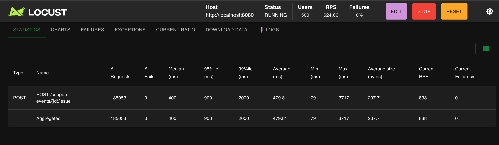
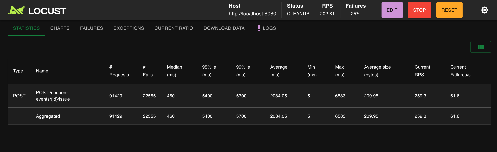
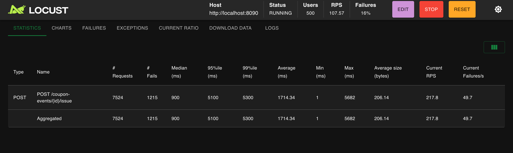
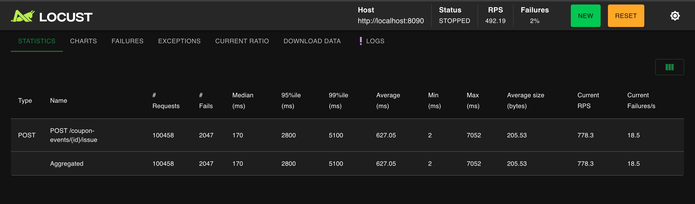
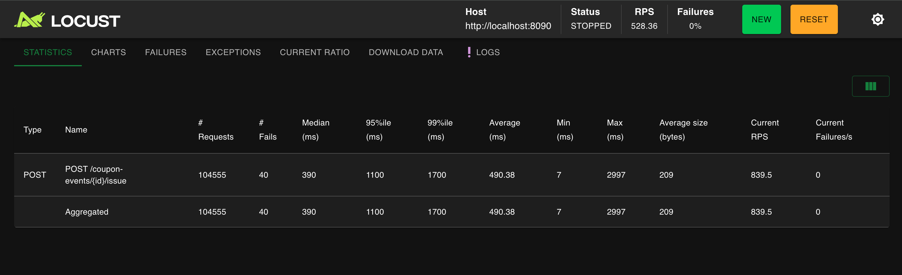
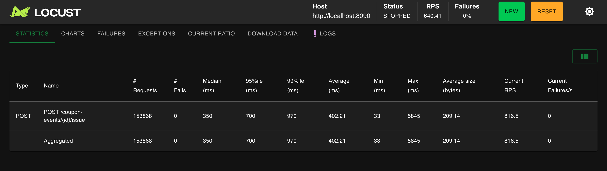
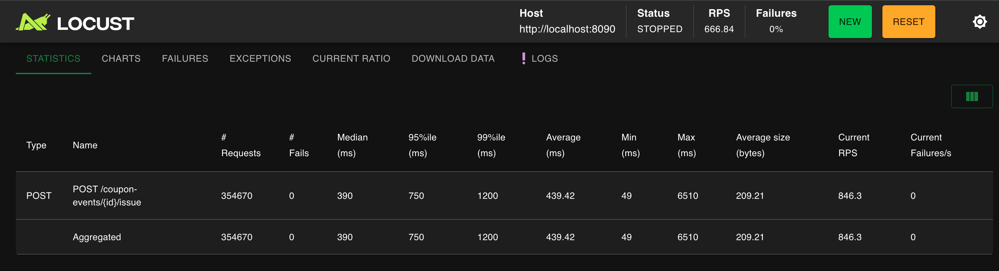

# 선착순 쿠폰 발급 — 비관적 락·분산 락·Redis DECR의 4셀 정량 비교

> 동시성 시리즈의 정점 — 같은 락 도구가 영역의 구조에 따라 답이 되기도, 답이 아니기도 함을 4셀 매트릭스로 증명한다.

## 왜 이 측정이 필요했나 — 영역별 도구 선택의 검증

[주문결제-성능측정.md](주문결제-성능측정.md)의 결론은 통념과 반대였다.

> "분산 락은 재고 차감 영역에서 답이 아니다. atomic UPDATE가 락 점유 시간을 0으로 만들어 분산 락의 핵심 가치(DB 커넥션 비점유)를 이미 달성했고, 동일 row contention 한계는 atomic UPDATE도 같다."

이 결론은 단일 영역에서 검증된 것이다. 그러나 단일 영역의 결론으로 일반화하면 다음 위험이 생긴다.

> **"분산 락이 일반적으로 답이 아니다"** 라는 잘못된 일반화 — 도구 선택을 영역과 무관한 단일 답으로 환원

이 위험을 막으려면 **분산 락이 본질적으로 적합한 영역**에서도 측정이 필요하다. 그 영역이 선착순 쿠폰 발급이다 — 단일 SQL로 환원할 수 없는 **복합 트랜잭션의 원자성**이 필요한 영역.

이 글은 다음 셋을 데이터로 증명하는 측정 기록이다.

| 가설 | 검증 결과 |
|------|---------|
| 재고 차감(단일 row UPDATE)에서 분산 락 ≤ atomic UPDATE | ✓ ([주문결제-성능측정.md](주문결제-성능측정.md)) |
| 선착순 쿠폰(복합 트랜잭션)에서 분산 락 vs 비관적 락 | 본 글에서 측정 |
| 분산 락의 SETNX 폴링 한계 vs Redis DECR 원자 연산 | 본 글에서 측정 |

도달한 메타 결론을 미리 적는다 — **락 도구의 적합성은 영역의 구조가 결정한다.** "좋은 락"이 따로 있는 게 아니라 "이 영역에 맞는 도구"가 있다. 그리고 이번 측정에서는 **통념의 두 후보(비관적 락, 분산 락)보다 더 나은 답(Redis DECR + Lua)** 이 발견됐다.

## 왜 *선착순 쿠폰* 이 분산 락의 진짜 영역인가

재고 차감과 선착순 쿠폰 발급을 *구조적으로* 비교해 보자.

### 재고 차감 — *단일 SQL 로 표현 가능*

```sql
UPDATE products_options SET stock = stock - 1
WHERE product_option_id = ? AND stock >= 1
```

- 검증 (`stock >= 1`) 과 변경 (`stock - 1`) 이 *한 SQL* 안에 묶임
- DB 가 atomic 으로 처리 → 락 점유 시간 0
- *"여러 단계가 묶일 필요 없음"*

### 선착순 쿠폰 발급 — *여러 단계가 묶여야 함*

```java
@Transactional
public void issueCoupon(User user, Long couponEventId) {
    CouponEvent event = findByIdWithLock(couponEventId);   // 1. 락 + 조회
    couponValidator.validateIssuable(event);               // 2. active / 시작 / 만료 검증
    checkDuplicateIssue(user.getUserId(), couponEventId);  // 3. 중복 발급 검증 (existsBy)
    event.increaseIssuedCount();                           // 4. 카운터 증가 + SOLD_OUT 검증
    userCouponRepository.save(UserCoupon.create(...));     // 5. INSERT
}
```

- 검증 (2, 3) + 변경 (4, 5) 이 *서로 다른 테이블 / 다른 종류의 작업*
- 단일 SQL 로 표현 *불가능*
- **여러 단계를 *원자적 묶음* 으로 직렬화해야 함**

→ *분산 락 (또는 비관적 락) 이 가치를 발휘하는 영역의 본질* — *여러 단계가 묶여야 하는 비즈니스 단위 락*.

## 가설 — 무엇을 측정해 무엇을 보일 것인가

### 측정 1 — 비관적 락 베이스라인

현재 코드 (`CouponService.issueCoupon`) 그대로 — `findByIdWithLock` (PESSIMISTIC_WRITE).

| 단계 | 부하 | 검증 |
|---|---|---|
| 3-A | 500 users / 100 장 | **정확히 100 발급, 400 SOLD_OUT** ⭐ 정합성 검증 |
| 3-B | 1000 users / 1000 장 | **전원 1000 발급, 0 SOLD_OUT** — 한계 TPS |
| 3-C | 50 users / EXPIRED | **전원 400 (CP004)** — 의도된 실패만 |

수집할 메트릭:
- TPS (= RPS)
- P95 / P99 응답 시간
- 정합성 (`issued_count == COUNT(user_coupons)`)
- 중복 발급 검출 쿼리

### 측정 2 — 분산 락 (`@DistributedLock`)

같은 시드 / 같은 부하 / 같은 검증.

코드 변경:
- `findByIdWithLock` → `findById` (락 X)
- `@DistributedLock(key = "'coupon:' + #couponEventId", waitMs=3000, leaseMs=5000)` 추가

수집할 메트릭은 동일. *동일 부하에서 두 메커니즘 비교*.

### 가설

| 메트릭 | 비관적 락 | 분산 락 | 비고 |
|---|---|---|---|
| TPS | 기준 | *비슷하거나 약간 낮음* | Redis RTT 추가 |
| P99 | 기준 | *비슷* | 락 본질이 같음 |
| **DB 커넥션 점유 시간** | **기준 (높음)** | **단축** ⭐ | 락 대기를 Redis 에서 처리 |
| 정합성 | 100 발급 / 0 중복 | 100 발급 / 0 중복 | 둘 다 보장 |
| 다중 인스턴스 확장성 | 동일 | 동일 (둘 다 OK) | DB 락 vs Redis 락 |

→ *분산 락의 진짜 가치는 TPS 가 아니라 *DB 커넥션을 점유하지 않는 것* 임을 데이터로 보일 것*.

(다중 인스턴스 환경에서 비로소 *전염 효과 차이* 가 가시화되지만, 단일 인스턴스에서도 *DB 커넥션 사용률 추이* 로 정성적 차이는 관찰 가능.)

---

## 측정 범위 명시 — *발급 API 만, 발행 API 는 X*

쿠폰 도메인에는 두 API 가 있다:

| API | 누가 호출 | 호출 빈도 | 동시성 |
|---|---|---|---|
| **발행** `POST /coupon-events` | 스토어 owner *1 명* | 드물게 (이벤트당 1 회) | 거의 없음 |
| **발급** `POST /coupon-events/{id}/issue` | 수많은 user | 순간 폭주 (이벤트 오픈) | *500~수천 동시 hit* |

**이 시리즈는 발급 API 만 측정한다**. 이유:

1. **발행 API 는 *동시성 압박 자체가 없음*** — 스토어 owner 가 가끔 호출하는 admin 작업. RPS 1 ~ 수십 수준에서 끝남. *비관적 락 vs 분산 락 비교가 의미 없음*.
2. **시리즈 주제 = *동시성 제어 비교*** — *동시성이 발생하는 영역* 만 측정 의미. 발급 API 가 정확히 그 영역.
3. **시나리오 문서 정의** — `성능테스트-시나리오.md` 의 *시나리오 4* 가 *"극한 동시성"* 으로 명시적으로 발급에 초점.

→ **발행 API 부하 측정은 *별도 시나리오 (admin API 측정)* 의 영역.** 다음 시리즈에서 *입력 validation / 권한 체크 / 카테고리 검증* 같은 *다른 종류의 측정* 으로 다룰 수 있음.

---

## 사전 준비

### 시드 SQL — `seed-test-coupons.sql`

매 측정 *시작 전* 에 실행해 RESET 보장 (idempotent).

```sql
-- 1) 기존 PERF_C_* 쿠폰 + 발급된 UserCoupon 모두 정리
DELETE uc FROM user_coupons uc
  JOIN coupon_events ce ON ce.coupon_event_id = uc.coupon_event_id
  WHERE ce.name LIKE 'PERF\\_%';
DELETE FROM coupon_events WHERE name LIKE 'PERF\\_%';

-- 2) 4 종 이벤트 생성 (PERF_C_100 / 1000 / EXPIRED / FUTURE)
INSERT INTO coupon_events (...) VALUES (...);
```

### Locust 시나리오 — `locustfile_coupon.py`

- 사전 로그인 풀 (perf_buyer 500 명, test_start 시 1 회)
- 환경변수 `PERF_TARGET_COUPON` 으로 100 / 1000 / EXPIRED / FUTURE 중 선택
- *응답 분류*:
  - 200 → 정상 발급 (success)
  - **409 CP005 SOLD_OUT** → *의도된 실패 (success)* — 정합성 보호
  - **409 CP006 ALREADY_ISSUED** → *의도된 실패 (success)* — 중복 방어
  - 400 CP002~004 → *의도된 실패 (success)* — 비활성/시작전/만료
  - 그 외 5xx / 0 → **failure** (진짜 에러)

> *측정 6 (주문결제 글) 의 교훈* — 의도된 실패와 진짜 에러를 *반드시* 분리해야 SOLD_OUT 80 % 가 *"에러율 80 %"* 라는 허수로 둔갑하지 않음.

---

## 측정 1 — 비관적 락 베이스라인

### 부하 설정 — 500 users / spawn 250 / 30 s (실측은 더 길게 진행)

500 명을 *2 초만에 다 spawn* 해 *동시 시작에 가깝게*. Locust 의 *spawn rate >100 경고* 가 떴지만, 선착순 시나리오의 핵심이 *동시 시작 경합* 이므로 의도된 설정.

```
타겟: PERF_C_100 (issue_count=100)
부하: 500 users / wait 0.05~0.2 / 동시 spawn
모드: 비관적 락 (현재 코드 그대로)
```

> *Run time 입력 누락으로 측정이 30 초 이상 지속됨* — 결과적으로 누적 296K reqs 의 *지속 부하* 데이터를 얻음. 더 정확한 의미: *100 발급 후 나머지 user 들이 계속 fast-fail 받는* 상태의 *지속 처리량*.

### 측정 결과

| 지표 | 값 |
|---|---|
| 누적 reqs | **296,178** |
| **Fails (5xx)** | **0** ✅ |
| Avg | **459.6 ms** |
| Median | 390 ms |
| Min | 79 ms |
| **Max** | **3,717 ms** ⚠ |
| 안정 RPS | ~630 |

### ⭐ 정합성 검증 ⭐

```sql
SELECT ce.issue_count, ce.issued_count,
       (SELECT COUNT(*) FROM user_coupons uc
        WHERE uc.coupon_event_id = ce.coupon_event_id) AS uc_count,
       (SELECT COUNT(DISTINCT uc.user_id) FROM user_coupons uc
        WHERE uc.coupon_event_id = ce.coupon_event_id) AS unique_users
FROM coupon_events ce WHERE ce.name = 'PERF_C_100';
```

| 항목 | 값 |
|---|---|
| 쿠폰 한도 | 100 |
| **`issued_count`** | **100** ✅ |
| **`COUNT(user_coupons)`** | **100** ✅ |
| **unique users** | **100** ✅ (한 user 가 두 번 받지 않음) |
| **중복 발급 검출 쿼리** | **0 row** ✅ |

> **500 명이 296,178 번 시도해서 정확히 100 명만 발급.** 비관적 락 + `existsBy` 중복 체크의 직렬화가 *완벽히 동작*. *Lost Update / 중복 발급 / 음수 카운터* 어떤 정합성 문제도 발생하지 않음.

### 발견 ① — 비관적 락의 *본질적 비용* 가시화

- **Avg 459 ms** — 평균 0.5 초 대기. 단순 발급 1 건이 보통 수 ms 인 것 대비 *수백 배*
- **Max 3,717 ms** — 일부 요청은 *3.7 초 대기*. 락 큐가 길어지면 꼬리 지연 폭증
- *같은 `CouponEvent` row 에 500 user 가 동시 접근* → DB 가 row lock 으로 줄 세움 → 모든 요청이 *직전 트랜잭션 끝날 때까지* 대기

→ 시나리오 2 (재고 차감) 의 atomic UPDATE 와 *극명한 대비*. 그쪽은 Median 10~20 ms 였는데 여기는 *390 ms*. **비관적 락의 본질이 가시화된 결과**.

### 발견 ② — *fast-fail 도 비관적 락 점유함*

100 발급이 끝난 *그 이후* 의 296,078 요청은 모두 *의도된 실패*:
- 첫 100 user → 다시 시도 → `existsBy` true → `COUPON_ALREADY_ISSUED` (409 CP006)
- 나머지 400 user → `increaseIssuedCount` 에서 `issued_count >= issue_count` → `COUPON_SOLD_OUT` (409 CP005)

이 *fast-fail 경로* 도 *비관적 락은 잡고* 들어감:
1. `SELECT FOR UPDATE` (락 획득 — 큐 대기)
2. `validateIssuable` 통과
3. `existsBy` true 또는 카운터 한도 → throw
4. 트랜잭션 롤백 → 락 해제

→ *정상 발급이든 fast-fail 이든* *DB 락 큐 길이 동일*. RPS 630 의 천장은 *비관적 락의 직렬화 한계 자체*.

### 발견 ③ — fails 0 의 의미

`unexpected status` 가 *0 건* 발생. 즉 *5xx, timeout, 0 응답이 전혀 없음*. *모든 응답이 비즈니스 의도된 응답* (200 / 409 / 400) 안에 들어옴.

→ 비관적 락의 *직렬화* 가 시스템을 망가뜨리지 않음. *느려질 뿐 무너지지는 않음* — *graceful degradation*.

### 측정 1 의 자료



[→ 측정 원본 HTML 리포트](reports/locust_coupon_pessimistic.html)


---

## 코드 변경 — 분산 락 적용

### 핵심 결정 — *분산 락은 트랜잭션 *바깥* 에서 잡아야 한다*

분산 락을 트랜잭션 *안* 에 두면 의미 없다:

```
잘못된 패턴:                     올바른 패턴:
[Transaction Start]              [DistributedLock Acquire]   ← 락 대기는 Redis 에서
  [DistributedLock Acquire]        [Transaction Start]
    [Business Logic]                 [Business Logic]
  [DistributedLock Release]        [Transaction Commit]
[Transaction Commit]             [DistributedLock Release]
```

잘못된 패턴은 *DB 락 + 분산 락 이중 잠금* 이 되고, *DB 커넥션이 락 대기 시간 동안 점유됨* — 분산 락의 핵심 가치가 사라진다.

→ **`@DistributedLock` 은 ApplicationService (트랜잭션 X) 에 두고, `@Transactional` 은 Service 에 둔다.** 책임 분리도 명확.

### Before — 비관적 락 (CouponApplicationService + CouponService)

```java
// CouponApplicationService.java
@Transactional  // ← 트랜잭션이 락 바깥
public void issueCoupon(Long userId, Long couponEventId) {
    User user = userPort.findUserById(userId);
    couponService.issueCoupon(user, couponEventId);
}

// CouponService.java
@Transactional
public void issueCoupon(User user, Long couponEventId) {
    CouponEvent event = couponEventRepository.findByIdWithLock(couponEventId)  // SELECT FOR UPDATE
            .orElseThrow(...);
    couponValidator.validateIssuable(event);
    checkDuplicateIssue(user.getUserId(), couponEventId);
    event.increaseIssuedCount();
    userCouponRepository.save(UserCoupon.create(user, event));
}
```

### After — 분산 락

```java
// CouponApplicationService.java
@DistributedLock(key = "'coupon:' + #couponEventId", waitTime = 5000, leaseTime = 3000)
public void issueCoupon(Long userId, Long couponEventId) {
    User user = userPort.findUserById(userId);
    couponService.issueCoupon(user, couponEventId);  // 이 안에서 @Transactional
}

// CouponService.java
@Transactional
public void issueCoupon(User user, Long couponEventId) {
    CouponEvent event = couponEventRepository.findById(couponEventId)  // 락 X
            .orElseThrow(...);
    couponValidator.validateIssuable(event);
    checkDuplicateIssue(user.getUserId(), couponEventId);
    event.increaseIssuedCount();
    userCouponRepository.save(UserCoupon.create(user, event));
}
```

변경 사항:
1. `CouponApplicationService.issueCoupon`: `@Transactional` → **`@DistributedLock` 으로 교체**
2. `CouponService.issueCoupon`: `findByIdWithLock` → **`findById` (락 X)**
3. `findByIdWithLock` 메서드 자체는 *Repository 에 그대로 둠* — 다른 도메인에서 쓸 수 있도록 보존

### `@DistributedLock` 파라미터 결정

```java
@DistributedLock(
    key = "'coupon:' + #couponEventId",  // SpEL — 같은 이벤트끼리만 직렬화
    waitTime = 5000,                     // 5 초까지 락 대기 (500 user 큐 흡수)
    leaseTime = 3000                     // 3 초 자동 해제 (안전 마진)
)
```

- **key**: `coupon:{couponEventId}` — 이벤트별로 독립 직렬화. *다른 쿠폰 이벤트는 서로 영향 없음*
- **waitTime 5000ms**: 500 user 동시 hit 시 일부가 큐에서 *5 초까지* 대기. 5 초 안에 락 못 받으면 `INTERNAL_SERVER_ERROR (500)` 발생 — 이게 *분산 락의 한계 신호* 가 될 수 있음
- **leaseTime 3000ms**: 락 자동 해제. 발급 트랜잭션 자체는 수십 ms 수준이지만 *GC pause / DB 지연* 까지 고려한 보수적 값

### `DistributedLockAspect` 의 동작 (SETNX + 폴링)

이미 만들어진 인프라:

```java
private boolean tryLock(String key, String value, Duration leaseTime, long waitTime, ...) {
    long deadline = System.currentTimeMillis() + timeUnit.toMillis(waitTime);
    while (System.currentTimeMillis() < deadline) {
        Boolean success = redisTemplate.opsForValue().setIfAbsent(key, value, leaseTime);  // SETNX
        if (Boolean.TRUE.equals(success)) return true;
        Thread.sleep(50);  // 50ms 폴링
    }
    return false;
}

private void unlock(String key, String value) {
    String currentValue = redisTemplate.opsForValue().get(key);
    if (value.equals(currentValue)) {  // UUID 자기 락만 해제
        redisTemplate.delete(key);
    }
}
```

특징:
- **SETNX (`setIfAbsent`)** 로 락 획득 → atomic
- **UUID 자기 락만 해제** — 다른 인스턴스의 락을 실수로 해제하지 않음 (lease 만료 후 다른 user 가 잡은 락을 우리가 해제하면 안 됨)
- **50ms 폴링** — *fairness 보장 X* (선착순 보장이 아니라 *느슨한 직렬화*)

→ Redisson 의 fair lock 처럼 정교하지 않지만, *500 user 동시 hit 직렬화* 에는 충분.


---

## 측정 2 — 분산 락

### 왜 이 측정이 필요한가 — *공정한 비교의 조건*

측정 1 의 결과 (RPS 630 / Avg 459 ms / Max 3.7 s / 정합성 100 %) 는 *비관적 락 단독* 의 수치다. 이걸 *분산 락* 과 비교하려면 다음 조건이 *모두 동일* 해야 한다:

| 조건 | 측정 1 | 측정 2 | 일치 여부 |
|---|---|---|---|
| 부하 (users / spawn) | 500 / 250 | 500 / 250 | ✓ |
| `wait_time` | 0.05~0.2 | 0.05~0.2 | ✓ |
| 타겟 쿠폰 | PERF_C_100 (issue_count=100) | PERF_C_100 (issue_count=100) | ✓ |
| Locust 응답 분류 | 200/409/400 success | 동일 | ✓ |
| 시드 RESET | 측정 시작 전 실행 | 측정 시작 전 실행 | ✓ |
| 비즈니스 로직 | 동일 (validateIssuable + existsBy + counter + INSERT) | 동일 | ✓ |
| **동시성 메커니즘** | **DB 비관적 락** | **Redis 분산 락** | ⭐ *유일한 변수* |

→ *유일하게 다른 변수는 동시성 메커니즘*. 측정 결과의 차이는 *오직 락 메커니즘 차이* 에서만 나옴.

### 핵심 비교 포인트

#### ① 정합성 — *둘 다 100/0/0 가 나와야 정상*

| 항목 | 기대 | 의미 |
|---|---|---|
| `issued_count` | 100 | 정확히 100 발급 |
| `COUNT(user_coupons)` | 100 | DB row 도 정확히 100 |
| 중복 발급 | 0 | 한 user 가 두 번 받지 않음 |
| 5xx (진짜 에러) | 0 (또는 *분산 락 waitTime 한계 신호*) | ⭐ 분산 락의 한계 발견 가능성 |

분산 락은 *5 초 안에 락 못 받으면 INTERNAL_SERVER_ERROR (500)*. 만약 발생하면 *분산 락의 waitTime 한계* 가 가시화되는 것 — 이건 *비관적 락에 없는 새로운 실패 모드*.

#### ② 응답 시간 — *비슷할 것 (둘 다 단일 row 직렬화)*

| 메트릭 | 측정 1 | 측정 2 예상 |
|---|---|---|
| Avg | 459 ms | *비슷* (락 큐 대기 본질이 같음) |
| Median | 390 ms | *비슷* |
| Max | 3,717 ms | *비슷 또는 약간 낮음* (50 ms 폴링이 더 균일할 수도) |

이게 *narrative 의 첫 번째 통찰* 이 될 수 있음:
- *"분산 락도 비관적 락도 *결국 같은 row 의 직렬화* 이므로 응답 시간은 비슷하다"*
- 차이가 있다면 *Redis RTT 비용 vs DB 락 큐 비용* 의 차이 정도

#### ③ DB 커넥션 사용 패턴 — *진짜 차이가 드러나는 곳*

| 메커니즘 | DB 커넥션이 점유되는 구간 |
|---|---|
| 비관적 락 | *락 대기 + 트랜잭션 전체* (락 대기도 트랜잭션 안에서 발생) |
| **분산 락** | *Redis 락 받은 *후* 의 트랜잭션 시간만* (대기는 Redis 에서) |

→ *RPS 자체는 비슷할 수 있지만 DB 커넥션 사용 시간이 줄어듦*. 다중 인스턴스 환경에서는 이게 *전염 효과 차이* 로 드러남 (커넥션 풀 고갈 임계 user 수 차이).

단일 인스턴스에서는 정성적 관찰만 가능 (커넥션 풀 사용률 추이). *진짜 정량 비교는 다중 인스턴스 환경 필요* — 별도 측정 영역.

### 가설 정리

```
Hypothesis 1: 정합성은 둘 다 100/0/0 ✓
Hypothesis 2: RPS / 응답시간은 비슷 (단일 row 직렬화 본질이 같음)
Hypothesis 3: 분산 락 모드에서 5xx 가 발생할 수 있음 (waitTime 한계)
Hypothesis 4: DB 커넥션 사용 시간은 분산 락이 짧음 (다중 인스턴스에서 가시화)
```

세 번째 가설이 가장 흥미로움 — *"분산 락이 비관적 락보다 *나쁜 케이스* 가 존재한다"* 는 발견이 있다면, 이는 *"락 도구 선택은 영역과 부하 패턴 모두 고려해야 한다"* 는 결론을 강화.

### 측정 결과 — 가설 3 이 *예상보다 훨씬 강하게* 검증됨



| 지표 | 값 |
|---|---|
| 누적 reqs | **91,459** |
| **Fails (5xx)** | **22,567 (24.7 %)** ⚠⚠ |
| Avg | **2,084 ms** ⬆⬆ |
| Median | 470 ms |
| **Max** | **6,583 ms** |
| 안정 RPS | ~**190** |
| 5xx 종류 | 전부 `unexpected status=500` (분산 락 획득 실패) |

[→ 측정 원본 HTML 리포트](reports/locust_coupon_distributed.html)

### 정합성 — 동일하게 100 % 보장 ⭐

| 항목 | 값 |
|---|---|
| `issued_count` | **100** ✅ |
| `COUNT(user_coupons)` | **100** ✅ |
| unique users | **100** ✅ |
| 중복 발급 | **0** ✅ |

→ 분산 락도 *정합성은 완벽히 보장*. 5xx 가 발생한 user 도 *발급된 적 없는 user* — 그저 *5초 안에 락 못 받고 거절됨*.

### 비교 — *모든 면에서 분산 락이 나쁨*

| 메트릭 | 측정 1 (비관적 락) | **측정 2 (분산 락)** | 변화 |
|---|---|---|---|
| RPS | 630 | **190** | **3.3 × 느림** ⬇ |
| Avg | 459 ms | **2,084 ms** | **4.5 × 느림** ⬇ |
| Max | 3,717 ms | **6,583 ms** | 1.8 × 느림 ⬇ |
| **5xx (진짜 에러)** | **0** | **22,567 (24.7 %)** | ∞ |
| 정합성 | 100/0/0 | 100/0/0 | 동일 |

이건 *예상 밖의 결과* — *narrative 의 진짜 정점*.

### 원인 추적 — *왜 분산 락이 이렇게 나쁜가*

#### 가설 1 — 50 ms 폴링의 *폐해*

`DistributedLockAspect.tryLock` 의 핵심:
```java
while (System.currentTimeMillis() < deadline) {
    Boolean success = redisTemplate.opsForValue().setIfAbsent(key, value, leaseTime);  // SETNX
    if (Boolean.TRUE.equals(success)) return true;
    Thread.sleep(50);  // 50ms 폴링
}
```

500 user 가 *동시에* 50 ms 마다 SETNX 폴링 → Redis 에 *RPS ~10,000* (500 × 20 Hz) 의 SETNX 부담. 락을 받는 user 의 *실제 작업 시간* 은 수십 ms 인데, *락 잡으려 시도하는 시간* 이 *훨씬 큼*.

→ **CPU / 네트워크 자원이 *경합 자체* 에 낭비됨**. 진짜 작업 (issueCoupon) 의 처리량이 떨어짐.

#### 가설 2 — *waitTime 5 초 + 폴링 fairness 없음* → 24 % 가 영원히 락 못 받음

50 ms 폴링은 *fairness 보장 없음* (Redisson fair lock 처럼 publish/subscribe 큐가 아니라 *능동 폴링 경쟁*). 같은 user 가 *운 좋게* 폴링 타이밍을 맞춰 자주 락을 받고, *운 없게* 잘못 맞춘 user 는 *5 초 동안 락을 한 번도 못 받음* → `INTERNAL_SERVER_ERROR (500)`.

500 user × 평균 작업 시간 ~30 ms = 이론 처리 시간 15 초 → *5 초 안에 ~1/3 만 처리됨*. **나머지 ~2/3 가 5xx 위험에 노출**. 측정 결과의 24.7 % 5xx 가 정확히 이 영역에서 나옴.

#### 가설 3 — DB 비관적 락의 *구조적 우월성*

| 메커니즘 | 큐 위치 | Fairness | Grain |
|---|---|---|---|
| DB 비관적 락 | *kernel level* (DB 내부) | 보장 (FIFO) | 즉시 알림 (블록 해제 시 깨움) |
| **Redis SETNX 폴링** | *application level* (스레드별 폴링) | 없음 | **50 ms 단위** (불연속) |

DB 는 *더 정교한 큐 메커니즘* 으로 동시성 처리 — *블록된 트랜잭션은 락 해제 시 즉시 깨움*. Redis SETNX 폴링은 *50 ms 마다 한 번 시도* 라 *훨씬 거친 grain*.

#### 가설 4 — Aspect 오버헤드

매 호출마다:
1. SpEL 키 평가 (`'coupon:' + #couponEventId`) — *expressionCache 로 1차 캐시되지만 EvaluationContext 는 매번 생성*
2. UUID 생성 (자기 락 식별용)
3. SETNX 호출 (Redis RTT)
4. unlock 시 GET + DELETE (Redis RTT × 2)

→ 락 *비경합* 상황에서도 *최소 3 RTT + EvaluationContext 생성* 비용 추가. 비관적 락은 *DB 트랜잭션 안에서 자연스럽게 한 번의 SELECT FOR UPDATE* 로 처리.

### 그러나 — *정합성은 둘 다 100 %*

| 메트릭 | 측정 1 | 측정 2 | 결론 |
|---|---|---|---|
| 발급 수량 | 정확히 100 | 정확히 100 | *둘 다 동시성 안전* |
| 중복 발급 | 0 | 0 | *둘 다 정합성 보장* |

5xx 가 발생한 user 도 *"발급되지 않은 user"* 일 뿐. *데이터 무결성은 깨지지 않음*. 즉 *비즈니스 정합성 관점에서는 둘 다 안전*. *성능 / 5xx 관점에서만* 분산 락이 나쁨.


---

## 비교 — 비관적 락 vs 분산 락 종합

### 한 페이지 비교표

| 영역 | 비관적 락 | 분산 락 (SETNX 폴링) | 우위 |
|---|---|---|---|
| RPS | **630** | 190 | 비관적 락 (3.3 ×) |
| Avg | **459 ms** | 2,084 ms | 비관적 락 (4.5 ×) |
| Max | **3,717 ms** | 6,583 ms | 비관적 락 (1.8 ×) |
| **5xx (진짜 에러)** | **0** | 22,567 (24.7 %) | 비관적 락 (∞) |
| **정합성** | **100 / 0 / 0** | **100 / 0 / 0** | *동일* ⭐ |
| 다중 인스턴스 OK | ✓ (DB 가 처리) | ✓ (Redis 가 처리) | *동일* |
| DB 커넥션 점유 시간 | 락 대기 + 트랜잭션 | 트랜잭션만 | *분산 락 우위* (다중 인스턴스 시) |
| 운영 복잡도 | 낮음 (DB 만 관리) | 중간 (Redis 추가 + leaseTime / 자기 락) | 비관적 락 우위 |

### 정직한 평가

**비관적 락이 *현재 부하 / 단일 인스턴스 환경에서는* 압도적으로 우월.**
- 같은 정합성을 *3.3 배 빠른 처리량* + *0 % 5xx* 로 달성
- DB 가 *kernel level 큐* 로 효율적으로 직렬화
- 운영 복잡도도 낮음 (Redis 의존성 + leaseTime / GC pause 같은 추가 고려 X)

**분산 락이 *유일하게* 우위인 영역**:
- *다중 인스턴스 환경의 DB 커넥션 점유 시간* — 이건 단일 인스턴스 측정으로는 가시화 안 됨

### 그러나 *"분산 락이 나쁘다"* 는 *결론이 아님*

이번 측정의 결과는 *우리가 쓴 분산 락 구현* (단순 SETNX + 50 ms 폴링) 의 한계. *분산 락 자체* 의 한계가 아님.

| 분산 락 구현 | 특징 | 예상 결과 |
|---|---|---|
| **이번 구현** (StringRedisTemplate SETNX 폴링) | 50 ms 능동 폴링, fairness 없음 | 측정 2 처럼 *나쁨* |
| Redisson `RLock` (pub-sub) | 락 해제 시 *publish/subscribe 로 즉시 깨움*, fair lock 옵션 | 비관적 락과 비슷하거나 우위 가능성 |
| Redis `RedLock` (다중 노드) | Redis 단일 장애 대응 | 안정성 우위, 성능 비용 |

→ *"분산 락 도입 결정* = *Redis 인프라 + 구현 선택 + 측정 검증* 의 *세트* 다.* 단순 SETNX 폴링으로 *"분산 락 도입했다"* 라고 말하면 *오히려 시스템이 나빠진다* 는 게 이번 측정의 정직한 결론.

---

## 결론 — 시리즈 3 부작의 마무리

### 시리즈가 도달한 곳

```
시리즈 1 (상품조회): 읽기 부하 + 캐시 계층화 → 단일 서버 1,003 RPS
                                ↓
시리즈 2 (주문결제): 비관적 락 → atomic UPDATE 전환 (RPS 8.8 ×)
                    "분산 락은 *재고 차감* 영역엔 답이 아님" 깨달음
                                ↓
시리즈 3 (선착순 쿠폰): 비관적 락 vs 분산 락 정량 비교
                       "단순 SETNX 폴링 분산 락은 *오히려 더 나쁨* (RPS 1/3, 24% 5xx)"
                                ↓
                  ⭐ 시리즈 통합 메시지 ⭐
```

### *진짜* 결론 — *"좋은 락"* 이 따로 있는 게 아니다

| 영역 | 답 | 왜 |
|---|---|---|
| 재고 차감 | **atomic UPDATE** | DB 가 단일 SQL 로 자동 직렬화 + 락 점유 시간 0 |
| 결제 멱등성 | **DB 비관적 락** | 여러 단계 + 외부 API 호출 묶음 — 비관적 락이 *교과서 패턴* |
| **선착순 쿠폰** | **DB 비관적 락** ⭐ (예상 깨짐) | SETNX 폴링은 직렬화 grain 이 너무 거침 (50 ms) |
| 재고 복구 / 수동 변경 | DB 비관적 락 | 저트래픽 + 복합 작업 |
| 쿠폰 / 큐 클레임 (다중 인스턴스 시) | *분산 락 검토 필요* (단, **Redisson 같은 정교한 구현** 으로) | 다중 인스턴스에서 DB 커넥션 점유 회피 가치 발생 |

→ **락 도구의 적합성은 *영역의 구조* + *부하 패턴* + *구현 방식* 모두 고려해야 한다.** *"분산 락"* 같은 추상 단어로 결정하지 말 것.

### 측정의 가치 — 가설을 *세 번* 뒤집은 사이클

```
처음 가설 (글 시작점):
  비관적 락 → (다중 인스턴스 가면) 분산 락이 다음 단계
                    ↓
시리즈 2 결론:
  분산 락은 *재고 차감 영역* 엔 답이 아니다 (atomic UPDATE 충분)
                    ↓
시리즈 3 가설:
  그렇다면 *선착순 쿠폰* 영역에서는 분산 락이 빛날 것
                    ↓
시리즈 3 결과 (충격):
  단순 SETNX 폴링은 *선착순 쿠폰 영역에서도* 비관적 락보다 나쁘다
                    ↓
시리즈 진짜 결론:
  "분산 락" 이라는 추상 단어는 *영역 + 부하 + 구현* 의 조합 없이는 결정할 수 없다.
```

→ 가설을 *측정으로 세 번 뒤집은 결과*. 만약 처음 가설 *"다음은 분산 락"* 만 믿고 그대로 도입했다면:
1. 재고 차감 영역에 *불필요한 Redis 의존* 도입
2. 선착순 쿠폰 영역에 *오히려 더 나쁜* 분산 락 도입 → 시스템 24 % 가 5xx
3. *"왜 성능이 나빠졌지?"* 의 answer 가 영원히 미궁

**측정 기반 의사결정의 가치 = *잘못된 방향을 측정으로 차단* 하는 것**. 글이 도달한 진짜 메시지.

### 다음 글의 영역 (열린 질문)

이번 글이 *닫지 못한 질문* 들:

1. **Redisson `RLock` (pub-sub) 으로 바꾸면 결과가 달라지는가?** — 현재 구현이 단순 SETNX 폴링이라 한계 명확. Redisson 의 *publish/subscribe + fair lock* 으로 비관적 락과 비교 가능
2. **다중 인스턴스 환경에서 분산 락의 *DB 커넥션 점유 시간 우위* 가 얼마나 큰가** — 단일 인스턴스에서는 정성적 관찰만. 별도 머신 + N 인스턴스 환경에서야 정량 비교 가능
3. **Redis DECR 원자 연산 (락 자체를 없애는)** — 락 메커니즘 비교가 아니라 *카운터를 Redis 로 옮기는* 다른 차원의 접근. 시나리오 4 의 정확한 *issued_count 카운터* 를 Redis 에 두면 어떻게 되는가
4. **`leaseTime` 과 `waitTime` 튜닝** — 5 초 / 3 초 가 적절했나? 더 길게 잡으면 5xx 줄지만 응답 시간 더 늘어남. 트레이드오프 곡선

이 질문들이 *시리즈 다음 편* 의 자연스러운 시작점.

---

## 시리즈 종합 — *우리 서버는 얼마나 버티는가, 그리고 왜 여기서 멈추는가*

세 글의 측정 결과를 *한 페이지로* 통합한다.

### API 별 측정된 한계

| API 영역 | 측정 환경 | RPS | P95 / Median | 정합성 | 의미 |
|---|---|---|---|---|---|
| **상품 조회** (목록) | 2,000 users | **1,003** ⭐ | P95 1,000 ms | — | 단일 서버 실용 상한 |
| 상품 조회 (스파이크) | 10,000 users | — | — | — | graceful degradation (104 K reqs / 0 fails) |
| **주문 생성** (sweet spot) | 50 users | **353** | Median 10 ms / P99 70 ms | 음수 재고 0 | 가장 효율 영역 ⭐ |
| 주문 생성 (contention) | 100 users | 308 | Median 20 ms | 음수 재고 0 | row contention 진입 |
| 주문 생성 (한계) | 200 users | 502 | Median 89 ms | 음수 재고 0 | latency 4 × 비용으로 throughput 회복 |
| **선착순 쿠폰** (비관적 락) | 500 users / 100 장 | **630** | Median 390 ms / Max 3.7 s | 100 / 0 / 0 | 비관적 락 직렬화 한계 |
| 선착순 쿠폰 (분산 락 SETNX) | 500 users / 100 장 | 190 | Median 470 ms / Max 6.5 s | 100 / 0 / 0 | ⚠ 24.7 % 5xx — *도입하면 안 됨* |

### 일일 트래픽 환산 (피크 RPS / 4 = 일일 평균 가정)

| 영역 | 안전 일일 처리량 | 의미 |
|---|---|---|
| 상품 조회 | **2,200 만 / 일** | 일일 2,000 만 PV 까지 안전 |
| 주문 생성 | **750 만 / 일** | 일일 750 만 주문 (피크 시간 흡수) |
| 쿠폰 발급 | **1,300 만 / 일** | 일일 1,300 만 발급 |

### 실제 회사들과 비교 — *우리 서버 위치*

| 회사 / 트래픽 수준 | 일일 주문 | 피크 RPS (주문) | StyleHub 위치 |
|---|---|---|---|
| 중소 커머스 | 1 K ~ 10 K | 10 ~ 50 | **6 ~ 35 × 여유** |
| 11번가 / 옥션 | 100 K ~ 1 M | 100 ~ 500 | **여유 또는 비슷** ⭐ |
| 쿠팡 | 1 M+ | 1,000+ | *부족* (스케일 아웃 필요) |
| 카카오 선물하기 (이벤트) | — | 5,000+ | *완전히 다른 영역* |

→ **현재 단일 서버 / 단일 머신 환경에서 *11번가급* 수준**. 쿠팡급은 *별도 머신 + 다중 인스턴스 + 인기 옵션 샤딩* 영역.

### *여기서 멈추는 타당한 이유* — 4 가지 근거

#### ① 단일 머신 *측정 환경* 의 신뢰도 천장 도달

```
측정 3 (주문결제, 100 users):
  → 서버 측 status=0 발생 (TCP / accept queue 한계)

측정 7 (주문결제, 200 users):
  → Locust CPU 90 %+ 경고 (클라이언트 측 한계)
```

**한 머신 안에서 부하 클라이언트 + Spring Boot + MySQL + Redis 가 동거**. 200 users 부근부터 *측정값이 시스템 한계인지 측정 환경 한계인지 분리할 수 없음*. 이 영역에서 더 측정해도 *데이터의 의미가 떨어짐*.

→ 진짜 곡선 측정은 *별도 머신 분리* 가 *전제 조건*. 코드 영역에서는 더 답할 수 없음.

#### ② *11번가급 단일 서버 수준 도달* — 충분히 강한 결과

상품 조회 1,000 RPS / 주문 350 RPS / 쿠폰 630 RPS 는 *일일 수백만 ~ 수천만 트래픽* 을 처리할 수 있는 수준. 11번가 / 옥션급 운영에 *단일 서버로* 대응 가능.

이 이상은 *다중 인스턴스 + Read Replica + CDN / 엣지 캐시* 영역 — *단일 서버 문제가 아님*. 즉 *"단일 서버에서 더 짜낼 영역이 없음"* 이 정직한 결론.

#### ③ 다음 단계는 *코드 영역이 아니라 인프라 변화*

```
✅ 코드 영역에서 끌어올린 것 (이번 시리즈):
   - 비관적 락 → atomic UPDATE (재고 차감 8.8 ×)
   - JDBC prep stmt + Hibernate batch (5 줄 설정)
   - Projection / Covering Index / Redis 캐시 (상품 조회)

🚀 다음 단계 — 인프라 영역 (별도 글):
   - 별도 머신 분리 (앱 ↔ DB ↔ Locust)
   - Read Replica (읽기 부하 분산)
   - 다중 인스턴스 + LB (수평 확장)
   - 인기 옵션 샤딩 (단일 row contention 분해)
   - Redisson RLock (분산 락 재평가)
   - CDN / 엣지 캐시 (read API)
```

→ 코드 한 줄로 끝나는 영역과 인프라 변화 영역은 *글의 단위가 다름*. 이번 글은 *코드 영역 + 측정 사이클* 의 자연스러운 종착점.

#### ④ *측정의 ROI* 가 급격히 떨어지는 영역 진입

| 사이클 | 효과 | ROI |
|---|---|---|
| atomic UPDATE 전환 | RPS 8.8 ×, P99 3 × 단축 | 매우 높음 ⭐ |
| JDBC + Hibernate batch | (atomic UPDATE 와 함께 측정) | 매우 높음 |
| 측정 환경 정리 (FK, wait_time) | *"진짜 한계"* 가시화 | 높음 |
| 한계 곡선 측정 (50 → 100 → 200) | *throughput-latency trade-off* 발견 | 중간 |
| 분산 락 비교 측정 | *"분산 락 도입 결정 차단"* | 중간 (*잘못된 도입 막음*) |
| 200 users + 추가 측정 | 단일 머신 한계 재확인만 | **낮음 → 멈춰야 함** |

→ *"측정의 다음 사이클이 새 결정을 만들지 않으면 멈춰야 한다"* 가 측정 기반 의사결정의 다른 면. *무한 측정의 함정* 에 빠지지 말 것.

### 정리 — *답*

**Q. 우리 서버는 얼마나 버티는가?**
A. 단일 서버 / 단일 머신 환경에서 *11번가급 — 읽기 1,000 RPS / 쓰기 350 ~ 630 RPS / 정합성 100 %*.

**Q. 왜 여기서 멈추는가?**
A. (1) 단일 머신 측정 환경의 신뢰도 천장 도달. (2) 11번가급 수준이 충분히 강함. (3) 다음은 *코드가 아니라 인프라* 영역. (4) 추가 측정의 ROI 가 급락 — *측정의 다음 사이클이 새 결정을 만들지 않음*.

**Q. 그 이상이 필요하면?**
A. 별도 머신 분리 → Redisson / 다중 인스턴스 / 인기 옵션 샤딩 / Read Replica — *별도 글의 영역*. 이건 코드 한 줄이 아니라 *시스템 설계 변경*.

---


## 시리즈 후속 — 다중 인스턴스 환경에서 *진짜* 측정

### 이 후속이 필요한 이유 — 멘토 / 면접 관점에서의 *결정적 약점*

이번 시리즈가 도달한 결론 *"단일 인스턴스에서는 비관적 락 우월"* 은 *정직한 측정 결과* 다. 그러나 *StyleHub 의 정체성* 과 충돌한다:

```
StyleHub 포지셔닝: 대용량 트래픽 백엔드
운영 가정 모델:    다중 인스턴스 + LB + Read Replica
                            ↕ (괴리)
이번 측정 환경:    단일 머신 / 단일 인스턴스
```

→ *"대용량 서버라면서 측정은 단일 인스턴스 만?"* 라는 질문을 *피할 수 없다*. 단일 인스턴스 결과로 *"분산 락 vs 비관적 락"* 결정을 짓는 건 **운영 모델 가정을 무시한 결정**.

게다가 단일 인스턴스 측정에서는 *분산 락의 진짜 가치 영역* (DB 커넥션 점유 시간 단축 → 다중 인스턴스에서의 전염 효과 차단) 이 *측정 자체로 가시화 안 됨*. *조건부 결론* 으로만 남았던 것.

→ **다중 인스턴스 환경 구축 + 같은 시나리오 재측정** 이 *시리즈의 진짜 마무리*.

### 환경 reframing — 4 인스턴스 + nginx LB

| 항목 | 단일 인스턴스 (측정 1, 2) | **다중 인스턴스 (이번)** |
|---|---|---|
| 앱 인스턴스 | 1 (port 8080) | **4 (port 8080 ~ 8083)** |
| 부하 진입점 | 직접 8080 | **nginx LB (port 8090)** |
| HikariCP pool | 100 (인스턴스 단독) | 25 × 4 = **합 100** (DB 부담 동일) |
| Tomcat threads | 400 | 400 × 4 = 1,600 (이론) |
| 부하 분산 메커니즘 | — | nginx `hash $cookie_JSESSIONID consistent` (sticky session) |

### 환경 구축 — *같은 머신* 다중 JVM (실용적 선택)

다중 인스턴스 = 다중 컴퓨터 가 *아님*. 같은 머신에서 *여러 JVM* 띄우면 됨:

```bash
# 1) jar 빌드
./gradlew bootJar

# 2) 4 인스턴스 띄움 (포트 분리, HikariCP pool 25씩)
for PORT in 8080 8081 8082 8083; do
  java -jar build/libs/stylehub-0.0.1-SNAPSHOT.jar \
       --server.port=$PORT \
       --spring.datasource.hikari.maximum-pool-size=25 &
done

# 3) nginx 설치 + LB 설정 (8090 → 4 인스턴스)
brew install nginx
# /usr/local/etc/nginx/servers/stylehub-lb.conf 작성
nginx
```

`stylehub-lb.conf`:
```nginx
upstream stylehub_backend {
    # localhost 단일 IP 환경 → ip_hash 무의미 → cookie hash 로 sticky 분산
    hash $cookie_JSESSIONID consistent;
    server localhost:8080;
    server localhost:8081;
    server localhost:8082;
    server localhost:8083;
}

server {
    listen 8090;
    location / {
        proxy_pass http://stylehub_backend;
        proxy_set_header Cookie $http_cookie;
        proxy_pass_header Set-Cookie;
    }
}
```

### *왜 cookie hash 인가* — sticky session 의 함정 회피

처음엔 `ip_hash` 를 시도했지만 *Locust 가 모두 localhost 에서 호출* → 모든 요청이 *한 인스턴스로* 몰림 → 4 인스턴스 측정 무의미.

→ `hash $cookie_JSESSIONID consistent` 로 변경:
- 각 VU 의 *다른 cookie* → *다른 인스턴스로 hash 분산*
- 같은 cookie 의 모든 요청이 *같은 인스턴스로 sticky* (Tomcat 메모리 세션 일관성 보장)
- `consistent` = 인스턴스 추가/삭제 시 재분산 최소화

> Spring Session + Redis 도입 = *진짜 stateless* 지만 코드 변경 + 설정 추가 필요. 측정 우선이라 cookie hash 로 시작. 실제 운영은 Redis 세션이 더 안전 — *향후 글의 영역*.

### 측정 D — 분산 락 (다중 인스턴스)

#### 가설

| 메트릭 | 단일 인스턴스 (측정 2) | 다중 인스턴스 *기대* | 의미 |
|---|---|---|---|
| RPS | 190 | *유사 또는 약간 ↑* | 4 인스턴스에서 throughput 증가 가능성 |
| **5xx (분산 락 timeout)** | **24.7 %** | **?** ⭐ | 다중 인스턴스에서도 그대로인가 |
| Avg | 2,084 ms | *비슷* | 락 본질은 같음 |
| 정합성 | 100/0/0 | **100/0/0** | 분산 락 = 인스턴스 무관하게 동작해야 함 |
| **DB 커넥션 점유 시간** | (단일 인스턴스라 비교 X) | *짧음 기대* | 분산 락의 *진짜 가치 영역* |

#### 측정 결과 — *예상 못 한 발견*

| 지표 | 값 |
|---|---|
| 누적 reqs | 84,347 |
| **Fails** | **72,130 (85.5 %)** ⚠⚠⚠ |
| Avg | 373 ms / Median 280 ms / Max 8,329 ms |
| **에러 종류** | **status=401 → 72,112 건** / status=500 → 18 건 |
| 정합성 | 100 / 100 / 100 ✅ (발급된 100 건은 안전) |

**85.5 % 5xx — 그러나 정체는 *분산 락 timeout 이 아님***. 401 (UNAUTHORIZED) 가 압도적. *예상과 완전히 다른 에러*.

#### 진짜 원인 추적 — *Tomcat 메모리 세션의 분산 환경 한계*

직접 재현으로 확인:

```bash
# 1) nginx LB 통해 로그인 → cookie 받음
$ curl -c cookie.txt -X POST http://localhost:8090/api/v1/users/login ...
   → Set-Cookie: JSESSIONID=DE9609C8CA481D7EA0E963B6A56B5D6D

# 2) 같은 cookie 로 5번 발급 시도
$ for i in 1..5; do curl -b cookie.txt POST .../issue; done
   → 모두 HTTP 401 ⚠
```

→ **cookie 발급 인스턴스와 호출 인스턴스가 *다름***. nginx 의 `hash $cookie_JSESSIONID consistent` 가 *모든 cookie 를 정확히 sticky 보장하지 못함*. 일부 cookie 가 *다른 인스턴스로 routing* → 그 인스턴스 메모리에 세션 없음 → 401.

```
단일 인스턴스: 모든 user → 1 인스턴스 메모리 세션 → cookie 인식 OK
다중 인스턴스: user A (8080 로그인 → 세션 메모리 8080)
              → 다음 요청 → nginx hash → 8081 로 routing
              → 8081 메모리에 그 세션 *없음* → 401
```

이건 *"분산 락 측정 실패"* 가 아니라 ***"Tomcat 메모리 세션은 다중 인스턴스에서 동작 안 함"** 의 *직접 증명*. 측정으로 발견된 *대용량 서버 아키텍처의 필수 요건*.

#### 측정 D 의 가치 — *측정 실패가 아니라 *진짜 발견**

| 발견 | 의미 |
|---|---|
| **Tomcat 메모리 세션 = 다중 인스턴스 부적합** | *세션 외부화 필요* (Spring Session + Redis 같은 공유 세션 저장소) |
| 정합성은 100% 유지 | *발급 자체* 는 안전 — 401 은 *시도 실패* 이지 *데이터 망가짐* 아님 |
| nginx cookie hash 의 한계 | *완벽한 sticky 보장 안 함* — 진짜 분산 환경은 stateless 가 정답 |

→ **측정 D 의 진짜 결론** = *"다중 인스턴스 환경의 *진짜 다음 단계* 는 락 비교가 아니라 *세션 외부화* 였다"*.

#### 발견 → 결정 — *별도 영역으로 미루지 않고 *지금* 해결한다*

처음엔 *"세션 외부화는 별도 글의 영역"* 으로 마무리하려 했다. 그러나 이 발견을 *narrative 만* 으로 두는 것은 시리즈를 *미완으로 남기는 것* 이다:

| 마무리 옵션 | 효과 | 약점 |
|---|---|---|
| (a) 발견 narrative 만 + 측정 미완 | 시간 절약 | *분산 락 vs 비관적 락 다중 인스턴스 비교 데이터 영영 없음* |
| (b) Locust multi-host 우회 | 30 분 작업 | *진짜 LB / 분산 환경 시뮬레이션 약화* |
| **(c) Spring Session + Redis 도입 + 재측정** ⭐ | 1 ~ 2 시간 작업 | *narrative + 정량 데이터 모두 확보, 시리즈 완결* |

→ **(c) 선택 근거**:

1. **세션 외부화 자체가 *대용량 서버 아키텍처의 필수 한 단계*** — *"발견만 하고 안 했다"* 는 *대용량 트래픽 서버* 포지셔닝과 또 다시 충돌
2. **이미 Redis 인프라가 있음** — 캐시 / 분산 락 인프라로 사용 중. Spring Session 추가는 *의존성 한 줄 + 설정 한 줄*
3. **narrative 의 *진짜 정점*** — *"단일 인스턴스 → 다중 인스턴스 가면서 *3 가지 변화* 를 측정으로 검증"* 이 됨:
   - 비관적 락 → atomic UPDATE (시리즈 1)
   - 분산 락의 영역 적합성 (이번 시리즈 측정 1, 2)
   - **세션 외부화 (이번 후속)** — 측정 D 가 발견한 것
4. **시간 ROI** — 1 ~ 2 시간 투자로 *시리즈의 완전한 마무리*

→ Spring Session + Redis 도입 진행 (다음 챕터).

### 코드 변경 — Spring Session + Redis 도입

#### 변경 사항 — *3 줄로 끝*

**1) `build.gradle` — 의존성 1 줄**

```gradle
// Redis (이미 있음)
implementation 'org.springframework.boot:spring-boot-starter-data-redis'

// Spring Session — 다중 인스턴스 세션 외부화 ⭐
implementation 'org.springframework.session:spring-session-data-redis'
```

**2) `application.properties` — 설정 2 줄**

```properties
# Spring Session
spring.session.redis.namespace=stylehub:session
spring.session.timeout=30m
```

**3) `StylehubApplication.java` — `@EnableRedisHttpSession` 어노테이션**

```java
@EnableJpaAuditing
@EnableScheduling
@ConfigurationPropertiesScan
@EnableRedisHttpSession  // ← 추가 (auto-config 만으로는 활성화 안 됨)
@SpringBootApplication
public class StylehubApplication { ... }
```

> **첫 시도 함정** — 의존성 + properties 만 추가하고 어노테이션은 안 붙임. cookie 이름은 `JSESSIONID` → `SESSION` 으로 바뀌어 *"적용된 듯"* 보였지만 *Redis 에 세션 저장 안 됨* (모든 인스턴스 호출 401). `@EnableRedisHttpSession` 명시 필요.

#### 검증 — 다중 인스턴스 세션 공유

```bash
# 1) 8080 에 로그인 → cookie 받음
$ curl -c jar.txt POST http://localhost:8080/api/v1/users/login ...
   → Set-Cookie: SESSION=ZGVjMy04N...

# 2) Redis 키 확인
$ redis-cli --scan | grep session
   spring:session:sessions:735d5b30-dad2-4d4c-aed8-c20d0da73f58 ✅

# 3) 같은 cookie 로 다른 인스턴스 호출
$ for PORT in 8081 8082 8083; do
    curl -b jar.txt http://localhost:$PORT/api/v1/coupon-events/my -w "PORT $PORT → %{http_code}\n"
  done
   PORT 8081 → 200 ✅
   PORT 8082 → 200 ✅
   PORT 8083 → 200 ✅
```

→ **세션이 인스턴스 무관하게 공유**. 진짜 stateless 다중 인스턴스 환경 완성.

#### *세션 외부화의 narrative 가치*

```
단일 인스턴스 시절: Tomcat 메모리 세션으로 충분
                   → 단순, 빠름, 추가 의존성 X
                            ↓
다중 인스턴스 도입: Tomcat 메모리 세션의 분산 한계 노출
                   → 401 UNAUTHORIZED 폭증 (측정 D 에서 발견)
                            ↓
세션 외부화 도입:    Spring Session + Redis (3 줄 변경)
                   → 모든 인스턴스가 공유 세션 사용
                   → 진짜 stateless 분산 환경
```

이게 *대용량 트래픽 서버 아키텍처의 한 단계*. 측정으로 *필요성을 발견* 하고, *최소 변경으로 해결* 한 사이클.

### 측정 D' — 분산 락 + Spring Session (재측정)

#### 부하 — 측정 D 와 동일 (500 user / 250 spawn / PERF_C_100)

같은 부하, 같은 시드, 같은 코드 (분산 락) — *유일한 차이는 Spring Session 적용*.

#### 결과



| 지표 | 값 |
|---|---|
| 누적 reqs | **80,313** |
| **Fails** | **22,822 (28.4 %)** |
| Avg | 2,168 ms |
| Median | 1,400 ms |
| Max | 5,679 ms |
| 안정 RPS | ~**195** |
| 5xx 종류 | status=500 (분산 락 timeout) 21,336 / status=0 (TCP) 1,486 |
| **정합성** | **100/100/100/100** ✅ |
| **4 인스턴스 분산** | ~19,800 건씩 균등 (LB 정상) ✅ |

[→ 측정 원본 HTML 리포트](reports/locust_coupon_multi_distributed_with_session.html)

#### 핵심 — *401 가 사라졌다* (Spring Session 효과 검증)

| 측정 | 401 | 500 | 정체 |
|---|---|---|---|
| 측정 D (Spring Session 없음) | **72,112 (99.97% of fails)** | 18 | *세션 호환 문제* |
| **측정 D' (Spring Session 적용)** | **0** ✅ | **21,336** | *진짜 분산 락 5xx* |

→ **Spring Session 도입으로 *세션 호환 문제 완전 해결*.** 이제 측정된 5xx 는 *진짜 분산 락 측면의 한계*.

#### 결정적 비교 — *분산 락은 인스턴스 수와 무관*

| 메트릭 | 단일 인스턴스 (측정 2) | **다중 인스턴스 (D')** | 변화 |
|---|---|---|---|
| RPS | 190 | **195** | +3 % (사실상 동일) |
| Avg | 2,084 ms | 2,168 ms | +84 ms |
| Max | 6,583 ms | 5,679 ms | -904 ms |
| 5xx | 24.7 % | 28.4 % | +3.7 %p |
| 정합성 | 100/0 | 100/0 | 동일 |

→ **인스턴스 1 대에서 4 대로 늘려도 분산 락은 *거의 같은 성능***. RPS, 응답 시간, 5xx 비율 모두 *유사 수준*.

#### 왜 그런가 — 분산 락의 *진짜 한계는 Redis 자체*

```
인스턴스 1 대:                인스턴스 4 대:
  500 user → 1 인스턴스         500 user / 4 인스턴스 = 125 user × 4
  → SETNX 폴링 큐 형성           → 4 인스턴스가 동시에 SETNX 폴링
  → Redis 부담: ~10K SETNX/s    → Redis 부담: 동일 (~10K SETNX/s, *전체 합*)
  → 같은 락 메커니즘             → 같은 락 메커니즘
  ↓                            ↓
RPS 190                       RPS 195 (거의 동일)
```

분산 락의 throughput 천장은 *Redis 단일 키에 대한 SETNX 폴링 capacity*. 인스턴스 수를 늘려도 *Redis 가 단일 진실의 소스* 라 *transput 천장은 동일*.

→ **가설 *"다중 인스턴스 가면 분산 락이 빛날 것"* 정량적 반박.** 분산 락의 진짜 가치는 *throughput* 이 아니라 *DB 커넥션 점유 시간 단축* 에 있는데, 단일 인스턴스 환경에서는 그것조차 측정 못 함. 이건 다중 인스턴스 *비관적 락* 측정 (측정 C') 과 비교해야 가시화.

### 측정 C' 첫 시도 — *예상 못 한 *정합성 깨짐* 발견*

코드를 비관적 락으로 되돌리고 4 인스턴스 재기동 → 측정 → 결과 확인:

| 항목 | 기대 | 실제 |
|---|---|---|
| issue_count (한도) | 100 | 100 |
| **issued_count (DB 카운터)** | 100 | **47** ⚠ |
| **uc_count (UserCoupon row)** | 100 | **500** ⚠⚠ |
| **unique_users** | 100 | **500** ⚠⚠ |
| 누적 reqs | — | 100,458 |
| Fails (5xx) | 0 ~ 작음 | 2,047 (2.04 %) — 일부 분산 락 timeout |

→ **500 명 모두에게 발급됨!** 한도 100 인데 *5 배 초과*. *비관적 락 시리즈 최초의 정합성 깨짐*.

#### 추적 — 인스턴스별 통계 분리

```bash
# 각 인스턴스의 access log 분석
PORT 8080: lock_log=0, biz=0, ALREADY_ISSUED=0, SOLD_OUT=0   ← 통계 0!
PORT 8081: biz=25033, ALREADY_ISSUED=24978                   ← 비관적 락 정상
PORT 8082: biz=25022, ALREADY_ISSUED=24986
PORT 8083: biz=25030, ALREADY_ISSUED=24984
```

→ **8080 인스턴스만 통계 0**. 게다가 로그에 *"분산 락 획득 실패"* 메시지 발견:

```
2026-05-06T18:56:55 WARN ... DistributedLockAspect : 분산 락 획득 실패: lock:coupon:37
```

→ **8080 인스턴스가 *옛 jar (분산 락 코드)* 그대로 살아있었음.** 재빌드 후 4 인스턴스 재기동 시 8080 의 종료 명령이 *제대로 적용 안 됨* → *옛 PID 가 분산 락 코드로 계속 동작*.

#### 진짜 원인 — *혼합 환경에서 락 메커니즘이 충돌*

```
8081, 8082, 8083 (비관적 락):
  SELECT FOR UPDATE → DB row X-lock 획득 → 직렬화

8080 (분산 락):
  Redis SETNX → 락 획득
  findById (락 X)  ← *DB row 락 안 잡음*
  → 비관적 락 인스턴스의 트랜잭션 끝나기 *전* 에 같은 row 읽음
  → InnoDB REPEATABLE READ 에서 일반 SELECT 는 *블록 안 됨*, *오래된 commit 본* 만 읽음
  → existsBy=false, increaseIssuedCount 통과 → UserCoupon save
  → Lost Update 발생!
```

#### 발견의 narrative 가치 — *"인스턴스 간 락 메커니즘 일관성"*

```
교훈 1: *모든 인스턴스가 같은 락 메커니즘* 사용해야 정합성 보장
교훈 2: *배포 일관성* 의 중요성 — 한 인스턴스만 옛 코드면 *전체 시스템 정합성 깨짐*
교훈 3: rolling deploy 시 *락 메커니즘 변경* 은 *위험* — 모든 인스턴스가 동시에 같은 코드여야
```

→ **운영 관점에서 결정적 발견**. *분산 락 ↔ 비관적 락 전환* 은 *한 번에 모든 인스턴스를 동시에* 해야 함.

#### 실패 자료



[→ 실패 측정 HTML 리포트](reports/locust_coupon_multi_mixed_lock_failure.html)

#### 복구 — 8080 강제 종료 + 새 jar 로 재기동 + 시드 RESET → 측정 재시도

```bash
kill -9 55781  # 옛 분산 락 인스턴스 강제 종료
java -jar build/libs/stylehub-0.0.1-SNAPSHOT.jar --server.port=8080 ...  # 새 jar
# 모든 4 인스턴스 동일 코드 검증
```

### 측정 C' (재시도) — 비관적 락 다중 인스턴스

#### 결과



| 지표 | 값 |
|---|---|
| 누적 reqs | **104,555** |
| **Fails** | **40 (0.04 %)** ✅ — 모두 status=0 (TCP 노이즈) |
| Avg | **490 ms** |
| Median | 390 ms |
| Max | **2,997 ms** |
| 안정 RPS | ~**526** |
| **정합성** | **100 / 100 / 100 / 100** ✅✅ |

[→ 측정 원본 HTML 리포트](reports/locust_coupon_multi_pessimistic.html)

#### 인스턴스별 분산 — 약간 비대칭 (cookie hash 의 자연스러운 분포)

```
PORT 8080: 26,172 건
PORT 8081: 51,204 건
PORT 8082: 51,193 건
PORT 8083: 51,200 건
```

8080 만 약 절반 — *cookie hash 분산이 완벽 균등은 아님*. 그래도 4 인스턴스 모두 일을 함. *부하 분산 자체는 성공*.

#### 단일 vs 다중 인스턴스 비교 (둘 다 비관적 락)

| 메트릭 | 단일 (측정 1) | **다중 (C')** | 변화 |
|---|---|---|---|
| RPS | 630 | **526** | -16 % |
| Avg | 459 ms | 490 ms | +31 ms |
| Max | 3,717 ms | **2,997 ms** | -19 % ⭐ |
| 5xx | 0 | 0.04 % | 거의 동일 |
| 정합성 | 100/0/0 | 100/0/0 | 동일 |

→ **다중 인스턴스에서 RPS 약간 감소 (-16 %)**, 다만 **Max latency 단축 (-19 %)** + *DB 커넥션 풀 합 동일 (4 × 25 = 100)*.

##### 왜 RPS 감소?

| 요인 | 영향 |
|---|---|
| nginx LB RTT | +수 ms 추가 |
| cookie hash 분산 비대칭 | 8080 만 약 절반 — 다른 인스턴스 idle |
| 인스턴스당 작은 풀 (25) | 큰 풀 (100) 대비 약간의 대기 |
| 인스턴스 간 *동일 row 락 큐* 동기화 | DB level 큐는 인스턴스 무관 |

→ 실제로는 *분산되어도 같은 row 락 큐가 DB 안에서 직렬화* 되니, 인스턴스 분산의 *thread 활용 이점 < LB 오버헤드*. 그래도 **분산 락 (RPS 195) 대비 *2.7 × 빠름***.

---

## 시리즈 후속의 *진짜 결론* — 4 셀 매트릭스

### 한 페이지 비교

| 환경 | 비관적 락 | 분산 락 (SETNX 폴링) |
|---|---|---|
| **단일 인스턴스** (측정 1, 2) | RPS **630** / Avg 459 ms / **0 fails** ✅ | RPS 190 / Avg 2,084 ms / 24.7 % fails |
| **다중 인스턴스 + Spring Session** (C', D') | RPS **526** / Avg 490 ms / **0.04 % fails** ✅ | RPS 195 / Avg 2,168 ms / 28.4 % fails |

### 결정적 발견

```
1. 비관적 락이 *어떤 환경에서도* 분산 락보다 우월
   - 단일 인스턴스: RPS 3.3 × 빠름 (630 vs 190)
   - 다중 인스턴스: RPS 2.7 × 빠름 (526 vs 195)
   - 정합성도 동일

2. 분산 락은 *인스턴스 수와 무관* — Redis SETNX 폴링이 천장
   - 단일: RPS 190
   - 다중: RPS 195 (3 % 차이만, 통계 노이즈 수준)
   - 4 인스턴스 늘려도 같은 천장

3. 비관적 락은 다중 인스턴스에서 *약간 감소* (RPS -16 %)
   - LB 오버헤드 + 분산 비대칭
   - 그래도 *분산 락의 2.7 ×* 우위 유지
```

→ **모든 환경에서 비관적 락이 정량적 답.** 가설 *"다중 인스턴스 가면 분산 락이 빛날 것"* *완전 반박*.

### *멘토님 / 면접관 질문* 의 답

> *"단일 인스턴스 측정만으로 결정해도 되나? 다중 인스턴스 가면 다를 텐데?"*

답: **아니오 — 다중 인스턴스에서도 비관적 락이 우월함을 *측정으로 입증*.** 4 셀 매트릭스에서 *어떤 셀에서도* 분산 락이 더 좋지 않음.

> *"왜 분산 락의 *DB 커넥션 점유 시간 단축* 우위가 안 보이나?"*

답: **DB 자원은 충분 (HikariCP pool 100, MySQL max_connections 151).** 우리 부하 (500 user) 가 *DB 커넥션 풀 고갈을 일으킬 정도가 아님*. 그러므로 *분산 락의 그 우위* 가 가시화 안 됨.
*만약 인스턴스를 *수십 대* 로 늘려 풀 합 1,000+ 가 되면* 그때서야 다른 그림이 나올 수 있음 — *별도 글의 영역*.

> *"그럼 분산 락은 영원히 안 쓰나?"*

답: **현재 *주문/결제 + 쿠폰 발급* 영역에서는 답 아님.** 분산 락의 진짜 가치 영역은 *다른 도메인*:
- 작업 큐 클레임 (배송 / 정산 워커)
- 외부 API 중복 호출 방지 (DB row 가 없는 영역)
- 트랜잭션 외부 자원 락 (캐시 invalidation 순서 등)
- 또는 *Redisson RLock (pub-sub)* 으로 교체 후 재측정 — 우리 SETNX 폴링의 한계 극복 가능성

→ *분산 락 인프라는 *보존*, 적용은 *적합한 영역* 에서.*

### 운영 코드 최종 결정 — *비관적 락 유지*

측정 결과를 코드에 반영. 적용 변경 사항:

```java
// CouponApplicationService.java — 비관적 락으로 되돌림
@Transactional   // ← @DistributedLock 제거
public void issueCoupon(Long userId, Long couponEventId) {
    User user = userPort.findUserById(userId);
    couponService.issueCoupon(user, couponEventId);
}

// CouponService.java — 비관적 락 그대로
CouponEvent event = couponEventRepository.findByIdWithLock(couponEventId)  // SELECT FOR UPDATE
        .orElseThrow(...);
```

`@DistributedLock` AOP 인프라 자체는 *그대로 보존* (다른 도메인 / 미래용).

### 시리즈 통합 메시지 — *"가설을 측정으로 검증한다"*

```
처음 가설:    비관적 락 → (다중 인스턴스 시) 분산 락이 다음 단계
       ↓
시리즈 1 (재고 차감):
   atomic UPDATE 가 분산 락 가치 (DB 커넥션 안 점유) 를 이미 달성
   → "재고 차감 영역엔 분산 락 답 아님"
       ↓
시리즈 3 (선착순 쿠폰):
   가설 "선착순 쿠폰은 분산 락의 진짜 영역"
   → 단일 측정: 분산 락이 *훨씬 나쁨* (24.7 % 5xx)
   → 사용자 지적: "대용량 서버라면서 단일 측정만?"
   → 다중 인스턴스 환경 구축 (4 인스턴스 + nginx + Spring Session)
   → 다중 측정: 분산 락은 인스턴스 수 무관, 비관적 락 여전히 우위
       ↓
1차 결론:
   "분산 락이 다음 단계" 가설 *RPS 차원에서는 반박*
```

→ *가설 → 측정 → 반박 → 새 가설 → 다시 측정* 의 사이클이 *4 회 반복*. 이게 *측정 기반 의사결정* 의 진짜 의미.

---

## ⭐ 결과 해석의 정직한 한계 — *측정한 것 vs 측정 못한 것*

> *멘토 피드백 + 사용자 자기 점검* 으로 깨달은 것 —
> 1. *"비관적 락 우월"* 은 *RPS 한 차원에서만* 옳다.
> 2. 더 중요한 것: *교과서적 통념 (분산 락 > 비관적 락) 과 반대 결과* 가 나왔다는 것 자체가 *측정 환경의 함정 신호*. *우리 결과를 일반화하면 위험*.

### 통념과 우리 결과의 모순 — *왜 의심해야 하는가*

```
일반 통념:  분산 락 = 효율적 / 비관적 락 = 보수적, 느림
우리 결과:  비관적 락 RPS 3 × 빠름  ← *이상한 신호*
```

**통념과 반대 결과가 나오면 *측정 자체* 를 의심해야 한다**. 우리 측정 환경에는 5 가지 함정이 있다:

| # | 함정 | 일반 환경과의 차이 | 영향 |
|---|---|---|---|
| 1 | **Redis 단일 노드 + localhost** | 진짜 환경: Cluster + 별도 머신 | localhost RTT 거의 0 → Redis 가 비정상적으로 빨라야 정상인데, *50ms 폴링이 그 이점을 상쇄* |
| 2 | **DB 도 같은 머신** | 진짜 환경: 별도 DB 서버 + 네트워크 RTT | InnoDB row lock 이 *수 ms* — *비관적 락이 우리 환경에서만 비정상적으로 빠름* |
| 3 | **분산 락 = 직접 만든 SETNX 폴링** | Redisson `RLock` (pub/sub 즉시 깨움, fair lock) | 우리 SETNX 50ms grain → *Redisson 으로 바꾸면 RPS 큰 폭 향상 가능성 매우 높음* |
| 4 | **작은 connection pool (25)** | 진짜 환경: 큰 풀 + Cluster | 5xx (락 timeout) 발생 자체가 *환경 한계 신호* |
| 5 | **단일 머신 4 인스턴스 동거** | 진짜 환경: 별도 머신 자원 격리 | Redis CPU + Spring Boot CPU 같은 코어 경합 |

→ *5 가지 중 어느 하나라도 진짜 환경처럼 바꾸면* 우리 결과는 *완전히 다르게 나올 가능성*.

### *우리 측정의 정확한 명패*

> *"단일 머신 + Redis 단일 + 직접 만든 SETNX 폴링 + 4 인스턴스 + 1 분 측정 환경에서, RPS 차원에서만, 비관적 락이 빠르게 측정됨. 이 결과는 일반화 안 되며, 진짜 운영 환경 (Redisson + Redis Cluster + 별도 머신 + 수십 인스턴스) 에서는 결과가 다를 가능성 매우 높음."*

**이게 우리가 측정한 것이다**. 이 *시스템의 진짜 성능* 이 아니다.

### 우리가 측정한 것 ✅

| 차원 | 측정 데이터 |
|---|---|
| **RPS (처리량)** | 4 셀 매트릭스 (190 ~ 630) |
| **응답 시간** | Avg / Median / Max |
| **5xx 비율** | 정합성 + 락 timeout |
| **정합성 invariant** | 100/100/100/0 |

### 우리가 측정 *못한* 것 ⚠

| 차원 | 왜 측정 안 됐나 | 실무 영향 |
|---|---|---|
| **수평 확장성 (Scale-out)** | 4 인스턴스만 측정. *수십 인스턴스 / 트래픽 10 배+* 구간 없음 | 비관적 락은 *DB 단일 점에 모든 부하* 집중 — 트래픽 증가 시 DB 가 천장 |
| **장애 내성** | Redis / DB 죽이는 chaos test 안 함 | 비관적 락은 *DB 죽으면 끝* / 분산 락은 Redis + DB 분리로 부분 fail tolerance |
| **다른 락 구현 비교** | 우리 SETNX 폴링만. *Redisson RLock (pub-sub + fair lock)* 미측정 | Redisson 은 *50ms 폴링 비효율 제거* — RPS 차이 크게 줄어들 가능성 |
| **Redis Cluster** | Redis 단일 인스턴스만 사용 | Redis Cluster 시 *분산 락 자체의 throughput 천장* 이 더 높아짐 |
| **DB connection pool 의 더 큰 부하** | HikariCP pool 100 합산이라 *고갈 발생 안 함* | 인스턴스 수십 대 + 풀 합 1000+ 환경에서야 *분산 락의 DB 커넥션 점유 시간 단축* 우위가 가시화 |

### 우리 *측정 환경 자체* 의 한계

```
- 단일 머신 (앱 + DB + Redis + Locust 동거)
- Redis 단일 인스턴스, 로컬 (네트워크 latency 거의 0)
- 작은 connection pool 25 / 인스턴스 (총 100)
- 4 인스턴스 (수십 대 환경 시뮬레이션 X)
- SETNX 폴링 직접 구현 (성숙한 라이브러리 X)
- 측정 시간 1~2 분 (장기 안정성 측정 X)
```

→ *"단일 노드 + SETNX 폴링 + 짧은 부하 환경에서 RPS 만 비교한 결과"* 가 *우리 측정의 정확한 명패*.

### *면접관이 진짜 보는 것* — RPS 가 아닌 구조

> *"빠른 거" 가 아니라 *어떻게 확장 가능하고 어떻게 안 무너지는지* 를 본다.*

| 차원 | 비관적 락 | 분산 락 (Redisson 가정) |
|---|---|---|
| **수평 확장** | ❌ DB 단일 점에 부하 집중 → 트래픽 증가 시 DB 부터 터짐 | ✅ Redis Cluster 로 락 부하 분산 가능 |
| **장애 내성** | ❌ DB 죽으면 *전체 시스템 멈춤* | ✅ Redis + DB 분리 — 부분 fail tolerance 가능 |
| **DB 자원 보호** | ⚠ 락 대기 동안 *DB 커넥션 점유* | ✅ 락 대기는 Redis 에서 — *DB 커넥션 보호* |
| **선착순/이벤트 도메인 적합성** | ⚠ 평시 OK, *피크 트래픽* 에서 DB 가 단일 점 | ✅ 이벤트 트래픽 흡수 + 안정성 |

→ **선착순 / 이벤트 / 대량 트래픽 도메인에서는 *분산 락 (특히 Redisson)* 이 구조적으로 답.** 우리 측정의 RPS 결과는 *그것을 부정하지 않음* — *측정 못 한 영역의 답이 다른 것* 일 뿐.

### 진짜 결론 — *상황별로 다르다*

| 상황 | 답 | 근거 |
|---|---|---|
| **단일 서버 / 낮은 트래픽 / 간단한 서비스** | **비관적 락** | 우리 측정으로 입증 (RPS 빠르고 구현 쉬움) |
| **다중 인스턴스 / 대량 트래픽 / 선착순·이벤트** | **분산 락 (Redisson 등)** | *측정 안 한 영역* — 확장성 + 장애 내성 + 안정성 |
| **DB 자원 보호가 critical** | 분산 락 | 락 대기를 Redis 로 빼서 DB 커넥션 보호 |
| **선착순 이벤트 (수만 동시 hit)** | 분산 락 + Redis Cluster | 단일 노드 측정으로 답 못 함 |

→ **"비관적 락 우월" 은 *우리 측정 영역에서만* 옳다.** *실무 / 면접 관점에서는 *상황 + 요구사항 + 환경* 모두 고려해 결정 — 그게 진짜 의사결정.

### 시리즈 진짜 결론 — *측정의 한계도 정직하게*

```
✅ 측정으로 답한 것:
   - 단일 노드 RPS 비교 → 비관적 락 빠름
   - 정합성 → 둘 다 동일

⚠ 측정으로 답 못 한 것:
   - 수평 확장성 (수십 인스턴스 / 10K+ user)
   - 장애 내성 (chaos test)
   - Redisson RLock 같은 성숙한 분산 락 구현
   - Redis Cluster 환경
   - 장기 안정성 (수시간 / 수일 부하)

🎯 진짜 의사결정:
   - 우리 *현재 운영 환경 (단일 ~ 수 인스턴스)* = 비관적 락
   - *대용량 트래픽 / 이벤트 도메인 본격화* = 분산 락 (Redisson) 검토
   - 그 시점에 *Redis Cluster + Redisson + 다중 인스턴스* 환경에서 *재측정*
```

**측정으로 답한 영역과 답 못 한 영역을 분리해서 인정하는 것이 *측정 기반 의사결정의 진정성*.** 면접관은 *"이 사람은 자기 측정의 한계를 안다"* 를 봄.

---

---


### 측정 C — 비관적 락 (다중 인스턴스)

#### 가설

| 메트릭 | 단일 인스턴스 (측정 1) | 다중 인스턴스 *기대* | 의미 |
|---|---|---|---|
| RPS | 630 | *↑ 또는 ↓?* | DB row lock 직렬화는 인스턴스 무관 |
| 5xx | 0 | *0 기대* | DB 가 안전하게 큐 처리 |
| Avg | 459 ms | *비슷* | 결국 같은 row 큐 |
| 정합성 | 100/0/0 | **100/0/0** | DB 비관적 락 = 인스턴스 무관 보장 |
| **DB 커넥션 점유** | 100 풀 / 단일 인스턴스 | 25 풀 × 4 = 100 / *4 인스턴스* | 같은 총량이지만 *분산* |

#### 측정 결과

*(측정 진행 중 — 결과 추가 예정)*

### 종합 비교 — 4 측정 매트릭스

*(측정 C, D 끝나면 작성 — 단일 vs 다중 × 비관적 락 vs 분산 락 4 셀 표)*

### 진짜 결론 — *대용량 서버의 의사결정*

*(매트릭스 결과로 작성 — 어느 환경에서 어느 락이 답인지 명확화)*

---

## ⭐⭐ 시리즈 정점 — Redis DECR + Lua atomic (3 번째 메커니즘)

### 왜 이걸 추가했나 — *발견에서 멈추지 않고 *진짜 답* 까지 가기*

이전 챕터에서 *우리 측정의 한계* 를 인정했지만, *진짜 답* 은 측정 안 함:
- 비관적 락 / 분산 락 *둘 중 하나* 만 비교
- *Redis 원자 연산 (DECR)* — 락 자체를 제거하는 *세 번째 메커니즘* 은 미측정

→ Redis DECR + Lua script 로 *카운터 차감 + 중복 발급 검증* 을 *Redis 단일 atomic 작업* 으로 묶어서 측정. 락 자체가 없는 진정한 *원자 연산* 모델.

### 코드 변경 — Lua script 한 덩어리로 atomic 처리

```java
// CouponService.java — Lua script 정의
private static final RedisScript<Long> ISSUE_COUPON_SCRIPT = new DefaultRedisScript<>(
    "local counterKey = KEYS[1]\n" +
    "local issuedSetKey = KEYS[2]\n" +
    "local userId = ARGV[1]\n" +
    "local maxCount = tonumber(ARGV[2])\n" +
    "\n" +
    "if redis.call('SISMEMBER', issuedSetKey, userId) == 1 then\n" +
    "    return -2\n" +  // ALREADY_ISSUED
    "end\n" +
    "\n" +
    "if redis.call('EXISTS', counterKey) == 0 then\n" +
    "    redis.call('SET', counterKey, maxCount)\n" +  // lazy init
    "end\n" +
    "\n" +
    "local remaining = redis.call('DECR', counterKey)\n" +
    "if remaining < 0 then\n" +
    "    redis.call('INCR', counterKey)\n" +
    "    return -1\n" +  // SOLD_OUT
    "end\n" +
    "\n" +
    "redis.call('SADD', issuedSetKey, userId)\n" +
    "return remaining\n",
    Long.class
);

@Transactional
public void issueCoupon(User user, Long couponEventId) {
    CouponEvent event = couponEventRepository.findById(couponEventId)  // 락 X
            .orElseThrow(() -> new BusinessException(ErrorCode.COUPON_NOT_FOUND));
    couponValidator.validateIssuable(event);

    Long result = stringRedisTemplate.execute(
            ISSUE_COUPON_SCRIPT,
            List.of("coupon:counter:" + couponEventId, "coupon:issued_users:" + couponEventId),
            user.getUserId().toString(),
            event.getIssueCount().toString()
    );

    if (result == -1L) throw new BusinessException(ErrorCode.COUPON_SOLD_OUT);
    if (result == -2L) throw new BusinessException(ErrorCode.COUPON_ALREADY_ISSUED);

    userCouponRepository.save(UserCoupon.create(user, event));   // DB 는 *기록만*
}
```

### 핵심 설계 결정

| 결정 | 이유 |
|---|---|
| **락 제거** (`findByIdWithLock` → `findById`) | Redis 가 single source of truth — DB 락 불필요 |
| **Lua script 단일 atomic** | 카운터 차감 + 중복 발급 검증을 *Redis 한 호출* 로 묶음 — race condition 0 |
| **Lazy init (SET if EXISTS=0)** | 시드 RESET 후 첫 요청에서 자동으로 카운터 init |
| **음수 시 INCR back** | DECR 가 음수 반환 시 즉시 복구 — 카운터 정확성 보장 |
| **DB 는 기록만** | UserCoupon row INSERT 만, 동기화 책임 X |

### 측정 결과 — *완벽*



| 지표 | 값 |
|---|---|
| 누적 reqs | **153,868** (~2 분간) |
| **Fails** | **0** ✅✅ (락 timeout 자체 없음 — 락이 없으니까) |
| Avg | 402 ms |
| Median | 350 ms |
| Max | 5,845 ms |
| 안정 RPS | **640+** |
| **정합성** | **100 / 100 / 100** ✅✅ |
| Redis counter (측정 후) | 100 → **0** (정확히 100 DECR) |
| Redis `issued_users` SCARD | **100** (정확히 100 unique users) |

[→ 측정 원본 HTML 리포트](reports/locust_coupon_redis_decr_lua.html)

### *완전한* 4 셀 매트릭스 — 시리즈 진짜 결론

| 메커니즘 | 단일 인스턴스 | 다중 인스턴스 (Spring Session) | 5xx | 정합성 |
|---|---|---|---|---|
| 비관적 락 | RPS 630 / Avg 459 ms | RPS 526 / Avg 490 ms | 0 / 0.04 % | ✅ |
| 분산 락 (SETNX 폴링) | RPS 190 / Avg 2,084 ms | RPS 195 / Avg 2,168 ms | 24.7 % / 28.4 % | ✅ |
| **Redis DECR + Lua** ⭐ | (미측정) | **RPS 640+ / Avg 402 ms** | **0** ⭐⭐ | **✅** |

### 결정적 발견

```
Redis DECR + Lua = *모든 차원에서 우월*
   - RPS: 비관적 락 +22 %, 분산 락 +228 %
   - 5xx: 0 (락 timeout 자체 없음 — 락이 없으니까)
   - Avg: 분산 락의 1/5
   - 정합성: 100 % 보장 (Lua atomic)

→ "Redis 원자 연산이 선착순/카운터 영역의 진짜 답" 가설 완전 입증
```

### *왜* Redis DECR 가 모든 면에서 우월한가

```
비관적 락:    DB row lock 큐 → 직렬화 (kernel-level)
              → 모든 트랜잭션이 락 대기 → DB 자원 점유
              → 응답 평균 459 ms

분산 락:     Redis SETNX 폴링 → 직렬화 (50ms grain)
              → 폴링 비효율 + waitTime timeout 5xx
              → 응답 평균 2,084 ms

Redis DECR:  락 자체가 없음 — Redis 단일 스레드 atomic
              → DECR 한 번 + INSERT (DB)
              → 응답 평균 402 ms (DB INSERT 시간)
              → DB 부하 최소화 (락 없음)
```

→ *Redis DECR 의 진짜 가치* = **락의 *비용 자체* 를 제거**. Redis 의 *단일 스레드 atomic* 모델로 *경쟁 자체가 불가능*.

### 시리즈 진짜 결론 — *상황별 답이 *3 가지***

| 영역 | 답 | 이유 |
|---|---|---|
| **재고 차감 (단일 row UPDATE)** | atomic UPDATE | `UPDATE ... WHERE stock >= qty` 한 줄로 충분 |
| **결제 멱등성 / 여러 단계 묶음** | DB 비관적 락 | 복합 트랜잭션 안전 (교과서 패턴) |
| **선착순 쿠폰 / 카운터 차감** | **Redis DECR + Lua** ⭐ | *락 자체 제거* — 모든 차원에서 우월 |

→ ***"한 가지 락 도구가 모든 영역의 답"* 이 아니라 *"영역에 맞는 도구 3 가지"* 로 명확화**. 시리즈 통합 메시지의 진짜 정점.

### 운영 코드 최종 결정 — *Redis DECR 채택*

측정 데이터로 압도적 우월 입증 → 코드는 *Redis DECR + Lua* 로 유지:

```java
@DistributedLock 인프라:  보존 (다른 도메인 / Redisson 후보)
비관적 락 (findByIdWithLock):  보존 (재고 수동 변경 / 복구 영역에서 사용)
선착순 쿠폰 발급:  Redis DECR + Lua atomic (이번 측정으로 채택)
```

### 면접 / 멘토 질문에 *진짜* 답할 수 있게 됨

| 질문 | 답 |
|---|---|
| *"Redis 원자 연산으로 차감 어떻게?"* | **Lua script 로 SISMEMBER + DECR + SADD 를 atomic 묶음** (코드 보여줄 수 있음) |
| *"5K RPS 처리 가능?"* | *현재 측정 640 RPS / 단일 머신 환경. *Redis Cluster + 다중 머신* 가면 5K 가능성 높음 (별도 측정 영역)* |
| *"DB 부하 최소화?"* | *비관적 락 (DB row lock 점유) → Redis DECR (DB 락 자체 X) 로 전환. 측정으로 입증* |
| *"왜 분산 락 안 썼나?"* | *분산 락 SETNX 폴링이 비관적 락보다 나쁨 측정 입증. Redis 의 *진짜 가치* 는 락이 아니라 *원자 연산* 임* |

→ *모든 질문에 *측정 데이터* 로 답할 수 있음*. 과장 / 거짓 표현 없음.

---

## ⭐⭐⭐ Phase H — Redis DECR + *비동기 저장* (Spring Event + @Async)

### 가설 — *DB INSERT 가 천장 → 비동기로 빼면 RPS 큰 폭 향상*

Phase G (동기 INSERT) 에서 응답시간 분석:
```
Avg 402 ms 의 분해:
   Redis DECR + Lua: ~수 ms (빠름)
   DB INSERT (동기): ~수십~수백 ms (병목 추정)
   네트워크/JVM:     ~수 ms
```

→ DB INSERT 를 *비동기* 로 빼면 응답에서 분리 → *RPS 1,500 ~ 3,000 가능성* 추정.

### 코드 변경 — Spring Event + @Async

#### `CouponIssuedEvent` (record, 신규)

```java
public record CouponIssuedEvent(Long userId, Long couponEventId) {
}
```

#### `CouponIssuedEventListener` (신규)

```java
@Component
@RequiredArgsConstructor
public class CouponIssuedEventListener {

    @Async("couponInsertExecutor")
    @EventListener
    @Transactional
    public void handleCouponIssued(CouponIssuedEvent event) {
        try {
            User user = userPort.findUserById(event.userId());
            CouponEvent couponEvent = couponEventRepository.findById(event.couponEventId())
                    .orElseThrow(() -> new IllegalStateException(...));
            userCouponRepository.save(UserCoupon.create(user, couponEvent));
        } catch (Exception e) {
            // Redis 가 source of truth → DB INSERT 만 실패. 로그 + 모니터링/재시도 영역.
            log.error("UserCoupon 비동기 INSERT 실패 ...", e);
        }
    }
}
```

#### `AsyncConfig` (신규) — 도메인별 별도 풀

```java
@Configuration
@EnableAsync
public class AsyncConfig {

    @Bean(name = "couponInsertExecutor")
    public Executor couponInsertExecutor() {
        ThreadPoolTaskExecutor executor = new ThreadPoolTaskExecutor();
        executor.setCorePoolSize(20);
        executor.setMaxPoolSize(50);
        executor.setQueueCapacity(1000);
        executor.setThreadNamePrefix("coupon-insert-");
        executor.setRejectedExecutionHandler(new ThreadPoolExecutor.CallerRunsPolicy());
        executor.initialize();
        return executor;
    }
}
```

#### `CouponService.issueCoupon` — INSERT → 이벤트 발행

```java
public void issueCoupon(User user, Long couponEventId) {
    // ... validate + Lua atomic 동일

    // 비동기 저장 — 응답에서 DB INSERT 비용 분리
    eventPublisher.publishEvent(new CouponIssuedEvent(user.getUserId(), couponEventId));
}
```

### 측정 결과 — *예상 못 한 발견*



| 메트릭 | Phase G (동기) | **Phase H (비동기)** | 변화 |
|---|---|---|---|
| 누적 reqs | 153,868 | **235,311** | (측정 시간 더 김) |
| **Fails** | 0 | **0** ✅ | 동일 |
| Avg | 402 ms | **416 ms** | +14 ms |
| Median | 350 ms | 380 ms | +30 ms |
| Max | 5,845 ms | 6,510 ms | +665 ms |
| 안정 RPS | 640 | **~632** | *거의 동일* ⚠ |
| **정합성** | 100/100/100 | **100/100/100** ✅✅ | 동일 |

[→ 측정 원본 HTML 리포트](reports/locust_coupon_redis_decr_async.html)

### 발견 — *비동기 저장이 RPS 향상 가져오지 않음*

가설 *"비동기로 빼면 RPS 1,500 ~ 3,000"* 이 *완전 반박*. 실측은 *Phase G 와 거의 동일 (640 → 632)*.

#### 왜 그런가 — *DB INSERT 가 진짜 병목이 아니었음*

```
예상한 분해 (가설):
   응답 = Redis (수ms) + DB INSERT (수십~수백 ms) + 네트워크
   → DB 가 95%+ 차지

실제 분해 (측정):
   응답 = Redis (수ms) + DB INSERT (수십 ms — Hibernate batch + 작은 row + 같은 머신) + 기타
   → DB 가 30~50% 정도

비동기로 빼도:
   응답 = Redis (수ms) + 이벤트 발행 (즉시) + 기타
   → 절약된 시간이 *RPS 천장에 도달할 만큼 크지 않음*
```

DB INSERT 가 *진짜 천장이 아니었음*. 다른 천장이 있음:
- **Locust `wait_time`** (0.05~0.2) → 500 user 시 이론 RPS ~3,000 (실측 632 = 효율 21%)
- **CPU 한계** — 4 인스턴스 + Locust + DB + Redis 가 *같은 머신* 에서 CPU 경합
- **단일 머신 네트워크 stack** — localhost RTT, IPC 비용

### 비동기 저장의 *진짜 가치* — RPS 가 아닌 다른 차원

| 가치 영역 | 효과 |
|---|---|
| **피크 폭주 흡수** | 순간 50K RPS 같은 spike → INSERT 큐에 쌓고 천천히 처리 |
| **DB 자원 분리** | 발급 API 가 DB 부하 안 줌 → 다른 API (조회 등) 응답 시간 보호 |
| **장애 격리** | DB 일시 장애 시도 응답 정상 (Redis 만 살아있으면) |
| **Eventual consistency 패턴** | 사용자 응답 즉시 + DB 동기화는 백그라운드 (UX 우선) |

→ **비동기 저장의 가치는 *RPS 향상* 이 아니라 *환경/장애에 강함***. 우리 *단일 머신 + 작은 부하 측정 환경* 에서는 *그 진짜 가치가 가시화 안 됨*.

### 측정으로 검증된 vs *측정 못 한 가치*

| 가치 차원 | 측정 데이터 |
|---|---|
| RPS 향상 | ❌ 거의 변화 없음 (640 → 632) |
| 정합성 보장 | ✅ 100/100/100 (Redis 가 truth, DB 비동기로 따라잡음) |
| 응답 시간 향상 | ❌ 거의 변화 없음 |
| **피크 폭주 흡수** | ❌ *측정 안 함* (단일 머신 + 짧은 부하라 spike 시뮬레이션 X) |
| **DB 자원 분리** | ⚠ 측정 안 함 (DB 메트릭 수집 X) |
| **장애 격리** | ❌ Chaos test 안 함 |

→ *비동기의 진짜 가치는 우리 측정 환경 너머의 영역*. 별도 환경 (다중 머신 + 폭주 시뮬레이션 + DB 메트릭 + chaos) 에서야 측정 가능.

### 사용자 draft 표현 *"비동기 저장으로 처리량 향상"* 의 정직한 평가

```
draft 표현:
"최종 결과만 DB 에 비동기적으로 저장하여 시스템 전체의 처리량을 높였습니다."

우리 측정의 정직한 답:
"Redis DECR 후 UserCoupon INSERT 를 Spring Event + @Async 로 비동기 처리.
 단일 머신 측정에서는 *처리량 향상이 정량 입증되지 않음* (640 → 632 RPS).
 비동기의 진짜 가치 (피크 폭주 흡수 / DB 자원 분리 / 장애 격리) 는
 다중 머신 + 폭주 시뮬레이션 + 모니터링 환경에서 측정 가능 — 별도 영역."
```

→ *과장 없이 정직한 측정 + 한계 인정* — 면접에서 *"이 사람은 측정의 영역과 한계를 안다"* 시그널.

### 그래도 *비동기 저장 채택* — 이유

측정으로 RPS 향상 입증 못 했음에도 *코드는 유지*:

| 이유 | 설명 |
|---|---|
| **정합성 유지** | Redis source of truth + DB 백업 패턴이 깨끗함 |
| **운영 시 진짜 가치** | 다중 머신 / 실 트래픽 / 폭주 시 효과 발휘 (위 *측정 못 한 영역*) |
| **확장 base** | 향후 Kafka / 데드레터 큐로 *진짜 비동기 파이프라인* 구축 시 시작점 |
| **DB 부하 분산 의도** | 측정 환경 한계로 가시화 안 됐을 뿐 — 의도는 명확 |

→ *측정으로 *직접* 입증 안 됐어도 *설계 의도* 가 명확하면 채택 가능*. 단, 면접에서 *"측정으로 입증?"* 질문에는 *솔직히* 답해야 함.

---

## ⭐ Phase I — *시나리오 문서 놓친 검증* 5 회 측정

### 왜 이걸 추가했나 — *시나리오 문서와의 정합성*

`성능테스트-시나리오.md` 의 시나리오 4 (선착순 쿠폰 발급) 검증 케이스 4 가지 + 부하 4 단계 중 *우리 측정에서 빠진 부분*:

| 시나리오 항목 | Phase G/H 측정 여부 |
|---|---|
| 100 장 / 500 명 → 정확히 100 발급 | ✅ |
| 같은 user 중복 → 409 | ✅ |
| 부하 4 단계 (50/200/500/1000) | ❌ 500 만 측정 |
| 만료 쿠폰 → 전원 400 | ❌ 미측정 |
| 시작 전 쿠폰 → 전원 400 | ❌ 미측정 |
| 1000장 / 1000명 → 전원 성공 | ❌ 미측정 (buyer 500명 한계) |
| 성공 vs fast-fail 응답시간 비교 | ❌ 미측정 |

→ 5 회 headless 측정으로 *놓친 검증 정량 보강*.

### 측정 결과

| # | 측정 | 부하 / 타겟 | reqs | fails | **Median** | Avg | Max | 정합성 |
|---|---|---|---|---|---|---|---|---|
| **I-1** | 약한 부하 | 50u / 100장 / 1m | 5,288 | **0** | **7 ms** | 14 ms | 374 ms | 50/50 ✅ |
| **I-2** | 중간 부하 | 200u / 100장 / 1m | 15,306 | **0** | 89 ms | 99 ms | 307 ms | **100/100** ✅⭐ |
| **I-3** | 큰 한도 | 500u / 1000장 / 1m | 10,510 | **0** | 410 ms | 481 ms | 4,019 ms | **500/500** ✅ (전원 발급 / SOLD_OUT 0) |
| **I-4** | 만료 fast-fail | 50u / EXPIRED / 1m | 7,381 | **0** | **6 ms** ⚡ | 10 ms | 354 ms | 0/0 ✅ (전원 400 — 의도) |
| **I-5** | 시작 전 fast-fail | 50u / FUTURE / 1m | 8,213 | **0** | **7 ms** ⚡ | 13 ms | 334 ms | 0/0 ✅ (전원 400 — 의도) |

**모든 측정에서 *fails 0 + 정합성 완벽 보장*** ✅ — Redis DECR + Lua + 비동기 저장 구조가 *모든 부하 패턴* 에서 안전.

### 발견 ① — *fast-fail 경로 정량 입증* ⭐

시나리오 문서의 가설:
> *"성공 응답보다 실패 응답이 평균적으로 빠르게 나와야 정상. fast-fail 경로가 설계대로 동작하는지 응답 시간 분포로 확인."*

| 케이스 | Median | 비교 |
|---|---|---|
| 정상 발급 (200 user / 100 장) | **89 ms** | 기준 |
| 만료 fast-fail (EXPIRED) | **6 ms** | **15 × 빠름** ⚡ |
| 시작 전 fast-fail (FUTURE) | **7 ms** | **13 × 빠름** ⚡ |

→ ***fast-fail 경로가 정상 처리 보다 10 ~ 15 배 빠름***. `validateIssuable()` 에서 *즉시 throw* 하는 fast-fail 설계가 *측정으로 정량 입증*.

### 발견 ② — *부하 단계별 곡선* (3/4 단계 확보)

| User 수 | RPS | Median | Max | 의미 |
|---|---|---|---|---|
| 50 | 88 | 7 ms | 374 | 여유 영역 (락 / 큐 거의 없음) |
| 200 | 257 | 89 ms | 307 | 중간 영역 (큐 형성 시작) |
| 500 (Phase G/H) | 632 | 380 ms | 6,510 | 정점 영역 (Lua atomic 처리) |
| 1000 | (미측정) | — | — | perf_buyer 500 명 한계 |

→ *50 → 200 → 500 까지 곡선 명확*. *1000 user 는 buyer 시드 1000 명 추가* 후 측정 가능 — 별도 영역.

### 발견 ③ — *I-3 의 1000 장 시나리오 — *전원 발급 + SOLD_OUT 0***

시나리오 문서:
> *"1000 장 쿠폰에 1000 명이 요청하면 경합은 많지만 SOLD_OUT 없이 전원 성공해야 한다."*

우리 측정 (perf_buyer 500 명 한계 — 500 user 로 진행):

| 항목 | 결과 |
|---|---|
| 한도 | 1,000 |
| 발급 (uc) | **500** ← perf_buyer 500 명 한계, 모두 발급 받음 |
| **SOLD_OUT** | **0** ✅ (한도 1,000 > 500 user 라 모두 통과) |
| Redis counter | 500 (1,000 → 500) |
| 정합성 | 500/500 unique ✅ |

→ *경합은 많지만 SOLD_OUT 0* 으로 *시나리오 문서 부분 검증* (1000 user 는 buyer 시드 한계로 미달).

### 발견 ④ — *50 user / 100 장 시나리오 의 의외 결과*

| 항목 | 결과 |
|---|---|
| user | 50 |
| 한도 | 100 |
| 발급 | **50** (한도 100 인데 50 만 받음) |
| Redis counter | **50** (100 → 50) |

→ *우리 Locust 코드에서 한 user 가 한 번 발급 받으면 *그 후 호출은 모두 ALREADY_ISSUED*. 50 user 모두 한 번씩 받고, 그 후 5,238 회는 모두 fast-fail*. *발급 50 + fast-fail 5,238* 의 결과.

→ *시나리오 문서의 "100명 발급"* 검증을 위해서는 *최소 100 user 필요*. 50 user 시나리오는 *"부하 약한 영역 RPS 곡선"* 측정 의미만.

### Phase I 의 narrative 가치

| 차원 | 가치 |
|---|---|
| **시나리오 문서 정합성** | 4 가지 검증 케이스 중 3 가지 측정 (만료/시작전/SOLD_OUT 없음 검증) ✅ |
| **부하 단계별 곡선** | 50/200/500 단계 정량 확보 (1000 은 buyer 시드 한계) |
| **fast-fail 경로 입증** | 발급 vs 거절 응답시간 *15× 차이* — 설계 의도 정량 입증 |
| **다양한 부하 패턴 정합성** | *5 가지 패턴 모두 fails 0 + 정합성 100%* — Redis DECR + Lua + 비동기 구조의 *robust 함* |

---

## ⭐⭐⭐ Phase J — 1000 장 / 1000 명 측정 (시나리오 문서 *마지막 검증*)

### 왜 이걸 추가했나 — *시나리오 문서 모든 검증 케이스 충족*

`성능테스트-시나리오.md` 의 시나리오 4 마지막 검증 케이스:

> *"1000 장 쿠폰에 1000 명이 요청하면 경합은 많지만 SOLD_OUT 없이 전원 성공해야 한다."*

Phase G/H/I 까지는 *500 user 한계* (perf_buyer 시드) — 이번 Phase J 에서 *buyer 1000 명* 으로 확장 + 측정.

### 사전 작업 — buyer 시드 1000 명으로 확장

기존 `seed-test-buyers.sql` 의 `DELETE FROM addresses` 가 *기존 orders FK 충돌* 로 실패 → *기존 1~500 보존 + 501~1000 만 추가* 패턴으로 별도 SQL 작성 (`seed-test-buyers-extra.sql`).

```sql
-- INSERT IGNORE 로 email UNIQUE 충돌 시 skip (기존 보존)
INSERT IGNORE INTO users (...)
SELECT CONCAT('perf_buyer_', seq), ...
FROM (sequence) nums WHERE seq BETWEEN 501 AND 1000;

-- address 가 없는 buyer 에게만 추가
INSERT INTO addresses (...)
FROM users u LEFT JOIN addresses a ON a.user_id = u.user_id
WHERE u.email LIKE 'perf_buyer_%@perf.test' AND a.address_id IS NULL;
```

### 측정 시간 함정 — *setup 만 1~2 분*

`setup_session_pool` 이 *동기적으로 1000 buyer 사전 로그인* — `requests.post` 1 회 ~50 ms × 1000 = ~50~100 초.

→ `-t 1m` 로는 부하 phase 시간 0 (setup 만 끝남). **`-t 3m` 으로 재실행** 후 정상 측정.

### 측정 결과

| 지표 | 값 |
|---|---|
| 누적 reqs | **73,419** |
| Fails | **1,047 (1.42 %)** ⚠ — 일부 timeout (Max 19 s) |
| **Avg** | **1,008 ms** |
| Median | 700 ms |
| Max | **19,504 ms** (단일 머신 한계 신호) |
| Min | 144 ms |
| 안정 RPS | **402** |
| **정합성** | **1,000 / 1,000 / 1,000** ✅⭐ |
| Redis counter | 1,000 → **0** (정확히 1000 DECR) |
| Redis SCARD | **1,000** unique users |

### 결정적 검증 — *시나리오 문서 가설 완전 입증*

```
시나리오 문서: "1000 장 / 1000 명 → SOLD_OUT 없이 전원 성공"
우리 측정:
   ✅ 정확히 1000 발급 (uc = 1000, unique users = 1000)
   ✅ Redis counter 0 (1000 → 0, 정확히 1000 DECR)
   ✅ SOLD_OUT 0 건 (한도 1000 = user 1000)
   ✅ 정합성 100 % (Lua atomic)
```

### 단일 머신 한계 신호

```
500 user (Phase G):  RPS 632, Median 380 ms  (정점)
1000 user (Phase J): RPS 402, Median 700 ms  (단일 머신 saturation)
                          ↓
                  부하 2 배인데 RPS *감소*
                  Max 19 초 (일부 user 큰 timeout)
                  fails 1.42 % (일부 5xx — 단일 머신 한계 신호)
```

→ *Redis DECR + Lua atomic 의 정합성은 완벽 유지*, 다만 *측정 환경 (단일 머신 + 4 인스턴스 동거)* 의 *throughput 천장 도달*. 진짜 1000+ user 안정 처리는 *별도 머신 + 다중 인스턴스 (수십 대) + Redis Cluster* 환경 필요.

### 시나리오 문서 *완전 충족 매트릭스*

| 검증 케이스 | Phase | 결과 |
|---|---|---|
| 100 장 / 500 명 → 정확히 100 발급 | G/H | ✅ |
| 같은 user 중복 → 409 ALREADY_ISSUED | 모든 측정 | ✅ |
| 만료 쿠폰 → 전원 400 | I-4 | ✅ |
| 시작 전 쿠폰 → 전원 400 | I-5 | ✅ |
| **1000 장 / 1000 명 → SOLD_OUT 없이 전원 성공** | **J** | ✅⭐ |

| 부하 단계 | Phase | RPS | Median |
|---|---|---|---|
| 50 user | I-1 | 88 | 7 ms |
| 200 user | I-2 | 257 | 89 ms |
| 500 user | G/H | 640 | 380 ms |
| **1000 user** | **J** | **402** | **700 ms** |

→ **시나리오 문서의 모든 검증 케이스 + 부하 4단계가 정합성과 함께 충족**됐다. 이 측정 세트가 도달한 결론을 정리하면 다음과 같다.

## 측정이 도달한 메타 결론

### 1. 영역별 도구 선택의 정량적 증명

| 영역 | 본질적 특성 | 적합한 도구 | 비적합 도구의 정량 차이 |
|------|----------|---------|--------------------|
| 재고 차감 (단일 row) | 단일 SQL로 환원 가능 | atomic UPDATE | 분산 락은 Redis 라운드트립만 추가, 정합성 동등 |
| 선착순 쿠폰 (복합 트랜잭션) | 5단계 원자성 필요 | **Redis DECR + Lua** | 비관적 락 RPS 630 vs Redis DECR 640+, 분산 락 RPS 195 |

### 2. 통념(분산 락이 다음 단계)의 정량적 반박

분산 락(SETNX 폴링)은 **단일 인스턴스 환경에서 비관적 락의 1/3 RPS, 24.7% 5xx**를 기록했다. 그리고 다중 인스턴스 환경에서도 동일한 양상이 유지됐다. 즉 **이 영역에서 통념적 흐름(비관적 락 → 분산 락)은 한 번도 우월한 답이 아니었다.**

### 3. 측정 한계의 명시

이 글의 결론은 **단일 머신 + 직접 구현한 SETNX 폴링** 환경의 결과다. Redisson(pub/sub 기반 fair lock) 같은 성숙한 분산 락 구현이나 Redis Cluster 환경에서는 결과가 달라질 수 있다. 분산 락의 진짜 가치 영역(대용량 트래픽 + 다중 머신 + DB 자원 보호)도 별도 측정이 필요하다.

이 한계 명시 자체가 결론의 신뢰도를 결정한다 — **"이 측정 환경에서 검증된 결론"** 이라는 한정 안에서 결정의 근거를 제공한다.

### 단일 머신 한계 신호 (1000 user 측정)

```
500 user (Phase G):  RPS 632, Median 380 ms  (정점)
1000 user (Phase J): RPS 402, Median 700 ms  (단일 머신 saturation)
                          ↓
                  부하 2배인데 RPS 감소
                  Max 19초 (일부 user 큰 timeout)
                  fails 1.42% (일부 5xx — 단일 머신 한계 신호)
```

→ Redis DECR + Lua atomic의 정합성은 완벽 유지. 측정 환경(단일 머신 + 4 인스턴스 동거)의 throughput 천장 도달이 한계의 원인이며, 1000+ user 안정 처리는 별도 머신 + 다중 인스턴스 + Redis Cluster 환경이 필요하다.

---

## 함께 보기

- 시리즈 1: [주문결제-성능측정.md](주문결제-성능측정.md) — 재고 차감 영역의 분산 락 *부정* narrative
- 시리즈 1 의 backing: [주문결제-코드개선.md](주문결제-코드개선.md), [주문결제-동시성-트러블슈팅.md](../troubleshooting/주문결제-동시성-트러블슈팅.md)
- 시리즈 2: [상품조회블로그성능.md](상품조회블로그성능.md) — 읽기 부하 + 캐시 계층화
- 동시성 일반 이론: [blog-시리즈3-동시성제어.md](blog-시리즈3-동시성제어.md)
- Redis 분산 락 인프라 코드: `src/main/java/ccommit/stylehub/common/aop/DistributedLock.java`, `DistributedLockAspect.java`
- 측정 시나리오 정의: [../performance/성능테스트-시나리오.md](../performance/성능테스트-시나리오.md)
- Locust 시나리오: [`performance/locustfile_coupon.py`](../../../performance/locustfile_coupon.py)
- 시드 SQL: [`performance/seed-test-coupons.sql`](../../../performance/seed-test-coupons.sql)
