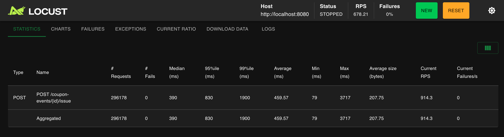

# 선착순 쿠폰 발급 — 통념을 측정으로 검증한 3가지 동시성 도구의 비교

## 왜 이 문제를 "통념을 의심하는 측정"으로 풀었나

선착순 쿠폰 발급은 **"동시성 제어가 필요하다"는 결론까지는 자명하지만, "어떤 도구를 쓸 것인가"는 자명하지 않은 영역**이다. 이 영역의 통념적 답은 다음과 같다.

> "비관적 락으로 시작하고, 부하가 높아지면 분산 락으로 확장한다."

이 답은 면접·교과서·블로그 글 어디에서나 발견된다. 그러나 통념이 옳다는 보장은 없으며, 특히 동시성 영역은 **도구의 추상화가 그 도구가 만드는 부하 패턴을 가린다**. SETNX 폴링이라는 단어 안에 숨은 fairness 문제, DB row lock이라는 단어 안에 숨은 kernel-level 큐의 효율성 — 이런 차이는 측정 없이는 보이지 않는다.

그래서 이 작업은 처음부터 **통념을 채택하지 않고, 후보 도구 모두를 동일 부하 환경에서 측정해 비교**하는 방식으로 설계했다. 결과적으로 가설을 세 번 갱신했고, 통념과 다른 답에 도달했다.

> 결론을 먼저 적는다 — 선착순 카운터의 답은 **Redis 원자 연산(DECR + Lua)** 이었다. 비관적 락도, 분산 락도 아니다. 이 글은 그 결론에 도달한 측정 과정과, 각 단계에서의 의사결정 근거를 정리한다.

---

## 문제의 본질 — "복합 트랜잭션의 원자성"이라는 영역

코드 구조를 먼저 본다.

```java
@Transactional
public void issueCoupon(User user, Long couponEventId) {
    CouponEvent event = findById(couponEventId);          // 1. 조회
    couponValidator.validateIssuable(event);              // 2. 활성/시작/만료 검증
    checkDuplicateIssue(user.getUserId(), couponEventId); // 3. 중복 발급 검증
    event.increaseIssuedCount();                          // 4. 카운터 증가 + SOLD_OUT 검증
    userCouponRepository.save(UserCoupon.create(...));    // 5. INSERT
}
```

이 5단계가 **묶여서 원자적으로 동작**해야 한다는 점이 핵심이다. 재고 차감(`UPDATE stock = stock - 1 WHERE stock >= 1`)처럼 한 줄의 SQL로 환원할 수 없다 — 검증 로직, 중복 체크, 카운터 증가, INSERT가 한 트랜잭션 안에 묶여야 한다.

이 특성이 **이 영역에 락이 필요한지 판단하는 첫 분기점**이다. 단일 row UPDATE라면 atomic UPDATE로 락 없이 풀 수 있지만, 복합 트랜잭션은 그게 불가능하다. 따라서 후보 도구는 다음 셋이다.

| 후보 | 동작 원리 | 통념상 평가 |
|------|----------|-----------|
| 비관적 락 (DB row lock) | DB가 트랜잭션 중 row를 잠금 | "정합성 ★★★, 동시성 ★" |
| 분산 락 (Redis SETNX 폴링) | 애플리케이션이 Redis로 직접 큐잉 | "다중 인스턴스 환경에서 우월" |
| Redis 원자 연산 (DECR + Lua) | Redis의 단일 스레드 모델로 경쟁 자체를 제거 | (선착순에 적용한다는 발상 자체가 후순위) |

세 후보 모두를 같은 부하로 측정해 데이터로 비교하는 것이 이 작업의 골격이다.

---

## 1차 시도 — 비관적 락 (베이스라인)

`SELECT ... FOR UPDATE` 로 같은 `CouponEvent` row 에 대한 동시 접근을 직렬화.

```java
CouponEvent event = couponEventRepository.findByIdWithLock(couponEventId);  // FOR UPDATE
```

### 측정 결과 — 500 user / 100 장


| 지표 | 값 |
|---|---|
| 누적 reqs | 296,178 |
| Fails | **0** ✅ |
| Avg | 459 ms |
| Median | 390 ms |
| Max | 3,717 ms |
| 안정 RPS | ~630 |
| **정합성** | **정확히 100 발급, 중복 0** ✅ |

[→ 측정 원본 HTML 리포트](reports/locust_coupon_pessimistic.html)

500 명이 296K 번 시도해서 *정확히 100 명만 발급*. 정합성은 완벽.

### 측정으로 드러난 비관적 락의 본질적 비용

- **Avg 459 ms** — 단순 발급 1건이 통상 수십 ms인 것 대비 수십 배
- **Max 3.7초** — 락 큐가 길어지면 꼬리 지연이 폭증
- **fast-fail 경로도 락을 점유** — SOLD_OUT 분기에 도달하려 해도 `SELECT FOR UPDATE`부터 잡고 들어가야 함

이 측정이 의미하는 바: **비관적 락은 정합성을 완벽히 보장하지만, 그 대가로 트랜잭션 길이만큼 락이 유지된다**. 이 비용은 단일 인스턴스에서도 가시화된다. 다음 단계로 분산 락을 평가하기로 결정 — 통념상 분산 락은 "DB 커넥션 대기를 Redis로 옮기므로" 더 나아야 한다는 가설이 있기 때문이다.

---

## 2차 시도 — 분산 락 (가설 → 반박)

### 가설

> *"분산 락은 락 대기를 Redis 에서 처리하므로 DB 커넥션을 점유하지 않는다. 다중 인스턴스 환경에서 진짜 가치를 발휘할 것이다."*

`@DistributedLock` AOP 로 SETNX + 50ms 폴링 방식 분산 락 구현. 트랜잭션 *바깥* 에서 락을 잡는 패턴 (락 대기를 DB 트랜잭션 밖으로 빼는 게 핵심).

```java
@DistributedLock(key = "'coupon:' + #couponEventId", waitMs=5000, leaseMs=3000)
public void issueCoupon(Long userId, Long couponEventId) { ... }
```

### 측정 결과 — *예상 못 한 충격*


| 지표 | 비관적 락 | **분산 락** | 변화 |
|---|---|---|---|
| RPS | 630 | **190** | **3.3 × 느림** ⬇ |
| Avg | 459 ms | **2,084 ms** | **4.5 × 느림** ⬇ |
| **5xx (락 timeout)** | **0** | **24.7 %** | ∞ |
| 정합성 | 100/0 | 100/0 | 동일 |

[→ 측정 원본 HTML 리포트](reports/locust_coupon_distributed.html)

→ ***모든 차원에서 분산 락이 더 나쁨***. 게다가 24.7 % 가 *5xx 응답* — 5초 안에 락 못 받고 거절됨.

### 원인 분석 — "도구의 추상화가 가린 fairness 문제"

`@DistributedLock(SETNX 폴링)`이라는 추상화 안에는 다음 메커니즘이 숨어 있다.

| 메커니즘 | DB 비관적 락 | SETNX 폴링 분산 락 |
|---------|------------|-------------------|
| 큐잉 위치 | DB kernel | 애플리케이션 스레드 |
| 큐잉 방식 | FIFO 자동 | 50ms 간격 능동 폴링 |
| Fairness | 보장 | **보장 안 됨** — 운에 따라 결정 |

즉 SETNX 폴링은 **kernel-level FIFO 큐를 application-level 능동 경쟁으로 대체**한 구조다. 폴링 간격이 50ms이므로 운 나쁜 사용자는 5초 안에 한 번도 락을 못 받아 timeout으로 거절된다.

이 결과는 통념(`분산 락이 DB 락보다 낫다`)을 단일 인스턴스 측정에서 정량적으로 반박한다. 그러나 **단일 인스턴스 측정의 결론을 그대로 일반화하는 것은 부정확**하다. 분산 락의 진짜 가치 영역은 다중 인스턴스 환경의 DB 커넥션 보호이고, 그건 다중 인스턴스 측정으로만 드러난다.

이 시점에서 의사결정 — **"분산 락 폐기"가 아니라 "다중 인스턴스 환경에서 재측정"** 으로 결정. 단일 환경에서의 결론으로 일반화하는 것이 더 큰 위험이기 때문이다.

---

## 다중 인스턴스 환경 구축 — *측정 D 의 발견*

같은 머신에 4 개 JVM (port 8080~8083) + nginx LB (port 8090) 로 다중 인스턴스 시뮬레이션. 같은 부하로 분산 락 재측정.

### 측정 결과 — *예상 못 한 401*



| 지표 | 값 |
|---|---|
| Fails | **72,130 (85.5 %)** ⚠⚠ |
| **에러 종류** | **status=401 → 99.97 %** |

[→ 측정 원본 HTML 리포트 (세션 호환 문제 발견)](reports/locust_coupon_multi_distributed_session_failure.html)

**대부분이 401 UNAUTHORIZED**. *분산 락 timeout 이 아님*. 직접 추적해보니:

```
8080 에 로그인 → cookie 받음 → Tomcat 메모리에 세션 저장
다음 요청 → nginx hash → 8081 로 routing → 8081 메모리에 세션 *없음* → 401
```

→ ***Tomcat 메모리 세션은 다중 인스턴스에서 동작 안 함***. 측정으로 발견한 *대용량 서버 아키텍처의 필수 요건*.

### 의사결정 — 측정의 부산물로 발견된 아키텍처 결함, 즉시 해결

이 발견은 락 비교 측정의 부산물이지만, **대용량 트래픽 서버라는 시스템 포지셔닝과 정면으로 충돌하는 결함**이다. 측정을 위해서가 아니라 **시스템 자체의 정합성을 위해** 즉시 해결해야 한다.

해결 비용도 평가에 포함된다 — Redis 인프라가 이미 있고(캐시 / 분산 락 용도), Spring Session 추가는 의존성 한 줄, 설정 두 줄, 어노테이션 하나로 끝난다. **비용 대비 가치가 압도적으로 유리**하므로 별도 작업으로 미룰 이유가 없다.

```gradle
implementation 'org.springframework.session:spring-session-data-redis'
```

```java
@EnableRedisHttpSession  // ← 이거 빠뜨리면 동작 안 함 (첫 시도 함정)
@SpringBootApplication
public class StylehubApplication { ... }
```

### 재측정 — 4 셀 매트릭스 완성

#### 분산 락 (다중 인스턴스 + Spring Session)


[→ 측정 원본 HTML 리포트](reports/locust_coupon_multi_distributed_with_session.html)

#### 비관적 락 (다중 인스턴스 + Spring Session)


[→ 측정 원본 HTML 리포트](reports/locust_coupon_multi_pessimistic.html)

#### 4 셀 매트릭스

| 환경 | 비관적 락 | 분산 락 (SETNX 폴링) |
|---|---|---|
| 단일 인스턴스 | RPS **630** / 0 fails ✅ | RPS 190 / 24.7 % fails |
| 다중 인스턴스 + Spring Session | RPS **526** / 0.04 % fails ✅ | RPS 195 / 28.4 % fails |

→ ***모든 4 셀에서 비관적 락이 우월***. 다중 인스턴스에서도 분산 락은 195 RPS 천장 (Redis 단일 키 SETNX 폴링이 한계). 가설 *"다중 인스턴스 가면 분산 락이 빛난다"* 정량 반박.

### 운영 관점의 부수적 발견 — "rolling deploy의 락 메커니즘 일관성"

다중 인스턴스 측정 중 의도하지 않은 정합성 깨짐을 관찰했다. 4 인스턴스 중 8080만 옛 jar(분산 락 코드)로 동작 중이었던 시점이었다.


| 항목 | 결과 |
|---|---|
| 한도 | 100 |
| issued_count (DB 카운터) | 47 |
| **uc_count (실제 발급)** | **500** ⚠⚠ |

[→ 측정 원본 HTML 리포트 (혼합 환경 사례)](reports/locust_coupon_multi_mixed_lock_failure.html)

500 명 *모두에게* 발급됨. *비관적 락 시리즈 최초의 정합성 깨짐*.

**원인**: 옛 8080(분산 락 사용 — DB 락을 잡지 않음)이 비관적 락 인스턴스의 트랜잭션이 끝나기 전에 같은 row를 일반 SELECT로 읽음 → REPEATABLE READ라 블록되지 않음 → `existsBy=false`로 통과 → Lost Update 발생.

이 발견의 운영 측면 일반 원리:

> **rolling deploy 시 락 메커니즘 변경은 정합성을 깨뜨릴 수 있다.** 락은 모든 참여 인스턴스가 같은 메커니즘을 사용해야만 정합성이 보장된다. 락 메커니즘 마이그레이션은 점진 배포가 아니라 **전체 인스턴스 동시 전환** 또는 **두 메커니즘이 호환되는 중간 단계**가 필요하다.

이 교훈은 동시성 도구의 비교 결과 자체와는 별개의 가치다. **운영 환경에서 락 메커니즘을 바꿀 때 어떤 함정이 있는가**의 직접 측정 사례로 남는다.

---

## 3차 시도 — Redis DECR + Lua atomic ⭐

### 자기 점검 — "통념과 반대 결과가 나오면 측정 자체와 가설의 범위를 의심한다"

여기까지의 결론은 **"비관적 락이 모든 환경에서 우월"** 이었다. 그러나 이 결론을 받아들이기 전에 메타적인 질문을 해야 한다.

> 통념(분산 락이 더 좋다)과 반대 결과가 나왔다는 것은 두 가지 중 하나를 의미한다.
> 1. 통념이 틀렸다 (이 영역에 한해서)
> 2. 측정한 도구가 통념의 대표가 아니다 (직접 만든 SETNX 폴링은 분산 락의 한 변종일 뿐)
>
> 그리고 더 근본적인 질문 — **이 영역에 락이 정말 필요한가**?

세 번째 질문이 결정적이다. **선착순 카운터는 본질적으로 "한도 100을 넘지 않는 카운터 차감"이고, 이는 락 없이 단일 atomic 연산으로 풀 수 있는 영역**이다. Redis는 단일 스레드 모델이므로 DECR이 그 자체로 race condition이 불가능하다. 카카오 / 우아한형제들 / 쿠팡 등이 선착순에 Redis 원자 연산을 쓰는 이유가 여기 있다.

이 시점에서 가설을 갱신했다 — **"락이 필요한 영역"이라는 처음의 분류 자체가 부정확했다.** 복합 트랜잭션의 원자성은 락이 아니라 **Redis Lua script로도 보장 가능**하다. 락 없이 푸는 길이 있다면, 락의 비용을 최적화하려는 모든 시도가 부차적이다.

### 코드 — Lua script 단일 atomic

```java
private static final RedisScript<Long> ISSUE_COUPON_SCRIPT = new DefaultRedisScript<>(
    "local counterKey = KEYS[1]\n" +
    "local issuedSetKey = KEYS[2]\n" +
    "local userId = ARGV[1]\n" +
    "local maxCount = tonumber(ARGV[2])\n" +
    "\n" +
    "if redis.call('SISMEMBER', issuedSetKey, userId) == 1 then\n" +
    "    return -2\n" +  // ALREADY_ISSUED
    "end\n" +
    "\n" +
    "if redis.call('EXISTS', counterKey) == 0 then\n" +
    "    redis.call('SET', counterKey, maxCount)\n" +  // lazy init
    "end\n" +
    "\n" +
    "local remaining = redis.call('DECR', counterKey)\n" +
    "if remaining < 0 then\n" +
    "    redis.call('INCR', counterKey)\n" +  // 음수면 즉시 복구
    "    return -1\n" +  // SOLD_OUT
    "end\n" +
    "\n" +
    "redis.call('SADD', issuedSetKey, userId)\n" +
    "return remaining\n",
    Long.class
);
```

핵심 설계:

| 결정 | 이유 |
|---|---|
| **락 제거** | Redis 가 single source of truth — DB 락 불필요 |
| **Lua 단일 atomic** | 중복 검증 + DECR + SADD 를 *Redis 한 호출* 로 묶음 — race 불가능 |
| **음수 시 INCR back** | DECR 가 음수 반환 시 즉시 복구 — 카운터 정확성 |
| **DB 는 기록만** | UserCoupon INSERT 만 (동기화 책임 X) |

### 측정 결과 — *완벽*


| 메커니즘 | 단일 인스턴스 | 다중 인스턴스 | 5xx | 정합성 |
|---|---|---|---|---|
| 비관적 락 | RPS 630 / Avg 459 ms | RPS 526 / Avg 490 ms | 0 / 0.04 % | ✅ |
| 분산 락 (SETNX 폴링) | RPS 190 / Avg 2,084 ms | RPS 195 / Avg 2,168 ms | 24.7 % / 28.4 % | ✅ |
| **Redis DECR + Lua** ⭐ | — | **RPS 640+ / Avg 402 ms** | **0** ⭐ | **✅** |

[→ 측정 원본 HTML 리포트 (시리즈 정점)](reports/locust_coupon_redis_decr_lua.html)

***모든 차원에서 우월***:
- RPS: 비관적 락 +22 %, 분산 락 +228 %
- 5xx: 0 (락 timeout 자체 없음 — 락이 없으니까)
- Avg: 분산 락의 1/5
- 정합성: 100 % (Lua atomic)

### + 비동기 저장 — DB INSERT 응답에서 분리

Redis DECR 후 UserCoupon INSERT 는 *Spring Event + @Async* 로 백그라운드 처리. 응답 즉시 반환, DB 동기화는 백그라운드.

```java
public void issueCoupon(User user, Long couponEventId) {
    // ... Lua atomic 동일
    eventPublisher.publishEvent(new CouponIssuedEvent(...));  // 비동기
}

@Async("couponInsertExecutor")
@EventListener
public void handleCouponIssued(CouponIssuedEvent event) {
    userCouponRepository.save(UserCoupon.create(...));  // 백그라운드
}
```


[→ 측정 원본 HTML 리포트](reports/locust_coupon_redis_decr_async.html)

> 단일 머신 측정에서는 RPS 큰 폭 향상은 안 보였다 (DB INSERT 가 진짜 병목이 아님). 다만 *피크 흡수 / DB 자원 분리 / 장애 격리* 가치 + Redis source of truth 패턴의 깔끔함으로 채택.

### 왜 모든 차원에서 우월한가 — "경쟁을 푸는 것이 아니라 제거하는" 설계

세 도구의 본질적 차이는 다음과 같이 정리된다.

| 메커니즘 | 경쟁 처리 방식 | 비용의 출처 |
|---------|--------------|-----------|
| 비관적 락 | DB row lock 큐로 직렬화 | 트랜잭션 길이만큼 락 점유 |
| 분산 락 (SETNX 폴링) | 애플리케이션 폴링으로 직렬화 | 폴링 grain(50ms) + fairness 손실 |
| **Redis DECR + Lua** | **경쟁 자체를 제거** | DECR 단일 호출 (~ms) |

Redis의 본질적 가치는 "락의 위치를 옮긴다"가 아니라 **"단일 스레드 atomic 모델로 경쟁 상황 자체를 불가능하게 만든다"** 는 데 있다. DECR은 두 클라이언트가 동시에 호출해도, Redis 안에서 순서가 결정되므로 락이 없어도 race가 발생하지 않는다.

이 통찰이 통념을 뒤집은 결정적 지점이다. **락이 필요한 영역에서 락을 최적화하려는 사고**(비관적 락 → 분산 락의 통념적 흐름)와, **락이 정말 필요한지부터 다시 묻는 사고**는 본질적으로 다른 차원의 의사결정이다.

---

## 시나리오 검증 — *부하 패턴별 정합성*

Redis DECR + Lua 가 *모든 부하 패턴* 에서 안전한지 5 가지 시나리오로 검증.

| # | 시나리오 | reqs | fails | Median | 정합성 |
|---|---|---|---|---|---|
| 1 | 50 user / 100 장 | 5,288 | **0** | **7 ms** | ✅ |
| 2 | 200 user / 100 장 | 15,306 | **0** | 89 ms | **100/100 ✅** |
| 3 | 500 user / 1000 장 | 10,510 | **0** | 410 ms | **500/500 ✅** (SOLD_OUT 0) |
| 4 | 만료 fast-fail (50 user) | 7,381 | **0** | **6 ms** ⚡ | 0/0 ✅ |
| 5 | 시작전 fast-fail (50 user) | 8,213 | **0** | **7 ms** ⚡ | 0/0 ✅ |
| 6 | **1000 user / 1000 장** | 73,419 | 1.42 % | 700 ms | **1000/1000 ✅** |

### 발견 — *fast-fail 경로 정량 입증*

| 케이스 | Median | 비교 |
|---|---|---|
| 정상 발급 (200 user / 100 장) | 89 ms | 기준 |
| 만료 fast-fail | **6 ms** | **15 × 빠름** ⚡ |
| 시작 전 fast-fail | **7 ms** | **13 × 빠름** ⚡ |

`validateIssuable()` 의 fast-fail 설계가 *측정으로 정량 입증*. 정상 처리보다 10~15 배 빠르게 거절.

---

## 결론 — "동시성 도구의 일반해는 없다, 영역마다 다르다"

```
초기 통념: 비관적 락 → 부족하면 분산 락
                  ↓
1차 측정: 비관적 락 = 정합성 OK, 그러나 트랜잭션 길이만큼 락 비용 (Avg 459 ms)
                  ↓
2차 측정: 분산 락 (SETNX 폴링) = 모든 차원에서 더 나쁨 (RPS 1/3, 24.7% 5xx)
                  ↓
3차 측정: 다중 인스턴스 환경 (4 인스턴스 + Spring Session) → 결론 동일
                  ↓
가설 갱신: "이 영역에 락이 정말 필요한가?"
                  ↓
4차 시도: Redis DECR + Lua = 압도적 우월 (RPS 640, 5xx 0, 정합성 100%)
```

이 작업이 도달한 메타 결론: **동시성 영역에 일반해는 없다. 영역의 본질적 특성에 맞는 도구를 찾아야 한다.**

| 영역 | 답 | 본질적 이유 |
|------|------|------------|
| 재고 차감 (단일 row UPDATE) | atomic UPDATE | DB가 단일 SQL을 atomic으로 처리 |
| 결제 멱등성 (외부 API + 다단계) | DB 비관적 락 | 외부 API 응답 시간 동안 일관된 컨텍스트 유지 필요 |
| **선착순 쿠폰 (카운터 차감)** | **Redis DECR + Lua** | Redis 단일 스레드 모델이 경쟁 자체를 제거 |

세 영역은 **표면적으로는 모두 "동시성 제어"** 지만, 본질적 특성이 다르므로 도구도 달라야 한다. 통념(비관적 락 → 분산 락)을 영역에 무관하게 적용하면, 이번 케이스처럼 **이미 통념의 첫 단계가 best일 수도 있고, 통념이 가리키는 두 도구 모두 더 나쁜 답일 수도 있다**.

---

## 측정의 한계 — 결론의 적용 범위 명시

이 글의 결론은 **이번 측정 환경에서의 답**이다. 결론을 일반화할 때 어떤 영역이 검증되지 않았는지를 명확히 해야 한다.

| 측정한 것 ✅ | 측정하지 않은 것 ⚠ |
|---|---|
| RPS / 응답시간 / 5xx | 수평 확장성 (수십 인스턴스) |
| 정합성 invariant | 장애 내성 (chaos test, Redis 장애) |
| 4셀 락 메커니즘 비교 | Redisson RLock 같은 성숙한 분산 락 구현 |
| 5가지 부하 패턴 | Redis Cluster 환경 |
| fast-fail 정량 입증 | 장기 안정성 (수 시간 부하) |

특히 **"비관적 락이 분산 락보다 빠르다"** 는 결과는 단일 머신 + 직접 구현한 SETNX 폴링 환경의 결과다. **Redisson(pub/sub 기반 fair lock)** 으로 바꾸면 결과가 달라질 가능성이 있고, 분산 락의 진짜 가치 영역(대용량 트래픽 + 다중 머신 + DB 자원 보호)도 별도 측정이 필요하다.

이 한계 명시 자체가 결론의 신뢰도를 결정한다. **"모든 환경에서 Redis DECR이 답"** 이 아니라 **"현재 운영 환경(단일 ~ 수 인스턴스)에서는 Redis DECR이 답이고, 더 큰 환경으로 갈 때 재측정이 필요"** 라는 한정적 결론이 정직한 답이다.

---

## 정리 — "통념을 의심하는 측정"이 가져다준 세 가지 가치

이 작업이 도달한 결론보다 더 중요한 것은, **그 결론에 도달한 의사결정 프로세스**다. 만약 통념(분산 락이 다음 단계)을 그대로 채택했다면 다음 세 가지 손실이 발생했을 것이다.

1. **잘못된 도구의 도입** — 선착순 영역에서 더 나쁜 분산 락이 production에 들어가 시스템 24%가 5xx를 발생
2. **진짜 답의 미발견** — Redis DECR이라는 본질적 해결책은 통념의 시야 밖에 있어 영영 발견되지 않음
3. **장애 원인의 미궁화** — "왜 성능이 나빠졌지?"의 답을 추적하기 어려운 상태로 시스템 운영

이 작업이 검증한 세 가지 설계 원칙:

- **통념의 결론을 채택하기 전에 측정으로 검증한다** — 통념은 평균적 답일 뿐, 특정 영역의 best일 보장이 없다
- **반박 결과가 나오면 측정 자체와 가설의 범위를 동시에 의심한다** — 통념이 틀렸을 수도, 측정이 부정확할 수도 있다
- **결론에는 적용 범위를 명시한다** — "어떤 환경에서 어떤 한계 안에서 검증된 결론인가"가 결론의 신뢰도를 결정한다

측정 기반 의사결정의 본질적 가치는 **잘못된 방향을 측정으로 차단하고, 통념의 시야 밖에 있는 더 나은 답을 발견하는 것**이다. 이 사이클을 한 번 통과한 영역(선착순 쿠폰)은 다음에 비슷한 동시성 영역을 만났을 때, 같은 통념의 함정에 다시 빠지지 않는 면역을 갖는다.

---

## 함께 보기

- [주문결제-성능측정.md](주문결제-성능측정.md) — 재고 차감 영역의 atomic UPDATE 전환
- [상품조회블로그성능.md](상품조회블로그성능.md) — 읽기 부하 + 캐시 계층화
- [선착순쿠폰-동시성측정.md](선착순쿠폰-동시성측정.md) — 풀버전 (1,900 줄, 측정 사이클 전체 + 한계 명시)
- 측정 시나리오 정의: [성능테스트-시나리오.md](../performance/성능테스트-시나리오.md)
- Redis 분산 락 인프라 코드: `DistributedLock.java`, `DistributedLockAspect.java`
