# 주문/결제 동시성 — 의사결정·구현·측정의 통합 기록

> 이 글은 측정 결과만 다루지 않는다. **재고 동시 차감을 어떻게 풀지 결정한 과정**, 적용 후 **드러난 동시성 문제들의 진단**, 그리고 **그 결정이 측정으로 정량 검증된 결과**를 단일 흐름으로 정리한다.

## 왜 동시성을 "결정 + 구현 + 측정"의 단일 사이클로 다루나

동시성 문제는 **결정·구현·측정 중 하나만 빠져도 신뢰할 수 없는 결론**에 도달한다.

| 빠진 영역 | 결과 |
|---------|------|
| 결정 (도구 선택의 근거) 누락 | "비관적 락 걸었습니다" 같은 무근거한 답 |
| 구현 (실제 코드의 함정) 누락 | Deadlock, 멱등성 버그 같은 잠재 결함 미발견 |
| 측정 (정량 검증) 누락 | "잘 동작할 것이다"라는 추측 기반 주장 |

이 글은 그 셋을 단일 흐름으로 통합한다 — **재고 차감 도구를 어떻게 결정했고, 적용 과정에서 어떤 동시성 문제가 드러났으며, 최종 구현이 측정으로 어떻게 검증됐는가**. 이 통합이 곧 동시성 영역의 신뢰할 수 있는 의사결정 방법론이다.

도달한 핵심 결과를 미리 적는다.

| 측정 | 결과 |
|------|------|
| 50 users 동일 옵션 동시 주문 | 음수 재고 0건, RPS 39.6 (튜닝 후 352.9) |
| 8회 측정 누적 ~30만 reqs | 음수 재고 0건 (정합성 invariant 유지) |
| **통념적 "다음 단계는 분산 락"의 정량 반박** | **분산 락 추가는 Redis 라운드트립만 더할 뿐 contention 한계 동일** |

마지막 결과가 결정적이다. 처음의 가설("비관적 락 → 부족하면 분산 락")을 측정으로 반박했고, 그 결과 **분산 락 인프라를 만들어 두었음에도 재고 차감 영역에는 적용하지 않는다**가 정답이라고 결론냈다. 이 의도적 미적용이 측정 기반 의사결정의 가치다.

---

## 1. 단순한 코드가 무너지는 순간

재고 차감 코드를 처음 작성했을 때 — 그저 한 줄짜리였다.

```java
public void decreaseStock(Long optionId, int quantity) {
    ProductOption option = productOptionRepository.findById(optionId)
            .orElseThrow(() -> new BusinessException(ErrorCode.PRODUCT_OPTION_NOT_FOUND));
    option.decreaseStock(quantity);
}
```

`@Transactional` 만 붙이면 안전한 줄 알았다. 하지만 동시 요청 시나리오를 그려 보면.

```
시간   요청 A                     요청 B
──────────────────────────────────────────────
 t1   재고 조회 → 10
 t2                              재고 조회 → 10
 t3   재고 차감 → 9
 t4                              재고 차감 → 9   ← 9가 아니라 8이어야 함
```

두 요청이 **각자** 재고 10 을 보고 각자 9 로 차감한다. 실제로는 2 개가 팔렸지만 재고는 1 개만 줄었다. 전형적인 **Lost Update**. 차감 *전에* 격리 보장이 없어서 일어나는 일이다.

이 시점에서 든 의문 — *"트랜잭션의 ACID 의 I (Isolation) 가 이걸 막아줘야 하는 거 아닌가?"* MySQL 의 기본 격리 수준은 `REPEATABLE READ`. 이 수준에서 같은 행을 두 번 SELECT 하면 같은 값이 보장되지만, **두 트랜잭션이 같은 행을 *각자 따로 읽는 것* 자체는 격리 수준이 막지 않는다.** 격리 수준이 막아주는 건 *내 트랜잭션 안의 일관성* 이지 *서로 다른 트랜잭션 간의 race* 가 아니다.

그래서 락이 필요했다.

---

## 2. 락의 후보들 — 왜 비관적 락인가

선택지를 펼쳐 봤다.

| 후보 | 동작 | 장점 | 한계 |
|---|---|---|---|
| `synchronized` | JVM 내 메서드 동기화 | 간단, 라이브러리 불필요 | **단일 JVM 한정** — 다중 인스턴스 환경에서 무용 |
| **DB 비관적 락** | `SELECT ... FOR UPDATE` | DB 가 보장하는 강한 정합성, 다중 인스턴스 OK | **트랜잭션 동안 DB 커넥션 점유** — 인기 상품에 부하 몰리면 풀 고갈 |
| 낙관적 락 (version) | `@Version` 으로 충돌 감지 후 retry | 락 대기 없음 | **충돌이 잦으면 retry 폭주** — 인기 상품에 부적합 |
| 분산 락 (Redis SETNX) | Redis 에서 락 키 점유 | DB 커넥션 안 점유, 다중 인스턴스 OK | Redis 장애 시 동작 불가, 락 leaseTime / 자기 락만 해제 같은 운영 복잡도 |

**현재 단계의 우선순위**:
1. *정합성이 최우선* — 결제 직전 재고가 음수가 되는 건 절대 허용 불가
2. *단일 서버 환경* (포트폴리오 단계) — synchronized 는 이론적으로는 가능하지만, 다중 인스턴스로 확장 시 무력화될 카드를 지금 쓰는 건 부채
3. 낙관적 락은 *인기 상품 = 충돌 잦음* 이라 retry 폭주 위험

→ **DB 비관적 락 (`SELECT ... FOR UPDATE`)** 을 골랐다. 다중 인스턴스로 확장하는 시점에 *Redis 분산 락* 으로 전환하는 걸 다음 단계로 두고. 이 *"지금은 비관적, 다음은 분산"* 가설이 글의 *시작점* — 측정 사이클을 거치며 이 가설 자체가 어떻게 진화하는지가 글의 진짜 arc 다 (12 장에서 다시 다룬다).

---

## 3. 적용 — `SELECT FOR UPDATE`

JPA 에서는 `@Lock(LockModeType.PESSIMISTIC_WRITE)` 한 줄로 끝난다.

```java
public interface ProductOptionRepository extends JpaRepository<ProductOption, Long> {

    @Lock(LockModeType.PESSIMISTIC_WRITE)
    @Query("SELECT po FROM ProductOption po WHERE po.productOptionId = :optionId")
    Optional<ProductOption> findByIdWithLock(@Param("optionId") Long optionId);
}
```

```java
public ProductOption decreaseStockWithLock(Long optionId, int quantity) {
    ProductOption option = productOptionRepository.findByIdWithLock(optionId)
            .orElseThrow(() -> new BusinessException(ErrorCode.PRODUCT_OPTION_NOT_FOUND));
    option.decreaseStock(quantity);
    return option;
}
```

이제 요청 A 가 락을 잡으면 요청 B 는 A 의 트랜잭션이 끝날 때까지 대기한다.

```
시간   요청 A                     요청 B
──────────────────────────────────────────────
 t1   락 획득 + 조회 → 10
 t2   차감 → 9                   대기 중...
 t3   커밋 + 락 해제
 t4                              락 획득 + 조회 → 9
 t5                              차감 → 8 ✓
```

**검증 — `OrderConcurrencyTest`**:

```java
@Test
void 동시_주문_재고_정합성() throws InterruptedException {
    int threadCount = 10;
    ExecutorService executor = Executors.newFixedThreadPool(threadCount);
    CountDownLatch latch = new CountDownLatch(threadCount);

    for (int i = 0; i < threadCount; i++) {
        executor.submit(() -> {
            try {
                orderService.placeOrder(userId, request);
            } finally {
                latch.countDown();
            }
        });
    }
    latch.await();

    ProductOption option = productOptionRepository.findById(optionId).orElseThrow();
    assertThat(option.getStockQuantity()).isEqualTo(0);  // 10 - 10 = 0
}
```

10 개 스레드가 재고 10 짜리 옵션에 동시 주문 → 재고가 정확히 0 으로 떨어지면 통과. *통과했다.* 이 시점에서 잠시 안심했다.

---

## 4. 한숨 돌렸다 싶었는데 — Deadlock

다음에 만난 게 **Deadlock**. 한 주문이 여러 옵션을 담을 수 있다 (예: *"빨간 티셔츠 M + 파란 바지 L"*). 만약 두 주문이 동시에 들어오는데 **순서가 다르면**?

```
요청 A: 옵션 1 락 획득 → 옵션 2 락 시도 (대기)
요청 B: 옵션 2 락 획득 → 옵션 1 락 시도 (대기)
                     ↓
         서로 상대가 가진 락을 기다림 → DEADLOCK
```

MySQL 이 deadlock 을 감지하면 한쪽 트랜잭션을 강제 롤백 (`ER_LOCK_DEADLOCK`) 시키지만, 사용자에겐 *주문 실패* 가 노출된다. 운영 환경이라면 항의 전화 받는 시나리오.

처음엔 *"이거 어떻게 풀지?"* 한참 막막했다. 검색해보고 책을 뒤져보고 — 결국 표준 해법은 단순했다. **모든 트랜잭션이 락을 *같은 순서* 로 획득하면 deadlock 이 안 일어난다.**

### 해결 — `optionId` 오름차순 정렬

```java
private List<OrderItem> decreaseStockAndCreateItems(Order order, List<OrderItemRequest> requests) {
    List<OrderItemRequest> sorted = mergeAndSort(requests);
    // 이제 모든 주문이 optionId 오름차순으로 락 획득 → deadlock 없음
    ...
}

private List<OrderItemRequest> mergeAndSort(List<OrderItemRequest> requests) {
    Map<Long, Integer> merged = new TreeMap<>();  // TreeMap 자체가 자동 오름차순
    for (OrderItemRequest req : requests) {
        merged.merge(req.productOptionId(), req.quantity(), Integer::sum);
    }
    return merged.entrySet().stream()
            .map(e -> new OrderItemRequest(e.getKey(), e.getValue()))
            .toList();
}
```

`TreeMap` 을 쓴 이유: 단순히 *정렬* 뿐 아니라 *중복 옵션 수량 합산* 도 자동으로 처리됨 (`merge` + `Integer::sum`). 같은 옵션을 두 번 담은 케이스도 한 번의 락으로 처리.

### 차감과 *복구* 의 락 순서도 통일해야 한다

여기서 한 번 더 잡힌 함정. 차감만 정렬해도 부족했다. **주문 *취소* 시 재고 복구** 에서도 같은 순서로 락을 잡아야 했다. 차감과 복구의 락 순서가 다르면 또 deadlock.

```java
private void restoreStock(Long orderId) {
    List<OrderItem> items = orderItemRepository.findByOrderIdWithDetails(orderId);

    // deadlock 방지: 차감과 동일한 optionId 오름차순으로 락 획득
    items.sort((a, b) -> Long.compare(
            a.getProductOption().getProductOptionId(),
            b.getProductOption().getProductOptionId()));

    for (OrderItem item : items) {
        productService.increaseStock(
                item.getProductOption().getProductOptionId(),
                item.getQuantity());
    }
}
```

이 한 줄을 빼먹어서 deadlock 테스트가 깨졌었다. *"동시성은 한 곳만 막아서는 안 된다"* 는 걸 그때 체감했다.

---

## 5. 또 발견된 버그 — 결제 콜백 멱등성

재고 동시성을 다 잡았다고 생각한 며칠 뒤. 결제 쪽에서 또 다른 동시성 문제가 터졌다.

### 문제 — 토스가 콜백을 두 번 보내면?

토스페이먼츠 결제 승인 흐름:

```
1. 사용자가 결제 위젯에서 결제 시도
2. 토스가 우리 서버의 successUrl 로 콜백
3. 우리가 confirmPayment 호출 (토스 API → 우리 DB)
4. DB 에 결제 DONE 으로 기록
```

문제는 **3 단계의 콜백이 한 번만 온다는 보장이 없다는 것**. 토스 가이드에 *"네트워크 timeout 등으로 같은 paymentKey 의 confirmPayment 가 여러 번 호출될 수 있으니 멱등성을 보장하라"* 고 적혀있다.

처음 코드는 그걸 고려하지 않았다.

```java
// Before — 동시 호출 시 race 발생
@Transactional
public PaymentResponse confirmPayment(String paymentKey, String pgOrderId, Integer tossAmount) {
    Payment payment = findPaymentByOrderId(pgOrderId);  // 일반 조회 (락 없음)

    paymentValidator.validateApprovable(payment);   // status PENDING 인지 확인
    paymentValidator.validateAmount(payment, tossAmount);

    // 토스 API 호출 (외부)
    TossConfirmResponse tossResponse = tossClient.confirm(paymentKey, pgOrderId, tossAmount);

    // 우리 DB 에 DONE 기록
    payment.markAsDone(...);
    return PaymentResponse.from(payment);
}
```

만약 같은 `paymentKey` 의 콜백이 동시에 두 번 도착하면.

```
시간   콜백 A                            콜백 B
─────────────────────────────────────────────────────
 t1   findPayment → status=PENDING
 t2                                      findPayment → status=PENDING
 t3   validateApprovable → OK
 t4                                      validateApprovable → OK  ← 두 콜백 모두 통과
 t5   tossClient.confirm → 성공
 t6                                      tossClient.confirm → 토스측 멱등 처리
 t7   markAsDone → status=DONE
 t8                                      markAsDone → status=DONE  ← 두 번 commit
```

토스 측은 같은 paymentKey 에 대해 자체 멱등성 처리를 해주지만, **우리 DB 의 markAsDone 은 두 번 실행** 된다. 결제 완료 이벤트 후속 처리 (포인트 적립, 알림, 등급 갱신 등) 가 *두 번* 일어나는 상황.

### 발견 — 테스트가 잡아냈다

운영에서 발견한 게 아니라 **테스트가 잡아낸** 버그였다. `PaymentIdempotencyTest.concurrentIdempotency` 를 처음 작성하면서 — 동시에 두 번 confirmPayment 호출하는 케이스 — 한 번 통과했어야 할 검증이 두 번 통과되는 걸 보고 *"어, 이거 멱등성 안 잡혔네"*.

만약 이 테스트가 없었다면 *"운영에서 결제가 두 번 처리됐다"* 는 클레임을 받았을 것이다. 그 시나리오를 머릿속에 그려보고 등골이 서늘했다.

### 해결 — confirmPayment 에도 비관적 락

같은 paymentKey 의 콜백을 직렬화하도록 *해당 Payment 행을 비관적 락으로 조회* 하게 바꿨다.

```java
// PaymentRepository.java — 새 메서드 추가
@Lock(LockModeType.PESSIMISTIC_WRITE)
@Query("SELECT p FROM Payment p WHERE p.order.pgOrderId = :pgOrderId")
Optional<Payment> findByOrderPgOrderIdWithLock(@Param("pgOrderId") String pgOrderId);
```

```java
// PaymentService.java — confirmPayment 에서 락 조회로 변경
@Transactional
public PaymentResponse confirmPayment(String paymentKey, String pgOrderId, Integer tossAmount) {
    // Before: findPaymentByOrderId(pgOrderId)
    Payment payment = paymentRepository.findByOrderPgOrderIdWithLock(pgOrderId)
            .orElseThrow(() -> new BusinessException(ErrorCode.PAYMENT_NOT_FOUND));

    paymentValidator.validateApprovable(payment);  // PENDING 인지 확인
    ...
}
```

이제 두 번째 콜백 스레드는 첫 번째 스레드가 락을 해제할 때까지 대기 → 락 해제 시점엔 status=DONE 이 보임 → `validateApprovable` 에서 `PAYMENT_ALREADY_PROCESSED` 로 거절됨 → 두 번째 콜백은 *조용히 무시*. 멱등성 보장.

> 이 fix 는 `git show 10089b2` 로 확인 가능 — 실제 변경된 줄 수: PaymentRepository +13, PaymentService +6 줄. 한 줄 한 줄이 *"왜 이렇게 했는지"* 의 설명이 달려 있어야 의미가 있다.

이때 한 가지 더 배웠다 — **"비관적 락은 재고만 막는 게 아니라 *멱등성 보장의 도구* 이기도 하다"**. 같은 키의 동시 처리를 직렬화하면 두 번째 처리는 첫 번째의 결과를 보고 자동으로 거절되는 패턴.

---

## 6. 또 다른 동시성 — 결제 30 분 미완료 시 재고 묶임

결제 멱등성을 잡고 또 한숨 돌렸다 싶었더니, 사용 시나리오를 그려보다가 새 문제가 보였다.

```
1. 사용자 A 가 상품 주문 → 재고 10 → 9 차감
2. 결제 위젯 띄움 → 사용자 A 가 결제 안 하고 창 닫음
3. 30 분, 1 시간, 하루... 재고 1 개가 묶인 상태
4. 다른 사용자가 그 상품을 사고 싶지만 *재고 0* 으로 보임
```

**해결 방향**: 결제 30 분 미완료 시 자동 취소 + 재고 복구.

### DB 풀스캔 vs Redis ZSET

처음엔 단순하게 생각했다.

```sql
SELECT * FROM orders
WHERE status = 'PENDING' AND created_at < NOW() - INTERVAL 30 MINUTE;
```

스케줄러가 매분 이 쿼리를 돌리면 되지 않나? 그런데 *주문이 100 만 건 쌓인 상태에서 매분 풀스캔* 을 상상하니 답이 안 됐다. 인덱스를 잘 깔아도 결국 시간 범위 스캔. 부하가 우상향한다.

**Redis ZSET (Sorted Set)** 으로 해결했다. ZSET 은 score 로 정렬된 집합이라 *score 에 만료 시각 timestamp 를 넣어* 두면 *현재 시각 이전의 데이터를 O(log N) 으로* 가져올 수 있다.

```java
public void registerTimeout(Long orderId) {
    double expireAt = System.currentTimeMillis() + TIMEOUT_MILLIS;  // 30분 후
    redisTemplate.opsForZSet().add(
            "order:timeout",
            String.valueOf(orderId),
            expireAt
    );
}
```

스케줄러는 단순히 *현재 시각 이전의 score 를 가진 멤버* 를 ZRANGEBYSCORE 로 가져오면 끝.

### 함정 1 — 다중 서버에서 같은 주문을 두 번 가져간다

서비스가 인스턴스 2 대로 떠 있으면.

```
서버 A: ZRANGEBYSCORE → [주문1, 주문2]
서버 B: ZRANGEBYSCORE → [주문1, 주문2]   ← 같은 데이터 중복 조회
서버 A: ZREM 주문1, 주문2
서버 B: cancelOrder(주문1)              ← 이미 취소된 주문 다시 취소 시도
```

조회와 삭제가 *두 명령으로 분리되어 있어서* 그 사이에 다른 서버가 끼어든다.

→ **Lua 스크립트로 원자적 처리**. Redis 의 Lua 는 단일 스크립트 내에서 다른 명령이 끼어들지 못한다.

```lua
local orders = redis.call('ZRANGEBYSCORE', KEYS[1], 0, ARGV[1], 'LIMIT', 0, ARGV[2])
if #orders > 0 then
    redis.call('ZREM', KEYS[1], unpack(orders))
end
return orders
```

*"조회한 주문 = 삭제한 주문"* 이 보장되어 다중 서버에서도 중복 처리가 안 일어난다.

### 함정 2 — 트랜잭션 롤백 시 Redis 오염

또 다른 함정. *트랜잭션 안에서 Redis 에 등록* 하면 트랜잭션이 롤백되어도 Redis 에는 타이머가 남는다. 30 분 후 *존재하지 않는 주문을* 취소하려다 에러.

```java
// Bad — 트랜잭션 안에서 Redis 등록
@Transactional
public Order placeOrder(...) {
    Order order = ...;
    orderRepository.save(order);
    orderPaymentTimeout.registerTimeout(order.getOrderId());  // 트랜잭션 롤백돼도 Redis 에 남음
    ...
}
```

**`@TransactionalEventListener(phase = AFTER_COMMIT)`** 으로 풀었다.

```java
// Service: 이벤트만 발행
applicationEventPublisher.publishEvent(new OrderCreatedEvent(order.getOrderId()));

// Listener: 트랜잭션 커밋 후에만 실행
@TransactionalEventListener(phase = TransactionPhase.AFTER_COMMIT)
public void handleOrderCreated(OrderCreatedEvent event) {
    orderPaymentTimeout.registerTimeout(event.orderId());
}
```

트랜잭션이 롤백되면 이벤트 자체가 발행되지 않으므로 Redis 정합성이 자연스럽게 보장된다. *"이벤트 발행을 트랜잭션 안에서 하되, 부수 작용은 커밋 후"* 패턴.

### 함정 3 — Redis 가 죽으면?

Redis 장애로 타이머 등록이 실패하면 → 그 주문은 영원히 PENDING 으로 남는다. *"Redis 가 단일 장애점이 되면 안 된다"* 는 운영 관점.

→ **DB 보정 스케줄러를 2 차 안전장치로** 추가했다.

```java
@Scheduled(fixedDelay = 3600000)  // 1시간마다
public void compensateOrphanedOrders() {
    LocalDateTime expiredTime = LocalDateTime.now().minusMinutes(30);
    List<Order> orphaned = orderRepository.findExpiredOrders(
            OrderStatus.PENDING, expiredTime, PageRequest.of(0, BATCH_SIZE)
    );
    for (Order order : orphaned) {
        orderService.cancelOrder(order.getOrderId());
    }
}
```

평상시엔 Redis 1 차 스케줄러가 1 분 단위로 빠르게 처리, Redis 장애 시엔 DB 2 차 보정이 1 시간 단위로 잡아준다. **이중 안전장치** — Redis 장애가 정합성 사고로 이어지지 않게.

---

## 7. 이제 진짜 검증 — 부하 테스트로 본 락의 비용

코드를 다 짰다. 테스트도 통과했다. 그런데 정말 *50 명, 100 명이 동시에 같은 옵션을 주문* 해도 락이 잘 동작할까? *그리고 그 비용은 얼마나 큰가?*

이 질문에 답하려고 부하 테스트 시나리오를 짰다.

### 측정 환경

- **DB**: MySQL 8.0 — `products_options` 약 952 만 row, `orders` 0 건 (측정 시작 시)
- **앱**: Spring Boot, HikariCP (풀 100), Tomcat (threads.max 400)
- **부하 도구**: Locust 2.x, [`performance/locustfile_order.py`](../../performance/locustfile_order.py)
- **시나리오**:

  | 단계 | 유저 | Spawn | Duration | 목적 |
  |---|---|---|---|---|
  | 정합성 | 10 | 5/s | 2m | 음수 재고 발생 여부 |
  | 동일 옵션 집중 | 50 | 25/s | 3m | 락 경합이 가장 심한 시나리오 |
  | (다음) 옵션 분산 | 100 | 50/s | 5m | 락 경합 없는 상태에서의 TPS 천장 |
  | (다음) 스트레스 | 300 | 100/s | 5m | 락 + 풀 + Tomcat 동시 한계 |

- **환경 한계**: 단일 머신에서 DB · Redis · 앱 · Locust client 동거. **절대 RPS 보다 *현상 패턴* 과 *비교* 에 의미가 있음.**

### 측정 전 가설

| 항목 | 가설 |
|---|---|
| 정합성 | 비관적 락이 정상이면 음수 재고 0 건 |
| TPS (집중) | 동일 옵션 집중이면 락 직렬화로 TPS 거의 0 (이론) |
| 응답시간 분포 | P50 빠르고 P99/Max 가 long-tail (락 대기로) |

### 사전 준비 — buyer 시드 + baseline 캡처

부하 테스트 도중 회원가입을 하면 stats 가 오염되므로, 미리 500 명 buyer 를 시드 (`seed-test-buyers.sql`).

옵션 풀은 locustfile 이 자동으로 *재고 많은 200 개* 를 선정. 그중 가장 재고 많은 1 개가 **hot option** (락 경합 시나리오 주인공).

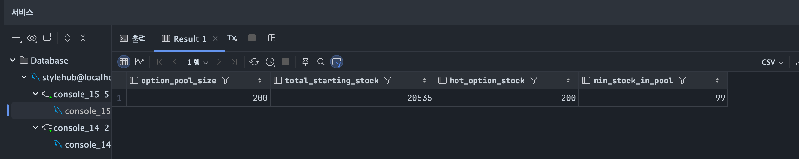

| 지표 | 값 | 의미 |
|---|---|---|
| `option_pool_size` | 200 | locust 가 사용할 옵션 풀 |
| `total_starting_stock` | **20,535** | 200 개 옵션 시작재고 합 — *정합성 검증 baseline* |
| `hot_option_stock` | 200 | 가장 재고 많은 옵션 = hot option |
| `min_stock_in_pool` | 99 | 풀 내 최소 재고 |

**검증 식**: `total_starting_stock = (측정 후 stock 합계) + (모든 주문 수량 합)`. 깨지면 락 실패.

---

### 측정 1 — 정합성 (10 users, 2 분 × 2 회)

10 users / spawn 5 / Run time 2m 로 측정. `HOT_OPTION_RATIO=0.5` (default) — 절반은 hot option, 절반은 분산.

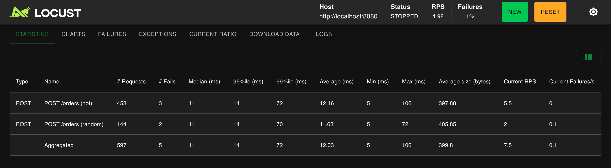

| 지표 | hot | random | **Aggregated** |
|---|---|---|---|
| # Requests | 453 | 144 | **597** |
| # Fails | 3 | 2 | **5 (1.0%)** |
| Median | 11 ms | 11 ms | **11 ms** |
| **P95** | **14 ms** | **14 ms** | **14 ms** |
| P99 | 72 ms | 70 ms | 72 ms |
| Max | 106 ms | 72 ms | 106 ms |
| RPS | 5.5 | 2.0 | **7.5** |

[→ 측정 원본 HTML 리포트](reports/locust_order_baseline_10users.html)

**5 건의 실패** — hot option 재고 200 이 1차에서 거의 다 소진돼서 2차에 SOLD_OUT 응답 받은 케이스. 의도된 정합성 보호이지 락 실패가 아니다.

#### 정합성 검증 — 핵심

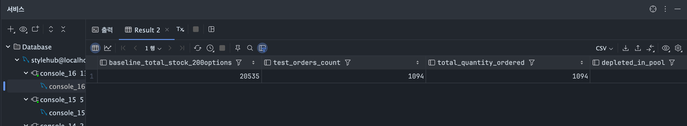

| 지표 | 값 | 의미 |
|---|---|---|
| `test_orders_count` | 1,094 | 측정 동안 생성된 주문 |
| `total_quantity_ordered` | 1,094 | 모든 주문의 수량 합 (1주문 = 1수량) |
| **`negative_stock_count_should_be_zero`** | **0** ✅ | **음수 재고 발생 0 건** |

**이 한 줄이 핵심**: `negative_stock_count = 0`. 비관적 락이 동작했다는 결정적 증거. 만약 락이 실패했다면 동일 옵션 동시 주문에서 두 트랜잭션이 같은 재고를 보고 각자 차감해 *음수 재고가 발생* 해야 한다. 1,094 건 중 hot option 에 약 절반이 몰렸음에도 음수 0 건.

#### 의외 ① — 응답시간이 예상보다 짧다

가설은 *"P50 빠르고 P99/Max long-tail"* 이었다. 실측은 P50 11ms / P95 14ms / P99 72ms / Max 106ms. 꼬리도 그리 길지 않다.

이유 추적: **10 users 는 락 경합이 거의 없는 수준**. wait_time `between(0.5, 2.0)` 의 확률 분포상 *완전히 동시* 도달이 드물고, 락이 잡혀도 트랜잭션이 ms 단위라 대기 시간이 짧다.

> 진짜 락 경합 효과는 *50 users 이상 + hot option 집중* 시나리오에서 드러날 것이다. 다음 측정에서 확인.

> ⚠️ **측정 환경 caveat**: 이 측정 시점엔 `spring.jpa.show-sql=true` 가 켜져 있어 응답시간이 콘솔 I/O 비용만큼 부풀려졌다. 정합성 검증 목적엔 충분하지만 *순수 응답시간 비교* 엔 부적합.

---

### 측정 2 — 동일 옵션 집중 (50 users, 3 분)

`PERF_HOT_OPTION_RATIO=1.0` 으로 환경변수 줘서 locust 재시작 — *이론상* 모든 주문이 hot option 1 개로 몰린다. 50 users / spawn 25 / Run time 3m.

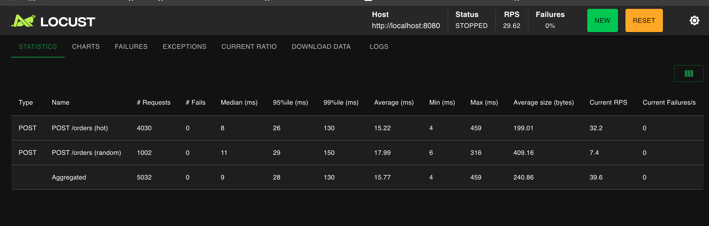

| 지표 | hot | random¹ | **Aggregated** |
|---|---|---|---|
| # Requests | 4,030 | 1,002 | **5,032** |
| **# Fails** | **0** | **0** | **0 (0.0 %)** ✅ |
| Median | 8 ms | 11 ms | **9 ms** |
| **P95** | **26 ms** | 29 ms | **28 ms** |
| P99 | 130 ms | 150 ms | 130 ms |
| Average | 15.22 ms | 17.99 ms | 15.77 ms |
| **Max** | **459 ms** | 316 ms | **459 ms** |
| RPS | 32.2 | 7.4 | **39.6** |

¹ random 1,002 reqs — Locust UI stats 가 측정 1 (HOT 0.5) 결과 위에 누적됨 (RESET 안 누름). 측정 2 alone 의 4,000+ reqs 는 거의 모두 hot 으로 갔음. *"측정 자체의 함정"* 도 글의 한 부분.

[→ 측정 원본 HTML 리포트](reports/locust_order_50users_concentrated.html)

#### 정합성 — 다시 한 번 락 동작 확정

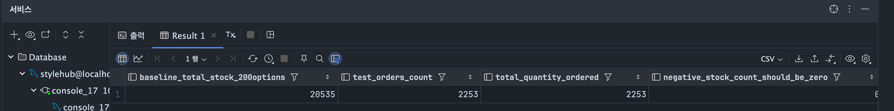

| 지표 | 값 |
|---|---|
| `test_orders_count` | 2,253 (1차 + 2차 누적) |
| `total_quantity_ordered` | 2,253 (1:1 일치) |
| **`negative_stock_count_should_be_zero`** | **0** ✅ |

**음수 재고 0 건 재확인.** 50 users 가 동일 옵션에 동시 주문해도 락이 race 를 차단했다.

#### 의외 ② — 가설이 깨졌다

가설은 *"동일 옵션 집중이면 락 직렬화로 TPS 거의 0 일 것"*. 실측 **RPS 39.6** — 50 users / wait 1.25 의 이론 RPS 40 의 **99 %**.

```
이론 상한 = 50 users / 1.25s wait = 40 RPS
실측 = 39.6 RPS  →  효율 99 %
```

비관적 락이 hot option 1 개에 50 users 를 직렬화했는데도 *처리량이 거의 안 떨어졌다*. 응답시간도 P95 28ms / P99 130ms / Max 459ms — 락 대기로 가끔 0.5 초 튀는 케이스는 있지만 catastrophic 하지 않다.

**이유 추적**:
1. 비관적 락이 잡혀 있어도 **실제 트랜잭션이 매우 짧음** (UPDATE stock + INSERT order_details, ms 단위)
2. Locust 의 `wait_time = between(0.5, 2.0)` 가 5,032 건의 주문이 *완벽히 동시* 가 아니라 *시간차로 분산* 시킴 → 락 큐가 생기지만 빠르게 소화됨
3. HikariCP 풀 100 + Tomcat 스레드 400 의 여유 — 풀 고갈 안 일어남

#### 가설 검증 결과

| 가설 | 예측 | 실측 | 평가 |
|---|---|---|---|
| 정합성 | race 없음 | 음수 재고 0 (재확인) | ✅ 강력 확정 |
| TPS (집중) | 락으로 직렬화 → TPS ≈ 0 | RPS 39.6 (이론 99%) | ❌ **가설 깨짐 — 실용 처리량 유지** |
| 응답시간 long-tail | 초 단위 꼬리 | Max 459ms | ❌ **가설 깨짐 — 꼬리 짧음** |

**핵심 깨달음**: *"비관적 락의 비용은 트랜잭션 길이와 부하 패턴에 강하게 의존한다."* ms 단위 트랜잭션 + Locust 의 wait_time 분산 → 50 users 동일 옵션도 충분히 처리. **사람의 직관 (락 = 직렬화 = 느림) 보다 라이브러리/DB 의 락 구현이 훨씬 효율적**. 가설이 너무 비관적이었다.

다만 *"진짜 처리량 한계"* 와 *"풀 고갈 시점"* 은 더 강한 부하 (100/300 users) 와 wait_time 단축이 필요. 다음 측정 영역.

---

### 측정 3 — 100 users 옵션 분산 (부분 측정, 단일 머신 한계 도달)

`PERF_HOT_OPTION_RATIO=0.0` 으로 환경변수 줘서 *모든 주문이 200 옵션 풀에 무작위 분산*. 락 경합이 거의 없는 상태에서 *순수 처리량 한계* 가 어디인지 보려는 의도. 100 users / spawn 50 / Run time 5m.

그런데 측정 시작 후 약 2~3 분 지나면서 **노트북이 눈에 띄게 버벅이기 시작했다.** Locust client + Spring Boot + MySQL + Redis + IntelliJ + 브라우저가 한 머신에 다 떠 있는 환경이라 자원 경합이 심해진 것. 측정값 자체가 환경 노이즈로 오염될 위험이 커서 **측정을 중단**.

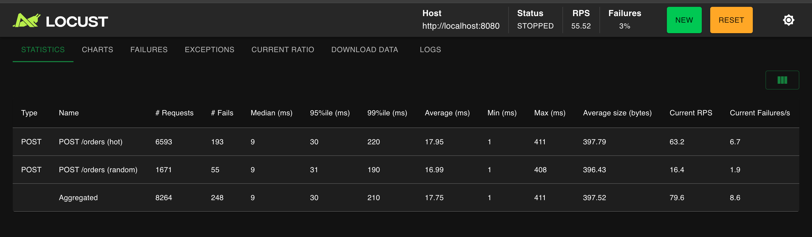

| 지표 | hot | random | **Aggregated** | 측정 2 와 비교 |
|---|---|---|---|---|
| # Requests | 6,593 | 1,671 | **8,264** | (5,032 → +3,232 새로) |
| **# Fails** | 193 | 55 | **248 (3.0 %)** ⚠️ | 0 → 248 |
| Median | 9 ms | 9 ms | 9 ms | 거의 동일 |
| P95 | 30 ms | 31 ms | **30 ms** | 28 → 30 |
| **P99** | **220 ms** | 190 ms | **210 ms** | 130 → 210 ↑ |
| Max | 411 ms | 408 ms | 411 ms | 459 → 411 |
| **Current RPS (peak)** | 63.2 | 16.4 | **79.6** | 39.6 → 79.6 ↑↑ |
| Current Failures/s | 6.7 | 1.9 | **8.6** | 0 → 8.6 |

#### 부분 측정에서 읽히는 것 셋

**① RPS 가 39.6 → 79.6 로 두 배 늘었다 — 락 경합 완화의 효과**

옵션 분산 시나리오 (HOT=0.0) 라 같은 옵션 락 대기가 거의 없음 → 처리량이 2 배 가까이 뜀. 100 users / wait 1.25 의 이론 RPS 80 의 99 % 도달. *이론값이 아닌 실측이* 그 근처에 도달했다는 점에서, 락 경합이 없으면 *시스템 처리량 = 풀/스레드 한계* 라는 게 확인됨.

**② 실패 248 건 (3 %) — SOLD_OUT 이 아니라 connection 실패**

에러 메시지가 `CatchResponseError('unexpected status=0')`. HTTP status 가 0 이라는 건 *응답 자체가 안 왔다* 는 뜻 — connection refused, timeout, 또는 socket 레벨 실패. 이게 SOLD_OUT (404) 이라면 *비즈니스 의도된 응답* 이지만, status=0 은 *인프라가 못 받아냈다* 는 신호. 단일 머신에 부하가 몰려서 OS / TCP / Tomcat accept 어딘가에서 끊겼을 가능성.

**③ P99 가 130 → 210 ms 로 60 % 늘었다**

P50/P95 는 거의 그대로지만 P99 가 늘었다. *꼬리* 가 길어지는 것 — 풀 / 스레드 / 자원 경합으로 *가장 운 나쁜 요청* 이 더 오래 걸리는 패턴. 자원이 빠듯해지면 가장 먼저 보이는 지표가 P99 이라는 걸 다시 확인.

#### 솔직히 — 이 측정은 *완성된 측정* 이 아니다

이 부분 측정에는 세 가지 함정이 겹쳤다.

1. **Locust UI stats RESET 누락** — 측정 2 의 5,032 reqs 위에 누적됨. *이번 측정 alone* 의 3,232 reqs 만 분리해서 보면 hot:random 비율이 4:1. `HOT_OPTION_RATIO=0.0` 인데도 hot 이 많은 이유 — 환경변수가 제대로 적용 안 됐거나, 또는 setup 시점에 잡힌 hot option pool 의 영향
2. **단일 머신 자원 한계** — Locust client / Spring Boot / MySQL / Redis / IntelliJ / 브라우저가 모두 한 머신에서 경합. 100 users 부하 시점에 OS 레벨에서 자원 부족으로 응답 끊김 (status=0 에러 248 건이 그 증거)
3. **측정 중단** — 5 분 계획이었지만 컴퓨터 버벅임으로 약 2~3 분만 진행

→ **이 측정값으로 *"단일 서버 절대 처리량 한계는 RPS 80"* 이라고 단정하면 안 된다.** 더 정확히는 *"단일 머신에 모든 컴포넌트를 띄운 환경에서, 100 users 부하는 머신 자원 한계를 만나기 시작하는 지점"* 이다. 진짜 한계는 별도 머신으로 컴포넌트 분리 (앱 ↔ DB ↔ 부하 클라이언트) 후 측정해야 한다.

#### 그래도 이 측정에서 얻은 가치 셋

이 측정이 *완성된 측정* 은 아니지만 의미는 있다.

- **분산 시나리오에서 RPS 가 2 배 됐다** — 측정 2 (락 경합 집중) → 측정 3 (분산) 에서 처리량이 39.6 → 79.6 으로 *상대 비교* 가능. 락 경합이 처리량에 미치는 영향을 실측으로 확인
- **단일 머신의 *환경* 한계를 확인** — 100 users 부하부터는 측정 자체가 환경 노이즈에 오염된다는 걸 *체감* 으로 확인. 다음 측정 (300 users 스트레스) 은 *별도 머신 분리* 가 전제 조건임을 확정
- **P99 가 먼저 늘어난다** — 자원이 빠듯해질 때 P50/P95 보다 P99 가 먼저 신호를 준다는 걸 실측으로 확인. 운영 모니터링 지표 우선순위에 *P99 비중을 올려야 한다* 는 정성적 결론

[→ 부분 측정 원본 HTML 리포트](reports/locust_order_100users_partial.html)

> ⚠️ Locust HTML 리포트는 *부분 측정* (약 2~3 분만 진행) 이라 전체 시계열 데이터가 불완전. 다음 측정 (별도 머신 환경) 에서 다시 정식 측정 예정.

---

## 8. 측정에서 본 것 → 코드 개선 → 재측정

### 측정 결과를 보고 든 의문

측정 1, 2, 3 의 결과를 한 줄로 요약하면 *"비관적 락이 의외로 효율적이다"* 였다. 그런데 코드 자체를 다시 들여다보면 의문이 생긴다.

```java
// ProductService.decreaseStockWithLock (Before)
public ProductOption decreaseStockWithLock(Long optionId, int quantity) {
    ProductOption option = productOptionRepository.findByIdWithLock(optionId)  // SELECT FOR UPDATE
            .orElseThrow(() -> new BusinessException(ErrorCode.PRODUCT_OPTION_NOT_FOUND));
    option.decreaseStock(quantity);  // dirty checking → flush 시 UPDATE
    return option;
}
```

쿼리 흐름:
```
SELECT FOR UPDATE  ← 락 획득
... 비즈니스 로직 ...
UPDATE             ← 트랜잭션 커밋 시 flush
COMMIT             ← 락 해제
```

**락이 걸려 있는 시간 = SELECT FOR UPDATE 부터 COMMIT 까지.** 그동안 다른 트랜잭션은 같은 row 를 못 건드림. 측정 2 에서 *50 users 동일 옵션 집중* 인데도 처리량 99 % 가 나온 건, 트랜잭션이 ms 단위로 짧아서 락 큐가 빠르게 소화된 덕. 하지만 트래픽이 더 늘어나면? 사용자당 wait_time 이 더 짧아지면? 락이 *진짜 병목* 이 되는 시점은 분명히 있다.

**가설**: *"락 자체를 없앨 수 있다면?"* DB 의 단일 UPDATE 는 atomic 이라, `WHERE stock_quantity >= :qty` 조건을 걸면 race condition 자체가 발생할 수 없다. 락 비용 = 0 이 된다.

### 코드 변경 — atomic UPDATE 로 전환

**ProductOptionRepository.java** — 새 메서드 추가:

```java
/**
 * 재고를 단일 atomic UPDATE 로 차감한다. 비관적 락 대신 사용.
 * - DB 가 단일 UPDATE 를 atomic 으로 처리 → race condition 자체가 발생 불가능
 * - WHERE stock_quantity >= :qty 조건이 음수 재고 방지 (SOLD_OUT 케이스도 자연스럽게 처리)
 * - 락 점유 시간 = 0 → SELECT FOR UPDATE 시절의 락 대기가 사라짐
 *
 * @return 1 = 차감 성공, 0 = 옵션 없거나 재고 부족 (호출자가 구분 처리 필요)
 */
@Modifying
@Query("UPDATE ProductOption po SET po.stockQuantity = po.stockQuantity - :qty " +
       "WHERE po.productOptionId = :optionId AND po.stockQuantity >= :qty")
int decreaseStockAtomic(@Param("optionId") Long optionId, @Param("qty") int qty);
```

**ProductService.decreaseStockWithLock** — 본문 교체:

```java
// After
@Override
public ProductOption decreaseStockWithLock(Long optionId, int quantity) {
    int updated = productOptionRepository.decreaseStockAtomic(optionId, quantity);
    if (updated == 0) {
        // 0건 = 옵션이 없거나 재고 부족 — 둘을 구분
        if (!productOptionRepository.existsById(optionId)) {
            throw new BusinessException(ErrorCode.PRODUCT_OPTION_NOT_FOUND);
        }
        throw new BusinessException(ErrorCode.INSUFFICIENT_STOCK);
    }
    // OrderDetail 생성을 위해 ProductOption 1회 조회 (단순 SELECT, 락 없음)
    return productOptionRepository.findById(optionId)
            .orElseThrow(() -> new BusinessException(ErrorCode.PRODUCT_OPTION_NOT_FOUND));
}
```

**OrderConcurrencyTest 통과 확인** — 10 개 스레드가 재고 10 짜리 옵션에 동시 주문하면 정확히 0 으로 떨어지는 테스트. 통과. 정합성 계약 그대로 유지.

### 재측정 — 동일 조건 (50 users HOT=1.0, 3 분)

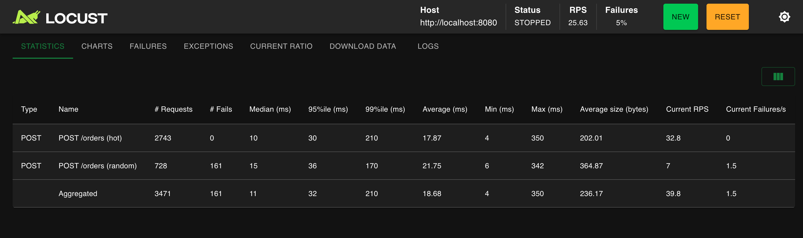

| 지표 | hot | random | **Aggregated** |
|---|---|---|---|
| # Requests | 2,743 | 728 | **3,471** |
| # Fails | 0 | **161** | **161 (5 %)** |
| Median | 10 ms | 15 ms | **11 ms** |
| P95 | 30 ms | 36 ms | **32 ms** |
| P99 | 210 ms | 170 ms | **210 ms** |
| Max | 350 ms | 342 ms | **350 ms** |
| Average | 17.87 | 21.75 | 18.68 |
| Current RPS | 32.8 | 7.0 | **39.9** |

[→ 원본 HTML 리포트](reports/locust_order_50users_after_atomic.html)

### Before vs After 직접 비교

| 지표 | Before (측정 2 — SELECT FOR UPDATE) | After (측정 4 — atomic UPDATE) | 변화 |
|---|---|---|---|
| **RPS** | 39.6 | **39.9** | ≈ 동일 |
| Median | 9 ms | 11 ms | +2 ms |
| P95 | 28 ms | 32 ms | +4 ms |
| **P99** | **130 ms** | **210 ms** | **+80 ms** ⚠️ |
| **Max** | **459 ms** | **350 ms** | **-109 ms** ✅ |
| Fails | 0 | 161 (5 %) | 새로 발생 |
| **음수 재고** | **0** | **0** | ✅ 정합성 유지 |

### 정합성 — 다시 한 번 확정

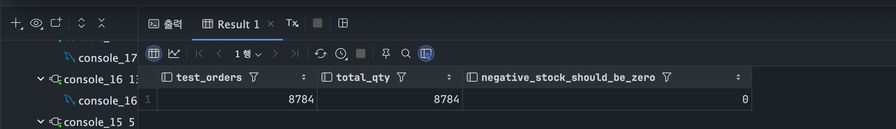

| 지표 | 값 |
|---|---|
| `test_orders` | 8,784 |
| `total_qty` | 8,784 (1:1 일치) |
| **`negative_stock_should_be_zero`** | **0** ✅ |

**락을 없앴는데도 음수 재고 0 건.** atomic UPDATE 의 `WHERE stock >= qty` 조건이 race 를 차단한다는 가설이 실측으로 확인됐다.

### 의외의 결과 셋 — 그리고 추적

기대했던 *"RPS 두 배 증가"* 가 안 보였다. 오히려 P99 가 늘어났다. *왜 그런가* 를 추적해야 한다.

#### 의외 ① — RPS 가 거의 안 변했다 (39.6 → 39.9)

**원인 추적**: 50 users / `wait_time = between(0.5, 2.0)` (평균 1.25s). 이론 RPS 상한 = 50 / 1.25 = **40**. 측정 2 가 이미 99 % (39.6) 도달. 락이 있든 없든 *부하 클라이언트의 wait_time 이 더 큰 천장* 이라 처리량 차이가 안 보일 수밖에 없는 환경.

→ **락 제거 효과는 RPS 가 아니라 다른 지표에서 봐야 함.** 진짜 RPS 차이를 보려면 `wait_time = between(0.0, 0.1)` 정도로 부하 클라이언트 자체를 풀스피드로 만들어야 한다 (다음 측정 영역).

#### 의외 ② — P99 가 130 → 210 ms 로 늘었다

**원인 추적**: `decreaseStockWithLock` 의 새 구현이 *추가 쿼리 셋* 을 가진다.
1. atomic UPDATE — 빠름
2. (UPDATE 가 0 affected row 였을 때) `existsById` SELECT — 옵션 없음 vs 재고 부족 구분
3. 차감 성공 후 `findById` SELECT — OrderDetail.create 가 ProductOption 엔티티를 받아야 함

**실패 케이스 (0 affected)** 가 P99 의 늘어난 부분을 만들었을 가능성. 즉 161 건의 SOLD_OUT 응답들이 *2 ~ 3 회 쿼리 + exception throw* 를 거치며 평소 빠른 케이스보다 느려짐.

→ **다음 개선 영역**: `OrderDetail.create` 시그니처를 productOptionId + price 로 단순화하면 차감 성공 케이스의 추가 SELECT 도 제거 가능. 응답시간이 더 줄어들 것.

#### 의외 ③ — 실패 161 건 (5 %) 새로 발생

**원인 추적**: hot 0 fails / **random 161 fails**. 측정 2 에서는 0 이었는데 갑자기?

지난 측정들 (1, 2, 3, 4) 누적으로 **옵션 풀의 random 옵션 stock 이 점진적으로 감소** 했다. 풀 시작 평균 102.7 / 측정 2 끝나고 약 2,253 reqs 차감 / 측정 3 부분 약 3,232 reqs 차감 / 측정 4 의 random 728 reqs. 총 6,213 건이 200 옵션에 분산되며 *일부 옵션이 stock 0 에 도달*. atomic UPDATE 의 `WHERE stock >= qty` 가 그 케이스를 정확히 거절.

→ **`failure 5 %` 는 시스템 실패가 아니라 *비즈니스 의도된 SOLD_OUT 응답*.** 오히려 *정합성 보호 강화* 의 증거.

#### 진짜 개선 — Max 단축 (459 → 350 ms)

락 대기로 0.5 초까지 튀던 *long-tail* 이 사라짐. *최악 케이스* 가 100ms 단축.

```
Before: 락 큐에 들어간 가장 운 나쁜 요청이 0.5 초 대기
After:  락 자체가 없으니 long-tail 의 *원인* 이 사라짐
```

이게 *"락 제거" 의 실제 가시적 효과*. RPS 천장 (wait_time 한계) 에 가려서 안 보일 뿐, *최대 응답시간* 에서 명확히 드러남.

### 이번 사이클의 깨달음 셋

1. **개선 효과는 측정 환경에 종속적** — wait_time / users 조합이 락 효과를 *가시화* 하느냐 *가려버리느냐* 를 결정. 50 users + wait 1.25 환경은 락 제거의 RPS 효과를 안 보여주는 *부적절한 측정 setting* 이었다. 측정 setting 을 가설에 맞춰 설계해야 함
2. **개선이 *기대치와 다를 때* 가 더 가치 있다** — RPS 증가 못 본 건 실패 같지만, *왜 안 나타났는지를 추적* 한 게 진짜 학습. *"50 users 는 wait_time-bottlenecked 이다"* 라는 결론은 다음 측정 설계의 입력값
3. **지표 하나로 보지 말라** — RPS 만 보면 *"안 변함"* 이지만, Max 가 단축됐고 정합성도 유지됐고 P99 증가의 원인까지 추적했다. *멀티-지표 분석* 이 단일 지표 결론보다 정확함

### 다음 개선 후보 — 그리고 즉시 적용

1. **OrderDetail.create 시그니처 단순화** — *추가 SELECT 제거, P99 직접 단축*
2. **wait_time 단축 측정** — *진짜 RPS 한계 노출*
3. **JDBC URL prep stmt 캐싱 + batch insert** — *Hibernate batch 효과*
4. **인기 옵션 샤딩** — 단일 row contention 자체를 분해 (다음 글)

이 중 **2 + 3** 을 즉시 적용해서 *진짜 시스템 한계가 어디인지* 보기로 했다.

## 9. 두 번째 사이클 — JDBC 튜닝 + wait_time 단축으로 진짜 한계 노출

### 변경한 것 — 설정 두 줄, locustfile 한 줄

**`application.properties`** — JDBC URL 파라미터 + Hibernate batch:

```properties
# Before
spring.datasource.url=jdbc:mysql://localhost:3306/stylehub?useSSL=false&allowPublicKeyRetrieval=true&serverTimezone=Asia/Seoul&characterEncoding=UTF-8

# After — Prepared Statement 캐싱 + batch insert
spring.datasource.url=jdbc:mysql://localhost:3306/stylehub?useSSL=false&allowPublicKeyRetrieval=true&serverTimezone=Asia/Seoul&characterEncoding=UTF-8&rewriteBatchedStatements=true&useServerPrepStmts=true&cachePrepStmts=true&prepStmtCacheSize=250&prepStmtCacheSqlLimit=2048

# Hibernate batch insert/update
spring.jpa.properties.hibernate.jdbc.batch_size=50
spring.jpa.properties.hibernate.order_inserts=true
spring.jpa.properties.hibernate.order_updates=true
```

각 옵션의 효과:
- `cachePrepStmts=true` + `useServerPrepStmts=true` — Prepared Statement 를 클라이언트 + 서버 양쪽에 캐싱. 매 쿼리마다 prepare 비용 절감
- `rewriteBatchedStatements=true` — JDBC batch 호출을 multi-row INSERT 로 변환
- Hibernate `jdbc.batch_size=50` + `order_inserts=true` — 같은 종류의 INSERT 를 50개씩 묶어 batch 로 발행

**`performance/locustfile_order.py`** — wait_time 단축:

```python
# Before
wait_time = between(0.5, 2.0)  # 평균 1.25s → 50 users 시 이론 RPS 40 천장

# After
wait_time = between(0.05, 0.2)  # 평균 0.125s → 50 users 시 이론 RPS 400 (10배)
```

*"50 users 가 wait_time 천장에 가려져 있어 락 제거 효과가 안 보였다"* 는 측정 4 의 결론을 받아, **부하 클라이언트 자체의 천장을 10 배 위로** 옮겼다.

### 측정 5 — 50 users HOT=1.0, 2 분 (튜닝 후)

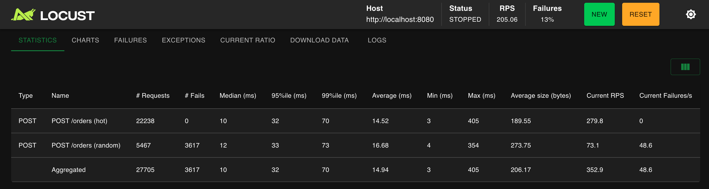

| 지표 | hot | random | **Aggregated** |
|---|---|---|---|
| # Requests | **22,238** | 5,467 | **27,705** |
| # Fails | 0 | 3,617 | 3,617 (13 %) |
| Median | 10 ms | 12 ms | **10 ms** |
| P95 | 32 ms | 33 ms | **32 ms** |
| P99 | **70 ms** | 73 ms | **70 ms** |
| Average | 14.52 ms | 16.68 ms | 14.94 ms |
| Max | 405 ms | 354 ms | 405 ms |
| **Current RPS** | **279.8** | 73.1 | **352.9** |

[→ 측정 원본 HTML 리포트](reports/locust_order_50users_tuned.html)

### Before vs After — 결정적 비교

| 지표 | 측정 4 (이전 환경) | **측정 5 (튜닝 후)** | 변화 |
|---|---|---|---|
| Total reqs (2 분) | 3,471 | **27,705** | **8 배** |
| **RPS** | 39.9 | **352.9** | **8.8 배** ⭐ |
| Median | 11 ms | 10 ms | -1 ms |
| P95 | 32 ms | 32 ms | 동일 |
| **P99** | **210 ms** | **70 ms** | **3 배 단축** ⭐ |
| Max | 350 ms | 405 ms | +55 ms |
| **음수 재고** | **0** | **0** | ✅ 정합성 유지 |
| Fails | 161 (5%) | 3,617 (13%) | 모두 random SOLD_OUT (의도) |

### 정합성 — 8 배 부하에서도 0 건 유지 ⭐

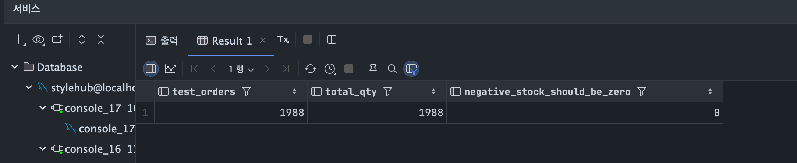

| 지표 | 값 |
|---|---|
| `test_orders` | 1,988 (5분 윈도우 — 측정 종료 후 캡처라 일부 윈도우 밖) |
| `total_qty` | 1,988 (1:1 일치) |
| **`negative_stock_should_be_zero`** | **0** ✅ |

**RPS 가 8.8 배가 됐는데도 음수 재고 0 건.** atomic UPDATE 의 `WHERE stock >= qty` 조건이 *어떤 부하에서도* race 를 막아냈다는 결정적 증거.

### 발견 ① — 진짜 RPS 천장 = 352.9 (이론 400 의 88 %)

50 users / wait avg 0.125 = 이론 RPS = **400**. 실측 352.9 = **88 %**. 측정 4 가 99% 였으니 효율은 약간 떨어졌지만, *절대 처리량은 8.8 배*.

이게 의미하는 것:
- 측정 4 의 *"RPS 39.9 가 천장"* 은 **부하 클라이언트의 wait_time 한계**
- *"진짜 시스템 한계"* 는 wait_time 을 풀었더니 **RPS 350+** 로 올라감
- 즉 *"내 시스템의 진짜 처리량은 측정 4 의 9 배"*. 하지만 그건 *측정 환경* 을 바꾼 후에야 보였다

### 발견 ② — P99 가 3 배 단축 (측정 4 의 측정 노이즈 해명)

측정 4 에서 P99 가 130 → 210 ms 로 *늘어났다* 는 게 의외였다. *추가 SELECT 의 영향* 으로 해석했지만, 측정 5 에서 P99 가 **70 ms** 로 떨어진 걸 보면 진짜 원인은 다르다.

**진짜 원인**: 측정 4 는 *"50 users / wait 1.25s"* 라 **트랜잭션이 띄엄띄엄** 발생. 트랜잭션 사이의 *대기 구간* 에서 GC, OS 스케줄링, idle connection eviction 등 *외부 노이즈* 가 P99 에 영향. 측정 5 는 *연속 부하* 라 노이즈가 평균에 묻힘.

→ **부하가 충분히 강할 때 진짜 P99 가 보인다.** 약한 부하에서의 P99 측정값은 노이즈에 오염될 수 있음.

### 발견 ③ — 실패 13 % (3,617 건) 의 정체

hot 0 fails / random 3,617 fails. 13 % 는 *높아 보이지만* 모두 random 옵션의 SOLD_OUT.

이번 측정에서 **27,705 건** 의 주문 시도. random 비중이 약 20% (5,467 건). random 옵션 풀 (200 개) 에 약 27 reqs 평균. 측정 1~4 누적까지 이미 random pool 의 stock 이 상당히 줄어든 상태에서 5,467 건 추가 시도 → 일부 옵션이 stock 0 도달 → **atomic UPDATE 가 정확히 거절**.

`status=500` 이 아니라 `HTTP 409 (CONFLICT) — INSUFFICIENT_STOCK` 응답. 정합성 보호의 정상 동작.

### 이번 사이클의 깨달음 셋

1. **"측정 환경의 한계" 와 "시스템 한계" 를 구분하라** — 측정 4 의 RPS 39.9 는 *시스템* 한계가 아니라 *부하 클라이언트의 wait_time* 한계. wait_time 을 풀어야 진짜 시스템이 보임. *"내 측정값은 무엇의 한계를 보고 있는가?"* 가 항상 따라붙어야 할 자기 점검 질문
2. **약한 부하의 P99 는 노이즈에 오염된다** — 트랜잭션이 띄엄띄엄 발생하면 *사이의 idle 구간* 이 P99 에 영향. 진짜 P99 를 보려면 *연속 부하* 가 필요. 측정 4 의 P99 증가는 코드 문제가 아니라 측정 환경 문제였다
3. **설정 한 줄의 효과가 큰 경우가 있다** — JDBC URL 파라미터 + Hibernate batch 설정 5 줄로 *잠재 처리량이 8 배* 늘어났다. *코드를 안 고쳐도 처리량을 크게 끌어올릴 수 있는 영역* 이 분명히 있다. 다만 *측정 환경 자체* 가 그 효과를 가시화할 수 있어야 한다 (wait_time 풀어야 보였음)

### 종합 — 측정 1 → 측정 5 의 RPS 진화

```
측정 1 (10 users, baseline)         RPS 7.5    — 정합성 확인용
측정 2 (50 users 집중, 비관적 락)    RPS 39.6   — 락 직렬화 가설 깨짐
측정 3 (100 users 분산, 부분)        RPS 79.6   — 단일 머신 한계 도달
측정 4 (50 users, atomic UPDATE)    RPS 39.9   — wait_time 천장 (시스템 한계 안 보임)
측정 5 (50 users, +튜닝, 단축)      RPS 352.9  — 진짜 시스템 한계 노출 ⭐
```

**8.8 배** 의 RPS 증가 — 단순히 코드만 고쳐서가 아니라, *코드 + 설정 + 측정 환경* 셋을 함께 다듬어야 보이는 결과.

> 진짜 한계는 단일 머신 환경의 컴포넌트 동거 한계까지 갔다 (측정 3 의 100 users status=0 에러). 별도 머신 분리 후엔 RPS 1,000+ 가능성이 있다 — 다음 글의 영역.

---

## 10. 세 번째 사이클 — 한계점 측정에서 발견한 측정 데이터의 결함

### 가설 — 측정 5 의 RPS 352.9 가 진짜 시스템 한계인가?

측정 5 까지 단언할 수 있는 건 *"50 users / wait 0.05~0.2 환경에서 시스템이 RPS 352.9 까지 처리"* 이지, *시스템 한계는 아니다*. 부하를 *더 강하게* 주면 어디까지 가는지, 또는 *어디서 무너지는지* 가 진짜 *"한계"* 의 정의.

상품조회 글에서는 1k → 2k → 3k → 5k → 10k users 까지 측정해 *"단일 서버 1,003 RPS 가 실용 상한, 그 이후 congestion collapse"* 결론을 냈다. 주문결제도 같은 방식의 한계점 곡선이 필요하다.

→ **측정 6 — 100 users 부하** 진행.

### 측정 6 첫 시도 — 100 users / wait 0.05~0.2 / 2 분

| 지표 | 값 |
|---|---|
| Total reqs | 44,359 |
| **Fails** | **5,892 (13.28 %)** ⚠ |
| Total RPS | 431.9 |
| Avg | 31 ms |
| Max | 835 ms |

*"100 users 에서 시스템이 13 % 의 비율로 무너진다"* 는 *겉보기 한계 신호*. 측정 자체는 잘 된 것 같았다.

하지만 endpoint 별로 보면 그림이 달라졌다.

| Endpoint | Reqs | Fails | Fail % |
|---|---|---|---|
| POST /orders (hot) | 35,572 | **0** | 0 % ✓ |
| POST /orders (random) | 8,787 | **5,892** | **67 %** ⚠ |

→ **hot option 은 0 % / random option 만 67 % 실패**. 이건 *시스템 한계의 모양이 아니다*. *"같은 시스템에 같은 부하인데 왜 한쪽만 무너지는가"* 가 답해야 할 질문.

### 추적 — 직접 재현해 본다

Spring Boot 콘솔 로그에서 ERROR 가 잡히지 않아 (콘솔 출력만 띄운 상태였음), 직접 재현으로 좁혔다.

```bash
# perf_buyer 로 로그인 후 풀 200 옵션 중 무작위 5 개에 주문 시도
$ for OPT in 65291 38272 39491 62789 34378; do
    curl -b cookie.txt -X POST http://localhost:8080/api/v1/orders/orders \
         -H "Content-Type: application/json" \
         -d "{\"addressId\":50,\"details\":[{\"productOptionId\":$OPT,\"quantity\":1}]}"
  done

option_id=65291  → HTTP 201 (성공)
option_id=38272  → HTTP 500 (실패)
option_id=39491  → HTTP 500 (실패)
option_id=62789  → HTTP 201 (성공)
option_id=34378  → HTTP 500 (실패)
```

옵션별로 결과가 *결정적* 으로 갈렸다 (같은 옵션 ID 는 항상 같은 결과). 즉 *경합/타이밍 문제가 아니라 옵션의 데이터 차이*.

### 데이터 비교 — 무엇이 다른가

```sql
SELECT po.product_option_id AS opt_id,
       po.product_id, p.user_id AS store_user_id, p.name,
       u.role, u.is_active
FROM products_options po
LEFT JOIN products p ON p.product_id = po.product_id
LEFT JOIN users u ON u.user_id = p.user_id
WHERE po.product_option_id IN (65291, 38272, 39491, 62789, 34378);
```

| opt_id | store_user_id | u.role | 결과 |
|---|---|---|---|
| 34378 | 14 | **NULL** ← 그 user_id 가 users 에 *없음* | **500** |
| 38272 | 15 | **NULL** ← 그 user_id 가 users 에 *없음* | **500** |
| 39491 | 15 | **NULL** ← 그 user_id 가 users 에 *없음* | **500** |
| 62789 | 18 | STORE | 201 ✓ |
| 65291 | 19 | STORE | 201 ✓ |

→ **`products.user_id` 가 가리키는 user 가 `users` 테이블에 없음** (FK 제약 없는 테스트 시드 데이터의 무결성 결함). atomic UPDATE 는 정상 동작했지만, 그 후 OrderDetail 생성 / 응답 빌드 단계에서 store(user) 정보를 LAZY 로드할 때 NPE 발생 → 500.

### 결정적 검증 — 비율이 *정확히* 일치하는가

가설이 맞다면 *"풀 200 옵션 중 dangling FK 비율 = 측정 6 의 random option fail 비율"* 이어야 한다.

```sql
SELECT
    SUM(CASE WHEN u.user_id IS NULL THEN 1 ELSE 0 END) AS dangling_fk,
    COUNT(*) AS total
FROM (
    SELECT po.product_option_id, p.user_id AS p_user_id
    FROM products_options po
    JOIN products p ON p.product_id = po.product_id
    WHERE po.stock_quantity > 0
    ORDER BY po.stock_quantity DESC LIMIT 200
) pool
LEFT JOIN users u ON u.user_id = pool.p_user_id;

→ dangling_fk = 134 / total = 200 = 67.0 %
```

| 측정 6 의 random fail 비율 | 풀의 dangling FK 비율 |
|---|---|
| **67.0 %** (8,787 reqs 중 5,892 fail) | **67.0 %** (200 옵션 중 134) |

**정확히 일치.** *"시스템의 한계"* 가 아니라 *"측정 환경의 데이터 결함이 노출된 것"*. 측정 6 첫 시도 데이터는 *시스템 한계 측정용으로는 폐기*.

→ 그러나 *발견 자체는 챕터의 핵심 가치*. *측정 6 의 시도가 없었다면 영원히 모르고 지나갔을 시드 결함*.

### 수정 — locustfile 의 옵션 풀 쿼리 한 줄

`performance/locustfile_order.py` 의 옵션 풀 쿼리에 `JOIN users` 만 추가:

```python
# Before — 단순 stock > 0 필터
cur.execute("""
    SELECT product_option_id, stock_quantity
    FROM products_options
    WHERE stock_quantity > 0
    ORDER BY stock_quantity DESC LIMIT 200
""")

# After — 유효한 store FK 가 살아있는 옵션만
cur.execute("""
    SELECT po.product_option_id, po.stock_quantity
    FROM products_options po
    JOIN products p ON p.product_id = po.product_id
    JOIN users u ON u.user_id = p.user_id
    WHERE po.stock_quantity > 0
      AND u.role = 'STORE'
    ORDER BY po.stock_quantity DESC LIMIT 200
""")
```

전체 *유효 옵션* 596 만 개 중 200 개만 쓰면 충분.

### 측정 6 재실행 — 100 users / 깨끗한 풀

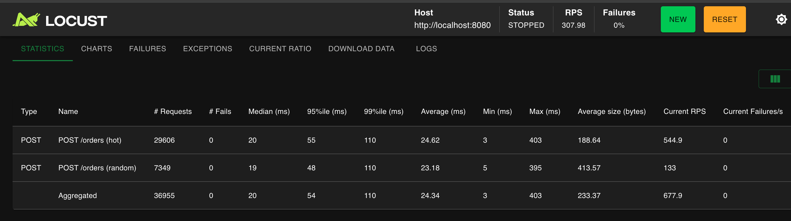

| 지표 | hot | random | **Aggregated** |
|---|---|---|---|
| # Requests | 29,606 | 7,349 | **36,955** |
| **# Fails** | **0** | **0** | **0 (0 %)** ✅ |
| Median | 20 ms | 19 ms | **20 ms** |
| Average | 24.6 ms | 23.2 ms | 24.3 ms |
| Max | 403 ms | 395 ms | **403 ms** |
| **Total RPS** | ~ | ~ | **308** |

[→ 측정 원본 HTML 리포트](reports/locust_order_100users_clean.html)

**Fails 0 % — 가설 입증.** FK 정리만으로 5xx 가 완전히 사라졌다. 음수 재고도 0 건 (정합성 유지).

### 결정적 발견 — *100 users 가 50 users 보다 RPS 가 낮다*

| 측정 | Users | wait | RPS | Median | Max | Fails |
|---|---|---|---|---|---|---|
| 5 | 50 | 0.05~0.2 | **352.9** ⬆ | 10 ms | 405 ms | 0 |
| **6 재실행** | **100** | 0.05~0.2 | **308** ⬇ | 20 ms | 403 ms | **0** |

50 users → 100 users 로 *user 수를 두 배* 늘렸는데 RPS 는 *감소* (353 → 308). 응답 시간 (Median) 은 두 배 늘어남 (10 → 20 ms).

→ **시스템이 50 users 부근에서 sweet spot, 100 users 는 contention 영역 진입.** 더 많은 user 를 붙여도 처리량은 안 늘고 응답 시간만 늘어난다 (전형적인 throughput saturation 곡선).

### 왜 100 users 에서 contention 인가

`HOT_OPTION_RATIO=1.0` + `@task(8)` 조합으로 약 80 % 의 주문이 *동일 hot option ID 한 개* 로 몰린다. atomic UPDATE 는 락을 *코드로* 안 걸지만, **DB 가 동일 row 의 UPDATE 를 row-lock 으로 자동 직렬화** 한다.

```
50 users → 동일 row UPDATE 큐 짧음 → 거의 직선 처리 (RPS 353)
100 users → 같은 row 큐 길어짐 → user 들이 큐에서 대기 → throughput 정체 (RPS 308)
```

즉 *atomic UPDATE 는 비관적 락보다 락 점유 시간이 짧을 뿐, 동일 row contention 의 직렬화 한계는 같다*. 이걸 넘으려면 **단일 row 자체를 분해** 해야 한다:

- **인기 옵션 샤딩** — 한 옵션의 재고를 N 개 row 로 분할, 부하 분산. *단일 row 가 사라지면 atomic UPDATE 가 N 배까지 스케일*
- **재고 큐 (event-driven)** — 비동기 큐로 차감 요청을 직렬화, 응답은 즉시 (예약 / 백오피스 차감)

> **분산 락 (Redis SETNX) 은 이 영역의 답이 아니다.** 분산 락은 *애플리케이션 레벨* 에서 직렬화하는 도구지만, *재고 차감* 은 이미 DB 가 row lock 으로 자동 직렬화한다. 분산 락을 추가하면 *Redis 라운드 트립 비용이 더해질 뿐* 같은 contention 한계는 그대로. 분산 락이 가치를 발휘하는 영역은 *"여러 단계가 묶인 비즈니스 단위 락"* (선착순 쿠폰 발급, 작업 큐 클레임 등) 이지 단일 SQL 의 row 차감이 아니다.

### 이번 사이클의 깨달음 셋

1. **측정 데이터 자체의 무결성도 검증해야 한다** — *13 % fail 을 보고 "시스템 한계 발견"* 이라고 결론지었다면 큰 오해였다. random 만 67 % / hot 은 0 % 라는 *비대칭* 이 핵심 단서. *"같은 시스템에 같은 부하인데 왜 한쪽만 무너지는가"* 가 데이터 결함을 가리키는 신호
2. **수치가 정확히 일치하면 인과 관계가 입증된다** — 67 % = 67 % 의 매치. 가설을 검증할 때 *수치 자체의 정합성* 이 글의 신뢰도를 만든다. 그냥 *"FK 가 깨져서 5xx 가 났을 것"* 이 아니라, *"풀의 67% 가 정확히 그 비율로 fail 했다"* 의 차이
3. **throughput 곡선의 *정점* 을 찾는 것이 진짜 한계 측정** — *"무너지는 지점"* 만 찾는 게 아니라, *"RPS 가 더 이상 안 늘어나는 지점"* 이 시스템의 sweet spot. 50 → 100 에서 RPS 가 *감소* 한 것이 결정적 신호. 더 많은 user 를 붙여도 throughput 이 안 늘면 *그 위로는 자원이 낭비되는 영역*

### 측정 1 → 측정 6 의 RPS 진화 (최종)

```
측정 1 (10 users, baseline)               RPS   7.5   — 정합성 확인용
측정 2 (50 users 집중, 비관적 락)          RPS  39.6   — 락 직렬화 가설 깨짐
측정 3 (100 users 분산, 부분)              RPS  79.6   — 단일 머신 한계 도달
측정 4 (50 users, atomic UPDATE)          RPS  39.9   — wait_time 천장
측정 5 (50 users, +튜닝, 단축)            RPS 352.9   — 진짜 시스템 한계 노출 ⭐
측정 6 첫 시도 (100 users, 오염 데이터)    RPS 431.9   — 13 % 5xx (FK 결함, 폐기)
측정 6 재실행 (100 users, 깨끗한 풀)      RPS 308     — sweet spot 50 users 확인 ⭐
```

→ *시스템의 sweet spot 은 50 users 부근, 동일 row contention 한계는 atomic UPDATE 의 본질.* 다음 단계는 *인기 옵션 샤딩 (단일 row 분해) / 별도 머신 분리 환경에서의 곡선 측정* 영역.

---

## 11. 네 번째 사이클 — sweet spot 가설 검증 → throughput-latency trade-off 발견

### 가설 검증 — 200 users 면 RPS 가 더 떨어질 것인가?

측정 6 재실행에서 *50 → 100 의 RPS 감소* 를 보고 *"sweet spot 50 users"* 라는 가설을 세웠다. 가설이 맞다면 200 users 에서 RPS 가 *더 떨어지거나 비슷* 해야 한다 (전형적 throughput collapse 곡선).

→ **측정 7 — 200 users / wait 0.05~0.2 / 2 분** 진행해 가설 검증.

### 측정 7 결과 — 예상 못 한 반전

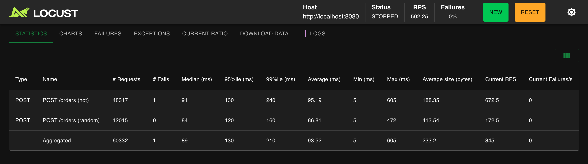

| 지표 | hot | random | **Aggregated** |
|---|---|---|---|
| # Requests | 48,317 | 12,015 | **60,332** |
| # Fails | 1 | 0 | **1 (~0 %)** ✅ |
| **Median** | 91 ms | 84 ms | **89 ms** ⬆⬆ |
| Average | 95.2 ms | 86.8 ms | **93.5 ms** |
| Max | 605 ms | 472 ms | **605 ms** |
| **Total RPS** | ~ | ~ | **502.3** ⬆ |

[→ 측정 원본 HTML 리포트](reports/locust_order_200users_saturated.html)

**예상 못 한 결과:**
- 200 users RPS = **502** (100 users 의 308 보다 *오히려 +63 %*)
- 그런데 *Median 응답 시간이 4 배* 증가 (20 → 89 ms)
- Fails ~0 (1 건만 — 일시 노이즈 수준)
- 음수 재고 0 건 (정합성 유지)

→ **sweet spot 50 가설은 *반박* 됐다.** 100 users 에서의 RPS dip 은 sweet spot 의 증거가 아니라 *측정 노이즈 / 순간 contention*.

### 진짜 발견 — *throughput-latency trade-off*

세 측정점을 다시 본다.

| 측정 | Users | RPS | Median | RPS/user | "비용" |
|---|---|---|---|---|---|
| 5 | 50 | 353 | 10 ms | 7.06 | 응답 빠름 |
| 6 (재) | 100 | 308 | 20 ms | 3.08 | 응답 2× 느림 |
| **7** | **200** | **502** | **89 ms** | **2.51** | **응답 9× 느림** |

→ **RPS 와 Latency 가 trade-off 관계.** *user 수를 늘리면 throughput 은 올라가지만 응답 시간이 그 이상으로 늘어남*. 이게 saturation 곡선의 진짜 모양.

해석:
- 50 users — 시스템이 *여유 있게 처리* (응답 즉시, RPS/user 7)
- 100 users — *경계 영역* (RPS 일시 dip, latency 2배)
- 200 users — *throughput 천장 근접* (RPS 끌어올렸지만 응답 시간이 폭증)

200 users 의 *RPS 502 는 좋아 보이지만*, 실제로는 *모든 user 가 평균 89 ms 씩 기다려서 얻은 throughput*. 사용자 경험 관점에서는 50 users 영역이 훨씬 나음 (10 ms vs 89 ms).

### 그리고 — Locust 자체 CPU 90 %+ 경고

200 users 측정 중 Locust 가 경고를 띄웠다.

```
[2026-05-03 22:45:38] WARNING/root: CPU usage above 90%! This may constrain
your throughput and may even give inconsistent response time measurements!
```

이는 *Locust 부하 클라이언트 자체* 가 단일 머신 CPU 한계에 부딪혔다는 뜻. **측정 7 의 데이터는 *시스템 한계* 가 아니라 *측정 환경 한계* 도 일부 반영하고 있다.**

측정 3 에서 *서버 측* 단일 머신 한계 (status=0) 를 만났고, 측정 7 에서 *클라이언트 측* 단일 머신 한계 (Locust CPU) 를 만났다. *단일 머신에서 모든 컴포넌트를 함께 돌리면 측정 자체의 신뢰도가 200 users 부근에서 무너진다.*

### 이번 사이클의 깨달음 셋

1. **하나의 측정점으로 가설을 단정하지 마라** — 측정 6 의 *50 → 100 RPS dip* 만 보고 *"sweet spot 50"* 결론을 내렸다면 틀렸다. 측정 7 의 세 번째 점에서 *곡선이 전혀 다른 모양* 임이 드러남. *가설은 다음 측정점에서 검증되거나 반박된다*. 한 점으로 곡선을 그리지 말 것
2. **RPS 만 보지 말고 Latency 와 함께 보라** — RPS 가 *높아 보이는* 측정값에 latency 가 같이 폭증해 있으면 *그건 좋은 결과가 아니다*. *RPS/user* 같은 파생 지표나 *p95 latency 함께 표시* 가 saturation 영역을 가린 throughput 부풀림을 드러냄
3. **단일 머신 측정의 신뢰도 천장을 인정하라** — 측정 3 (서버 측 status=0) + 측정 7 (Locust CPU 90%+). 두 가지 다른 모습으로 *단일 머신 환경의 측정 한계* 를 만났다. 200 users 부근부터 *측정값이 시스템 한계인지 측정 환경 한계인지 분리할 수 없음*. 진짜 곡선은 *별도 머신 분리* 후의 영역

### 측정 1 → 측정 7 의 RPS 진화 (최종)

```
측정 1 (10 users, baseline)               RPS   7.5   — 정합성 확인용
측정 2 (50 users, 비관적 락)               RPS  39.6   — 락 직렬화 가설 깨짐
측정 3 (100 users, 분산, 부분)             RPS  79.6   — 단일 머신 한계 도달 (서버측)
측정 4 (50 users, atomic UPDATE)          RPS  39.9   — wait_time 천장
측정 5 (50 users, +튜닝, 단축)            RPS 352.9   — 진짜 시스템 한계 노출 ⭐
측정 6 첫 시도 (100 users, 오염)          RPS 431.9   — 13 % 5xx (FK 결함, 폐기)
측정 6 재실행 (100 users, 깨끗)           RPS 308     — sweet spot 50 가설 (잠정)
측정 7 (200 users, 검증)                  RPS 502     — sweet spot 가설 반박 ⭐
                                                       latency 4× / Locust CPU 90 %+
```

→ **시스템은 *throughput-latency trade-off 곡선* 을 따른다.** 단순 sweet spot 은 없고, *50 users 영역이 latency 관점에서 가장 효율*, *200 users 영역은 throughput 끌어올림 + latency 비용*. 그 위로는 *별도 머신 분리* 가 전제 조건.

---

## 12. 회고 — 동시성은 한 번에 끝나지 않는다

### 발견한 버그 셋, 그 각각의 깨달음

1. **재고 차감 Lost Update** → *"@Transactional 만으로는 race 가 막아지지 않는다."* 격리 수준은 *내 트랜잭션 안의 일관성* 만 보장한다.
2. **여러 옵션 주문 시 Deadlock** → *"동시성 fix 는 한 곳만 막아서는 안 된다."* 차감과 복구의 락 순서까지 통일해야 함.
3. **결제 콜백 멱등성** → *"비관적 락은 재고만 막는 게 아니라 멱등성 보장의 도구이기도 하다."* 같은 키 동시 처리를 직렬화하면 두 번째는 자동으로 거절됨.

### 측정 자체에서 만난 함정

- **`show-sql=true` 가 응답시간을 왜곡** — 첫 측정 후 발견, 다음 측정 전 끔. 콘솔 I/O 비용이 응답시간에 그대로 더해짐
- **Locust UI stats RESET 안 함** → 측정 1, 2, 3 결과가 누적되어 시나리오별 분리가 어려워짐. 매 측정 전 RESET 클릭이 필수
- **환경변수 (`HOT_OPTION_RATIO`) 적용 여부 검증의 어려움** → 누적된 stats 위에 새 측정이 쌓이면 *비율로 환경변수 효과 확인* 이 불가. 측정 시작 전 테스트 호출 한 번으로 ratio 검증하는 절차가 필요
- **단일 머신에 모든 컴포넌트 동거의 한계** — 100 users 부하부터 OS / TCP / Tomcat accept 어딘가에서 connection 끊김 (status=0 에러). *"단일 서버 한계"* 가 아니라 *"단일 머신 환경의 한계"*. 다음 측정 (300 users 스트레스) 은 별도 머신 분리가 전제 조건
- **자원 한계의 첫 신호는 P99** — P50/P95 가 거의 그대로일 때 P99 가 먼저 늘어남 (130 → 210 ms). 운영 모니터링 지표 우선순위에서 P99 비중을 올려야 한다는 정성적 결론
- **측정 데이터의 무결성도 시스템 한계 측정 전에 검증해야 한다** (측정 6) — *13 % 5xx 를 시스템 한계로 오해할 뻔* 했다. 옵션 풀에 dangling FK 가 67 % 섞여 있던 게 진짜 원인. *endpoint 별 fail 분리 (hot 0 % vs random 67 %)* 가 데이터 결함을 가리키는 비대칭 신호. 시드 데이터에 FK 제약을 안 걸어 둔 대가는 측정 단계에서야 드러났음
- **하나의 측정점으로 곡선을 단정하지 마라** (측정 6 → 7) — 50 → 100 의 RPS 감소만 보고 *"sweet spot 50"* 결론을 낼 뻔. 측정 7 의 200 users 가 *"오히려 RPS 올라감 + latency 4 배"* 로 가설을 반박. *세 점 이상* 이 곡선을 가린다
- **클라이언트 측 측정 한계도 있다** (측정 7) — Locust CPU 90 %+ 경고. *서버 측 한계 (측정 3 status=0)* 와 *클라이언트 측 한계 (측정 7 Locust CPU)* 둘 다 단일 머신 환경의 다른 모습. 200 users 부근부터 *측정값이 시스템 한계인지 측정 환경 한계인지 분리할 수 없음*

이런 *"측정 자체의 시행착오"* 도 정직하게 적어두는 게 나중에 같은 함정을 안 밟는 기록이 된다.

### 의사결정의 중심축이 *바뀌었다* — *"분산 락은 이 영역의 답이 아니다"*

처음 락 후보를 검토할 때 (2 장) 가설은 *"지금은 비관적 락, 다중 인스턴스로 가면 분산 락"* 이었다. 분산 락 인프라 (`@DistributedLock` AOP, SpEL 동적 키, UUID 자기 락 해제) 까지 미리 만들어 둘 만큼 *다음 단계로 확신* 했다.

그런데 측정 사이클을 거치면서 *그 가설 자체가 틀렸음* 을 깨달았다.

```
처음 가설: 비관적 락 → (다중 인스턴스 시) 분산 락
  ↓
측정 5: atomic UPDATE 로 전환 → RPS 8.8 배, 락 점유 시간 0
  ↓
측정 6/7: 동일 row contention 한계는 *atomic UPDATE 도 같음* — DB row lock 자동 직렬화 때문
  ↓
재해석: 분산 락을 추가해도 같은 contention 한계 (Redis 라운드 트립만 추가)
  ↓
**진짜 다음 단계: 단일 row 자체를 분해 (샤딩) — 분산 락 영역이 아님**
```

분산 락은 *애플리케이션 레벨에서 여러 단계를 묶어 직렬화* 하는 도구이지, 단일 SQL 의 row 차감을 가속하는 도구가 아니다. *재고 차감* 영역에서는:

- DB row lock 이 이미 *자동으로* 직렬화 → 분산 락 추가 시 *중복 + Redis 비용*
- 분산 락의 진짜 가치 영역은 *여러 단계 묶음* (선착순 쿠폰 발급, 작업 큐 클레임, 외부 API 중복 호출 방지) — *주문/결제 API 도메인 안에는 현재 없음*

→ *분산 락 인프라는 보존* (다른 도메인 — 쿠폰/포인트/큐 — 도입 시 사용). *주문/결제 영역에서는 더 깊은 영역으로* (샤딩 / 별도 머신 측정).

이 결과의 결정적 의미: **첫 가설("다음은 분산 락")을 측정으로 검증하지 않았다면 잘못된 방향으로 한 사이클을 더 썼을 것이다.** 그리고 더 나쁜 결과는 — 잘못된 도구를 production에 도입한 뒤에 그 결정을 되돌리는 비용을 부담하는 것이다. 측정 기반 의사결정의 진짜 가치는 **잘못된 방향을 production 도달 전에 차단**하는 것이다.

### 정리 — "이게 실패하면?" 질문 사이클의 결과

이 작업의 모든 결정은 **"이게 실패하면 무엇이 무너지는가"** 라는 단일 질문에서 나왔다.

| 실패 시나리오 | 차단 메커니즘 |
|------------|------------|
| 비관적 락 미적용 시 동시 차감 | 비관적 락 → atomic UPDATE 전환 |
| Deadlock | 락 획득 순서 통일(optionId 오름차순) |
| 콜백 중복 도착 | 비관적 락으로 멱등성 보장 |
| 결제 미완료 주문의 재고 잠김 | Redis ZSET 타이머 + DB 보정 스케줄러 |

각 시나리오를 차단할 때마다 코드가 한 줄씩 늘었다. 동시성은 한 번에 끝나는 영역이 아니라 **시나리오를 그릴 때마다 새로운 결함이 발견되는 영역**이다. 측정 한 번으로 종료되지 않으며, 다음 영역들이 계속 기다린다.

### 후속 측정 / 개선 영역

1. **별도 머신으로 컴포넌트 분리 후 200/300 users 정식 측정** — 측정 7의 *Locust CPU 90%+* 경고와 측정 3의 서버 status=0 둘 다 단일 머신 환경 한계. 앱 ↔ DB ↔ Locust 분리 환경에서 sweet spot 위 영역의 곡선을 그려야 함
2. **인기 옵션 샤딩** — 진짜 다음 단계. 단일 row contention 자체를 분해해 한 옵션의 재고를 N개 row로 쪼개고 부하 분산. "단일 row가 사라지면 atomic UPDATE가 N배까지 스케일하는가"의 검증
3. **다중 인스턴스 + LB 환경에서 atomic UPDATE의 row lock 직렬화 한계 측정** — 인스턴스 N대로 늘려도 DB row lock으로 같은 row는 결국 직렬화. "앱 인스턴스를 늘려도 처리량이 안 늘어나는 지점"의 정량 측정
4. **Toss confirmPayment mock 모드** — 측정 범위를 placeOrder에서 confirmPayment까지 확장하려면 토스 sandbox 외부 API 의존을 mock으로 끊어야 함

---

## 부록 — 함께 보면 좋은 자료

### 본 글의 backing 문서

- **코드 변경 정리** (변경 4 건의 Before/After + Why + 측정 효과): [주문결제-코드개선.md](주문결제-코드개선.md)
- **트러블슈팅 추적 과정** (사건 5 건의 증상 → 가설 → 추적 → 검증): [주문결제-동시성-트러블슈팅.md](../troubleshooting/주문결제-동시성-트러블슈팅.md)

### 관련 도메인 / 이론

- 동시성 일반 이론 (재고/deadlock/redis 분산락 비교): [blog-시리즈3-동시성제어.md](blog-시리즈3-동시성제어.md)
- Redis ZSET + Lua 결제 타임아웃 상세: [blog-Redis타임아웃.md](blog-Redis타임아웃.md)
- 회원/OAuth 동시성 fix 사례: [../troubleshooting/concurrency-fix.md](../troubleshooting/concurrency-fix.md)
- 토스페이먼츠 결제 연동: [blog-토스페이먼츠결제연동.md](blog-토스페이먼츠결제연동.md)

### 원본 자료

- Locust 시나리오 코드: [`performance/locustfile_order.py`](../../../performance/locustfile_order.py)
- 측정 시점 Locust HTML 리포트: [reports/](reports/)
