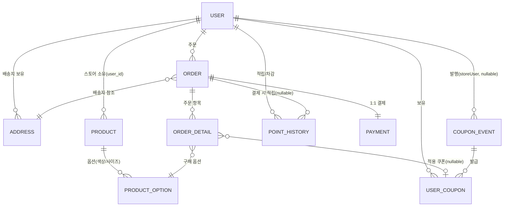

# StyleHub 포트폴리오 — 문제를 어떻게 풀었는가

> 이 문서는 "무엇을 만들었는가"보다 "왜 그렇게 만들었는가"에 집중합니다.
> 각 섹션은 문제 상황 → 검토한 대안 → 선택 근거(측정/트레이드오프) → 한계의 순서로 구성했습니다.
> 실측 수치가 나오는 부분은 모두 출처 문서를 링크했고, 아직 완료되지 않은 부분은 완료된 것처럼 쓰지 않았습니다.

---

## 0. 프로젝트 개요

StyleHub은 무신사·29CM 같은 패션 이커머스의 백엔드를 표방한 개인 포트폴리오 프로젝트입니다. 화면을 갖춘 서비스를 완성하는 것보다 대용량 트래픽 환경에서 발생하는 동시성·성능·도메인 결합 문제를 실측 기반으로 해결하는 과정을 보여주는 데 목적을 두었습니다.

**스택**: Java 17, Spring Boot 4.0.3, Spring Data JPA + QueryDSL, MySQL(InnoDB), Redis(Lettuce), BCrypt, Lombok
**외부 연동**: 토스페이먼츠(결제), Google OAuth 2.0(소셜 로그인)
**도메인**: user(회원·스토어·포인트 통합) · product · order · payment · coupon
**검증 방식**: 도메인 서비스 단위 테스트 + `OrderConcurrencyTest`(동시성 재현 테스트) + Locust 부하 시나리오 8종, 누적 수십만 건 요청으로 정합성 검증

---

## 1. DB 설계 — 엔티티 관계와 설계 결정

### 1.1 도메인 모델



### Store를 별도 테이블이 아닌 User에 통합한 이유

초기에는 `User`/`Store`를 분리했지만, 스토어 신청 승인 흐름에서 `User`와 `Store`가 별도 트랜잭션으로 생성되며 원자성 문제가 생겼습니다(멘토 코드 리뷰에서 지적받은 부분). 스토어 역할이 회원 역할의 확장이라는 도메인 특성을 고려해 `User` 엔티티로 통합하고, `StoreSignUpFacade`로 승인 플로우를 감쌌습니다. 테이블을 하나 줄이는 대신 트랜잭션 경계 문제 자체를 없앤 선택입니다.

### UserCoupon에 복합 UNIQUE 제약을 건 이유

선착순 쿠폰 발급은 애플리케이션 레벨에서 중복 발급 여부를 먼저 체크하지만, 동시 요청 두 개가 이 체크를 동시에 통과할 수 있습니다(TOCTOU 문제). `(user_id, coupon_event_id)` 복합 유니크 제약을 DB 레벨의 최후 방어선으로 걸어, 애플리케이션 로직이 뚫려도 데이터베이스가 중복 발급을 거부하도록 이중으로 막았습니다.

### 주문·배송 상태를 하나로 합친 이유

처음에는 주문 상태와 배송 상태를 별도 enum으로 뒀지만, 실제로 두 상태가 항상 함께 전이되고 조합 검증 로직만 늘어나는 것을 확인하고 `OrderStatus` 하나(`PENDING → PAID → PREPARING → SHIPPING → DELIVERED / CANCELLED`)로 합쳤습니다. 상태 전이는 `Order` 엔티티 내부 메서드(`markPaid()`, `cancel()` 등)로 캡슐화해 "이 상태에서 저 상태로 갈 수 있는가"를 엔티티가 스스로 보장합니다.

### 대용량 데이터로 실측한 이유

인덱스·페이징 설계의 효과는 데이터가 적을 때는 드러나지 않습니다. 상품 100만~300만 건 규모의 벌크 데이터를 직접 생성하는 시드 스크립트(`product-bulk-insert.sql`, `option-bulk-insert.sql`)를 작성해 실제 쿼리 성능 차이를 눈으로 확인했습니다. 결과는 [5장 대용량 트래픽 대응](#5-대용량-트래픽-대응)에서 다룹니다.

### 정직하게 밝히는 부분

현재 스키마는 SQL DDL을 손으로 관리하지 않고 JPA 엔티티에서 파생됩니다(dev: `ddl-auto=update`, prod: `ddl-auto=validate`로 배포 시 스키마 불일치를 사전에 걸러내도록 설정). 저장소에 있는 `stylehub.sql`은 설계 초기 스케치이며, 이후 User-Store 통합 리팩터링을 거치며 실제 엔티티와는 결이 달라졌습니다. 최신 스키마의 기준은 엔티티 코드입니다.

인덱스는 현재 UNIQUE 제약(`User.email`, `User.name`, `Order.pgOrderId`, `UserCoupon` 복합키)에 의존하고 있고, 별도의 커버링 인덱스 설계는 상품 조회 커서 페이징 쿼리(PK 기반)에 한정되어 있습니다. 조회 패턴이 늘어나면 추가 인덱스 설계가 다음 과제입니다.

---

## 2. 도메인 간 연관관계 해결 — 결합을 줄여온 과정

### 출발점: Repository를 직접 참조하며 뒤섞인 도메인

`OrderService`를 처음 구현했을 때 `UserRepository`, `AddressRepository`, `ProductOptionRepository`를 모두 직접 참조해 의존성이 6개였고, 3개 도메인의 로직이 한 클래스에 뒤섞여 있었습니다. 코드 리뷰에서 도메인 경계 위반을 지적받은 뒤 단계적으로 구조를 바꿨습니다.

### 1단계 — Application/Service 계층 분리

각 도메인을 "권한/오케스트레이션(ApplicationService)"과 "자기 도메인 로직만 다루는 순수 서비스(Service)"로 나눴습니다.

```java
// ProductApplicationService — 스토어 소유권 검증(교차 도메인 관심사)
public ProductResponse registerProduct(Long userId, Long storeId, ProductCreateRequest request) {
    User owner = userPort.findApprovedStoreByOwner(userId, storeId);
    return productService.registerProduct(owner, request);
}

// ProductService — 다른 도메인 엔티티를 모른 채 상품 로직만
public ProductOption decreaseStockWithLock(Long optionId, int quantity) {
    ProductOption option = productOptionRepository.findByIdWithLock(optionId)
            .orElseThrow(() -> new BusinessException(ErrorCode.PRODUCT_OPTION_NOT_FOUND));
    option.decreaseStock(quantity);
    return option;
}
```

`product`, `coupon` 도메인에 이 패턴을 적용했습니다. 다른 도메인의 엔티티가 순수 `Service`에 들어오면 "이 로직이 잘못된 계층에 있다"는 신호로 삼는 규칙을 세웠습니다.

### 2단계 — 헥사고날 Port로 도메인 간 호출을 인터페이스화

도메인 간 호출이 Repository 직접 참조 대신 `UserPort`, `ProductPort` 같은 인터페이스를 거치도록 바꿨습니다. `OrderService`는 `ProductOptionRepository`가 아니라 `ProductPort.decreaseStockWithLock()`을 호출합니다. 상품 도메인이 재고 차감 방식을 내부적으로 바꿔도 주문 도메인 코드는 영향받지 않습니다.

### 3단계 — Order ↔ Payment 양방향 의존을 이벤트로 끊기

주문과 결제는 서로가 서로를 알아야 하는 구조였습니다(주문 생성 시 결제 준비, 결제 실패 시 주문 취소). Repository/Service 직접 참조로는 순환 의존이 생겨 `ApplicationEventPublisher`로 분리했습니다.

```java
// OrderService.java — 주문 생성 트랜잭션 안에서 이벤트만 발행, Payment를 모른다
eventPublisher.publishEvent(new OrderPlacedEvent(savedOrder.getOrderId(), totalAmount, finalAmount));
```

```java
// OrderEventListener.java — 커밋 이후에만 외부 부수효과(Redis 타이머) 실행
@TransactionalEventListener(phase = AFTER_COMMIT)
public void onOrderPlaced(OrderPlacedEvent event) {
    orderTimeoutManager.registerTimeout(event.orderId());
}
```

동기 리스너(`@EventListener`)와 커밋 이후 리스너(`@TransactionalEventListener(AFTER_COMMIT)`)를 목적에 따라 구분했습니다. 결제 승인/실패에 따른 주문 상태 변경은 같은 트랜잭션에서 원자적으로 처리해야 하므로 동기 리스너로, Redis 타이머 등록처럼 롤백되면 안 되는 외부 부수효과는 커밋 이후 리스너로 나눴습니다.

### 정리 중인 추상화 — 정직하게 밝히는 부분

이벤트 기반 리팩터링 이후 `order/port/OrderPort`, `payment/port/PaymentPort`는 실제 구현체와 호출부가 사라져 고아 상태가 됐습니다(주석으로 명시하고 후속 PR에서 제거 예정으로 남겨둠). 쿠폰 도메인의 `coupon/port/CouponPort`도 향후 통합을 염두에 두고 정의했지만 아직 구현체가 없습니다.

이걸 굳이 숨기지 않는 이유는, 추상화를 만든 것과 그 추상화가 더 이상 필요 없어졌음을 알아채는 것은 다른 능력이기 때문입니다. Port를 도입했다가 이벤트 기반으로 한 번 더 리팩터링하면서 일부가 불필요해진 것 자체가 "설계는 한 번에 완성되지 않고, 다음 리팩터링에서 이전 결정을 재평가한다"는 걸 보여주는 사례라고 생각합니다.

---

## 3. 동시성 제어 — 두 가지 사례, 서로 다른 결론

같은 "동시성 문제"라도 영역에 따라 정답이 다르다는 걸 두 사례를 통해 실측으로 확인했습니다.

### 3.1 사례 A — 재고 차감: 비관적 락이 정답이었던 이유

`OrderConcurrencyTest`로 재고 1개 상품에 10명이 동시 주문하는 상황을 재현하자 2명 이상이 성공하는 Lost Update가 발생했습니다.

**검토한 방법들**

- **비관적 락(`SELECT FOR UPDATE`)** — 확실하지만 대기가 발생한다. 최종 채택.
- **낙관적 락(`@Version`)** — 락이 없어 대기는 없지만, 재고 차감처럼 충돌 확률이 높은 연산에서는 재시도가 반복돼 오히려 느려질 수 있다. 부적합.
- **DB 원자적 UPDATE** — `UPDATE ... WHERE stock_quantity >= 1` 한 줄로 가장 빠르지만, 주문 생성에는 재고 차감 외에 상품가·스토어 정보가 함께 필요하다. UPDATE만으로는 이 정보를 가져올 수 없고, 별도 SELECT를 추가하면 동시성 문제가 다시 생긴다. 부적합.
- **Redis DECR** — 동시 1000명도 ~1ms급으로 처리되지만, Redis와 DB 사이의 이중 저장소 정합성을 별도로 관리해야 한다. 현재 단일 서버 규모에서는 보류.
- **Redis 분산 락(SETNX)** — 다중 서버 대응이 가능하지만 현재는 단일 서버라 과한 선택. 보류.

**왜 비관적 락인가** — "재고 차감만 하는 게 아니라 상품가·스토어 정보를 같은 트랜잭션에서 함께 읽어야 하기 때문"입니다. `SELECT ... FOR UPDATE`에 fetch join을 걸어 락 획득과 N+1 방지를 한 쿼리로 처리했습니다.

```java
@Lock(LockModeType.PESSIMISTIC_WRITE)
@Query("SELECT po FROM ProductOption po JOIN FETCH po.product p JOIN FETCH p.store WHERE po.productOptionId = :optionId")
Optional<ProductOption> findByIdWithLock(@Param("optionId") Long optionId);
```

**Deadlock 방지** — 여러 옵션을 한 주문에서 동시에 잠글 때, 스레드 A/B가 반대 순서로 락을 걸면 교착 상태에 빠집니다. `TreeMap`으로 `optionId`를 오름차순 정렬해 모든 트랜잭션이 같은 순서로 락을 걸도록 강제했습니다(중복 옵션 합산도 같은 자료구조로 동시에 처리).

**재고 복구 경로도 동일한 락 전략으로 통일** — 주문 취소 시 `increaseStock()`이 락 없이 `findById()`로 조회하면, 동시에 진행 중인 `decreaseStockWithLock()`의 변경이 유실될 수 있음을 코드 리뷰 후 발견하고 `findByIdWithLock()`으로 통일했습니다.

**검증 결과** — 재고 10개에 10명 동시 주문 시 정확히 10명 성공, 재고 0. 재고 5개에 10명 동시 주문 시 정확히 5명 성공·5명 `INSUFFICIENT_STOCK`, 정합성 100%를 확인했습니다.

**측정 사이클에서 드러난 통념 반박** — atomic UPDATE로 전환해 락 점유시간을 0으로 만들면 "다음은 분산 락"이라는 가설을 세웠지만, 측정으로 검증한 결과 동일 row에 대한 직렬화는 atomic UPDATE도 DB row lock으로 자동 발생해 분산 락을 더해도 이득이 없고 Redis 왕복 비용만 늘어난다는 걸 확인했습니다. 재고 차감 영역에서는 분산 락 인프라(`@DistributedLock`)를 만들어두되 적용하지 않기로 결정했습니다. (근거: [`docs/troubleshooting/주문결제-동시성-트러블슈팅.md`](../troubleshooting/주문결제-동시성-트러블슈팅.md) 사건 5)

### 3.2 사례 B — 선착순 쿠폰: 같은 "락 문제"인데 정반대 결론

재고 차감과 정반대로, 선착순 쿠폰 발급에서는 분산 락이 오히려 더 나빴습니다. 4가지 메커니즘을 실제로 구현하고 Locust로 측정 비교했습니다.

**DB 비관적 락(베이스라인)** — 단일 인스턴스 RPS 630, 다중 인스턴스 RPS 526, 5xx 0~0.04%.

**Redis 분산 락(SETNX 폴링)** — 단일 인스턴스 RPS 190, 다중 인스턴스 RPS 195, **5xx 24.7~28.4%**. "다중 인스턴스면 분산 락이 유리할 것"이라는 처음 가설이 측정으로 완전히 반박된 지점입니다. 50ms 간격 폴링은 fairness가 없고, waitTime을 초과한 요청은 그대로 500을 던지는 구조라 오히려 실패율이 치솟았습니다.

**Redis DECR + Lua atomic(최종 채택)** — 다중 인스턴스 RPS 640+, 5xx 0%. 락 자체를 없애고 Redis의 단일 스레드 원자성(카운터 차감 + 중복 검증을 하나의 Lua 스크립트로 묶음)을 활용하는 방식이 모든 지표에서 우월했습니다.

```lua
-- 카운터 차감 + 중복 발급 검증을 원자적 한 덩어리로
if redis.call('SISMEMBER', issuedSetKey, userId) == 1 then return -2 end
local remaining = redis.call('DECR', counterKey)
if remaining < 0 then redis.call('INCR', counterKey); return -1 end
redis.call('SADD', issuedSetKey, userId)
return remaining
```

**+ 비동기 저장(Spring Event)** — RPS는 632로 거의 동일해 처리량 향상 가설은 입증하지 못했지만, 피크 흡수·DB 자원 분리라는 운영 이점이 명확해 설계는 채택했습니다. 측정으로 입증 안 된 부분은 "측정으로 입증 안 됐다"고 그대로 남겼습니다.

**다중 인스턴스 환경을 만들며 만난 문제** — 이 비교를 위해 Spring Boot 4대 + nginx LB로 다중 인스턴스 환경을 직접 구축하다가, Tomcat 메모리 세션이 인스턴스 간 공유되지 않아 401이 폭증하는 문제를 만났습니다. `spring-session-data-redis` + `@EnableRedisHttpSession` 세 줄로 세션을 외부화해 해결했습니다.

**측정 데이터 결함을 스스로 잡아낸 사례** — 100 users 측정에서 5xx 13.28%가 나왔을 때 "시스템 한계"로 오해할 뻔했지만, 엔드포인트별로 실패율을 분리해보니 특정 옵션 풀에서만 실패가 몰려 있었습니다. 추적 결과 테스트 시드 데이터의 67%가 FK 무결성이 깨진 데이터였고, 실패 비율(67.0%)과 오염 데이터 비율(67.0%)이 정확히 일치함을 확인해 인과관계를 수치로 입증했습니다. (근거: [`docs/troubleshooting/주문결제-동시성-트러블슈팅.md`](../troubleshooting/주문결제-동시성-트러블슈팅.md) 사건 2)

**지금 정직하게 밝히는 부분** — 위 측정은 별도 성능 측정 사이클에서 검증한 결과이고, 현재 `main`의 `CouponService.issueCoupon()`은 여전히 비관적 락(v1)을 사용합니다(`// TODO: 성능 테스트 후 분산락 적용예정` 주석이 코드에 남아 있음). Redis DECR + 이벤트 기반 비동기 저장으로 가기 위한 `CouponIssuedEvent`/`CouponIssuedEventListener`는 만들어뒀지만 아직 `CouponService`에 연결되지 않은 상태입니다. 측정으로 더 나은 방법을 검증했다고 해서 검증되지 않은 코드를 곧바로 운영 경로에 흘려보내지 않는다는 원칙을 지킨 결과입니다.

### 3.3 트랜잭션 범위 설계 — 락과는 다른 각도의 동시성 문제

회원가입에서 BCrypt 해싱(~100ms)이 `@Transactional` 안에서 실행되며 DB와 무관한 CPU 작업 동안 커넥션을 점유하는 문제를 발견했습니다. 동시 100명이 가입하면 커넥션 풀이 고갈될 수 있는 구조였습니다. `TransactionTemplate`으로 해싱을 트랜잭션 밖으로 빼서 커넥션 점유 시간을 110ms에서 10ms로, 11배 줄였습니다.

토스페이먼츠 연동 설계 때도 같은 유형의 문제를 만났습니다. `@Transactional`이 메서드 전체를 감싸면 외부 결제 API 호출(수초 소요) 동안 커넥션이 잠깁니다. 초기에는 `OrderService`(흐름 관리)와 `OrderTransactionService`(DB 트랜잭션)로 클래스를 분리해 이 문제를 풀려고 시도했지만, 실제로 유지보수해보니 클래스가 늘어난 만큼의 이득이 크지 않다고 판단해 이후 리팩터링(`2026/03/29`)에서 다시 `OrderService` 하나로 통합했습니다 — 시도했다가 스스로 되돌린 설계입니다.

**정직하게 밝히는 부분**: 그 결과 현재 `PaymentService.confirmPayment()`/`cancelPayment()`는 토스 API 호출이 여전히 `@Transactional` 내부에 있습니다. PG 응답이 느려지면 그만큼 DB 커넥션을 오래 점유한다는 뜻이고, 이건 User 도메인의 BCrypt 사례처럼 트랜잭션 밖으로 빼지 못한 채 남아 있는 개선 지점입니다. 대신 이 구조 덕분에 PG 호출이 실패하면 트랜잭션이 자동 롤백되어 로컬 상태가 절대 어긋나지 않는다는 이점은 있고, 이는 단위테스트로 검증되어 있습니다.

한편 별도 성능 측정 브랜치(`refactor/주문결제-api-성능측정`)에서는 다른 문제 하나를 실제로 풀었습니다 — 결제 승인 콜백이 네트워크 재시도 등으로 동시에 두 번 도착하는 상황을 `PaymentIdempotencyTest.concurrentIdempotency`로 재현했고, `PaymentRepository.findByOrderPgOrderIdWithLock()`(비관적 락)으로 두 번째 요청이 첫 번째 커밋 이후의 `DONE` 상태를 보고 자연스럽게 거절되도록 고쳤습니다. 이 멱등성 처리는 검증까지 끝났지만 아직 이 브랜치에는 병합되지 않았습니다.

---

## 4. 결제 도메인

### 상태 모델과 이벤트 기반 흐름

`Payment`는 `Order`와 1:1이며 `READY → DONE / ABORTED`, `DONE → CANCELED / PARTIAL_CANCELED` 상태를 엔티티 내부 메서드(`approve()`, `cancel()`, `abort()`)로 캡슐화했습니다.

`PaymentEventListener`가 `OrderPlacedEvent`를 받아 같은 트랜잭션에서 `Payment`를 `READY`로 생성합니다(`em.getReference(Order.class, orderId)`로 FK 프록시만 참조해 `Order` 전체 로딩을 피함). 결제 승인(`confirmPayment`) 시 토스 API를 호출해 승인되면 `Payment.approve()` + `Order.markPaid()` + `PaymentApprovedEvent` 발행으로 이어집니다. 결제 실패·취소 시에는 `PaymentFailedEvent` / `PaymentFullyCanceledEvent`를 발행해 `OrderEventListener`가 받아 주문을 취소 처리합니다 — Order와 Payment가 서로를 직접 호출하지 않고 이벤트로만 연결되는 구조는 [2장](#2-도메인-간-연관관계-해결--결합을-줄여온-과정)에서 설명한 리팩터링의 결과입니다.

### 금액 위변조 대응

결제 승인 시 클라이언트/PG사가 보고하는 금액을 DB에 저장해둔 최초 요청 금액과 서버에서 대사합니다.

```java
// PaymentValidator.java — DB 저장 금액과 토스 전달 금액을 서버에서 직접 비교
public void validateAmount(Payment payment, Integer amount) {
    if (!payment.getRequestedAmount().equals(amount)) {
        throw new BusinessException(ErrorCode.PAYMENT_AMOUNT_MISMATCH);
    }
}
```

클라이언트가 결제 금액을 조작해 전달해도, 서버가 신뢰하는 값은 항상 주문 생성 시점에 DB에 저장해 둔 금액이라는 원칙입니다. 이는 서버 측 금액 대사 로직이며, PG사 웹훅에 대한 암호화 서명 검증은 별도로 구현하지 않았습니다 — 과장하지 않고 있는 그대로 밝힙니다.

### 부분 취소와 배송 상태에 따른 취소 가능 범위

`cancelPayment()`는 배송 상태에 따라 취소 가능 여부를 다르게 판단합니다(배송 중에는 취소 차단, 배송 완료 후 7일 이내만 허용). `cancelAmount`가 없으면 전액 취소, 있으면 부분 취소로 처리하고 완전 취소된 경우에만 `PaymentFullyCanceledEvent`를 발행해 주문까지 취소되도록 구분했습니다.

---

## 5. 대용량 트래픽 대응

### 상품 목록 조회 — Offset에서 커서 페이징으로

상품이 100만 건을 넘어가며 목록 뒤쪽 페이지 조회가 2초 가까이 걸렸습니다. `LIMIT 20 OFFSET 999980`은 DB가 앞의 999,980건을 순회하며 건너뛰어야 하는 구조적 한계가 있습니다. `WHERE product_id < cursor LIMIT 20`으로 바꿔 PK 인덱스를 직접 타도록 전환하고, 다음 페이지 존재 여부는 `size+1`건을 조회해 판별해 COUNT 쿼리 비용도 없앴습니다.

100만 건 데이터에서 100만 번째 조회는 1,945ms(Offset)에서 94ms(커서)로 **20배** 개선됐습니다. Offset은 앞쪽 행을 건너뛰는 비용이 데이터량에 비례해 늘어나지만, 커서는 인덱스로 시작점을 바로 찾기 때문에 데이터량 증가의 영향을 받지 않습니다. (출처: [`docs/architecture/paging.md`](../architecture/paging.md))

> 정직하게 밝히는 부분: 이전 버전 문서에 "300만 건, 6,896ms → 14ms, 492배"라는 수치가 있었지만, 재검증 과정에서 이를 뒷받침하는 원본 측정 로그를 리포지토리 전체(모든 브랜치, 커밋 이력 포함)에서 찾지 못해 제외했습니다. 검증 가능한 100만 건/20배 수치만 사용합니다.

동적 필터링(스토어별·카테고리별)을 JPQL로 짤 때 Hibernate가 `Long` 타입 null 파라미터를 `IS NULL`로 정확히 평가하지 못하는 문제를 겪어, QueryDSL `BooleanBuilder`로 전환해 null 조건은 쿼리에서 아예 제외되도록 해결했습니다.

### 미결제 주문 타임아웃 — DB 폴링에서 Redis ZSET으로

재고를 주문 시점에 선차감하는 구조라, 결제를 안 하면 PENDING 상태로 재고가 묶여버립니다. 처음엔 Spring `@Scheduled`로 5분마다 DB 전체를 스캔해 만료 주문을 찾았지만, 대용량 환경에서 주기적 풀스캔은 부하가 크고 최대 5분의 오차도 문제였습니다.

Redis ZSET을 delay queue로 사용해 주문 생성 시 `score = 만료시각`으로 등록하고, Lua 스크립트로 `ZRANGEBYSCORE` 조회와 `ZREM` 제거를 원자적으로 묶어 1분 주기로 폴링합니다(다중 인스턴스가 같은 키를 동시에 폴링해도 중복 처리되지 않도록). DB 기반으로도 1시간 주기 보정 스케줄러를 별도로 둬, Redis 타이머 등록이 서버 장애로 유실된 주문까지 잡아내는 이중 안전장치를 만들었습니다. 만료 오차는 최대 5분에서 최대 1초 수준으로 줄었고, DB 풀스캔은 사실상 제거됐습니다.

### 부하 테스트로 확인한 한계선

Locust로 8종 시나리오를 설계해 실측했습니다. 단일 서버 실용 상한은 약 2,000 users / ~1,003 RPS였고, 극한 부하(10,000 users)에서도 요청 실패율 0%로 graceful degradation을 확인했습니다. 재고 차감은 비관적 락에서 atomic UPDATE 전환 + JDBC 튜닝으로 RPS 39.6에서 352.9로 8.8배, 선착순 쿠폰은 Redis DECR+Lua로 다중 인스턴스 RPS 640+, 5xx 0%를 달성했습니다.

측정할 때마다 "직관과 다른 결과가 나오면 코드보다 측정 환경을 먼저 의심한다"는 원칙을 지켰습니다. 예를 들어 atomic UPDATE 적용 후 P99가 오히려 늘어난(130ms → 210ms) 사건에서, 처음엔 "추가 SELECT 비용"이라는 가설을 세웠지만 다음 측정에서 부하 패턴(요청 간격)을 촘촘히 하자 P99가 오히려 줄어드는 걸 보고 원인이 코드가 아니라 느슨한 부하 사이의 GC·스케줄링 노이즈였음을 확인했습니다. 잘못된 가설로 불필요한 코드 변경을 할 뻔한 걸 측정으로 막은 사례입니다.

---

## 6. 트러블슈팅에서 얻은 원칙

측정 사이클을 반복하며 예상과 다른 결과 5건을 추적했습니다. (전체 추적 과정: [`docs/troubleshooting/주문결제-동시성-트러블슈팅.md`](../troubleshooting/주문결제-동시성-트러블슈팅.md))

### 사건 1 — atomic UPDATE 후 P99가 오히려 증가

처음 가설은 "추가 SELECT 비용"이었지만, 부하 간격을 좁힌 재측정에서 P99가 오히려 줄어드는 걸 보고 반박했습니다. 실제 원인은 느슨한 부하 패턴 사이에 낀 GC·OS 스케줄링 노이즈였습니다.

### 사건 2 — 100 users에서 5xx 13.28%

처음엔 "시스템 처리 한계 도달"로 보였지만, 엔드포인트별 실패율을 나눠보니 특정 옵션 풀에서만 실패가 몰려 있었습니다. 테스트 시드 데이터의 67%가 FK 무결성 결함이었고, 실패율과 오염 데이터 비율이 정확히 67%로 일치해 인과관계를 수치로 입증했습니다.

### 사건 3 — 100 users RPS가 50 users보다 낮음

"50 users가 sweet spot"이라는 가설을 세웠지만, 측정점이 2개뿐이었습니다. 200 users로 재측정하자 RPS가 다시 올라가면서 이 가설은 반박됐습니다.

### 사건 4 — 200 users에서 RPS는 회복, latency는 4배 폭증

단일 지표(RPS)만으로는 설명이 안 되는 상황이었습니다. RPS/user라는 파생 지표를 계산해보니 처리량은 늘어도 사용자별 대기 시간이 그 이상으로 늘어나는 전형적인 throughput-latency trade-off였습니다.

### 사건 5 — "다중 인스턴스=분산 락이 정답"이라는 통념

측정 전에는 당연해 보이는 결론이었지만, atomic UPDATE로도 DB row lock이 이미 직렬화를 보장해 분산 락은 비용만 추가한다는 걸 4가지 메커니즘 실측 비교로 확인했습니다. (3.2절)

### 다섯 가지 원칙

이 다섯 사건에서 이끌어낸 원칙입니다. 직관에 반하는 결과는 코드보다 측정 환경부터 의심한다. 특정 구간에서만 실패가 몰리면 시스템 한계가 아니라 데이터·환경 결함을 의심한다. 수치가 정확히 일치하는지까지 확인해야 "추정"이 아니라 "입증"이 된다. 측정점 2개로 곡선을 단정하지 않는다. 가설은 주장이 아니라 검증 가능한 형태로 세워야 측정이 답을 준다.

---

## 7. 예외 처리와 횡단 관심사

모든 비즈니스 예외를 `BusinessException` + `ErrorCode` enum(도메인별로 그룹화된 48개 코드)으로 통일하고, `GlobalExceptionHandler`에서 비즈니스 예외는 `warn`, 예상 못 한 시스템 예외는 `error`로 로그 레벨을 분리해 장애 추적 시 노이즈를 줄였습니다.

`ApiLoggingAspect`로 order/payment 패키지의 요청·응답·실행시간을 자동 기록하고, `@ExecutionTimeCheck`로 임계값 초과 메서드를 자동 감지합니다. 서비스 코드에 로깅 코드를 직접 넣지 않기 위한 선택입니다.

`@DistributedLock`(Redis SETNX + SpEL 동적 키) AOP는 만들어뒀지만, 3장에서 설명한 것처럼 실측 결과 재고·쿠폰 도메인 어디에도 적용하지 않기로 결정했습니다. 인프라를 만드는 것과 그것을 적용할지 판단하는 것을 분리한 사례로 남겨뒀습니다.

---

## 8. 협업 습관

혼자 진행한 프로젝트지만 실무와 동일한 프로세스를 적용했습니다. 기능 단위 GitHub Issue → 이슈 번호 기반 브랜치 → PR 순서를 유지했고, PR에는 설계 결정과 트레이드오프를 명시했습니다. 예를 들어 입점 신청 PR에서 "User/Store가 별도 트랜잭션인데 Store 실패 확률이 낮아 단순함을 우선했다"는 근거를 남겼다가, 멘토 리뷰에서 원자성 문제를 지적받고 근거를 가지고 논의한 뒤 Facade 패턴 도입으로 해결했습니다(1장의 User-Store 통합 이전 단계의 실제 사례).

코드 컨벤션(와일드카드 import 금지, 엔티티 `@SuperBuilder` + 정적 팩토리 패턴, DTO record 통일)은 초기에 정하고 일관되게 유지했고, 리뷰 피드백은 무조건 수용하지 않고 근거가 있으면 트레이드오프를 설명하며 논의했습니다.

---

## 9. 운영 — 배포 자동화와 모니터링

### Jenkins로 실제 운영 서버까지 자동 배포

CI/CD를 설정 파일만 만들어두는 데 그치지 않고 실제로 동작시켰습니다. Jenkins 파이프라인은 `Checkout → Test(Docker 컨테이너 안에서 Gradle 실행, 호스트에 JDK 설치 불필요) → 이미지 빌드 → GHCR(GitHub Container Registry) push → SSH로 운영 서버 배포` 순서로 흐르고, 배포 단계는 운영 서버에서 최신 이미지를 pull한 뒤 `docker compose up -d app`으로 앱 컨테이너만 교체합니다. mysql·redis는 데이터 볼륨을 유지한 채 그대로 두고 앱만 교체되는 구조라, 배포마다 DB 데이터를 새로 심을 필요가 없습니다.

### AWS EC2 t3.micro에서 실제로 떠 있는 서비스

이 파이프라인이 실제로 배포하는 대상은 AWS EC2 t3.micro 인스턴스입니다. app·mysql·redis 세 컨테이너가 Docker Compose로 함께 떠 있고, 각 서비스에 헬스체크(`healthcheck`)를 걸어 mysql·redis가 정상 기동을 마친 뒤에야 app이 시작하도록 의존 순서를 강제했습니다.

t3.micro는 메모리가 넉넉하지 않은 사양이라, JVM이 컨테이너 메모리 한도를 인식하지 못하고 호스트 전체 메모리 기준으로 힙을 잡아 OOMKill 당하는 문제를 미리 피하기 위해 `-XX:MaxRAMPercentage=75.0`으로 컨테이너 메모리 한도(`mem_limit`) 대비 비율로 힙을 산정하도록 Dockerfile에 명시했습니다. 서버 사양이 바뀌어도 compose의 `mem_limit`값만 조정하면 힙 크기가 따라오는 구조입니다 — 작은 인스턴스 하나로 운영해야 하는 제약이 실제 튜닝으로 이어진 사례입니다.

### CloudWatch로 CPU·메모리 알람

배포하고 끝내지 않고 운영 중 이상 징후를 감지할 수 있도록 CloudWatch에 EC2 인스턴스의 CPU 사용률과 메모리 사용률 알람을 설정했습니다. t3.micro처럼 리소스가 제한된 인스턴스는 트래픽이 조금만 몰려도 CPU/메모리 임계치에 먼저 닿기 때문에, 장애가 사용자에게 보이기 전에 신호를 받을 수 있는 최소한의 관측 장치를 마련한 것입니다.

### 정직하게 밝히는 부분 — 아직 완전한 무중단은 아니다

지금 배포 방식(`docker compose pull app && up -d app`)은 기존 컨테이너를 내리고 새 컨테이너를 올리는 방식이라, 새 컨테이너가 healthy 상태가 될 때까지 수 초의 공백이 생깁니다. 진짜 무중단 배포는 리버스 프록시 뒤에 인스턴스를 2개 이상 두고 하나씩 순차 교체하는 rolling/blue-green 방식이 필요하고, 이 부분은 아직 적용 전입니다. 다만 [3.2절](#32-사례-b--선착순-쿠폰-같은-락-문제인데-정반대-결론)에서 다중 인스턴스 실험을 위해 세션을 Redis로 이미 외부화해뒀기 때문에, 인스턴스를 늘려도 로그인 세션이 깨지지 않는 기반은 이미 마련되어 있습니다 — 다음 단계는 nginx를 앞에 두고 인스턴스를 2대로 늘리는 것입니다.

---

## 10. 이 프로젝트가 보여주는 것

**가설을 세우고 데이터로 검증하는 습관** — 3장의 락 방법 비교, 6장의 트러블슈팅 5건.
**통념을 그대로 따르지 않는 비판적 사고** — "다중 인스턴스=분산 락" 가설을 실측으로 반박한 3.2절.
**도메인 경계와 결합도에 대한 감각** — 2장의 Port·이벤트 기반 리팩터링, 불필요해진 추상화를 알아채고 정리한 것.
**트랜잭션·동시성에 대한 실전 이해** — 3.3절 트랜잭션 범위 분리, self-invocation 프록시 문제 해결.
**자신의 작업 한계를 정확히 아는 태도** — 완료·미완료를 구분해 밝힌 4장, 3.2절의 "측정 vs 실제 운영 코드" 구분.
**실무형 협업 습관** — 8장의 이슈·PR·코드 리뷰 대응 이력.
**인프라·운영까지 책임지는 태도** — 9장의 Jenkins→GHCR→EC2 파이프라인을 실제 서버에 돌리고, CloudWatch로 직접 알람을 걸어 배포 이후의 관측 가능성까지 챙긴 것.

---

## 11. 앞으로 남은 과제

쿠폰은 Redis DECR + Lua 방식이 측정으로는 검증됐지만 `CouponService`에는 아직 연결되지 않았습니다(`CouponIssuedEvent`/`Listener` 골격은 준비된 상태, 3.2절). 포인트 사용(차감) 로직과 쿠폰 적용 시 할인 계산이 주문 흐름에 아직 완전히 통합되지 않았습니다. `order/port/OrderPort`, `payment/port/PaymentPort` 등 고아가 된 Port 인터페이스 정리가 남아 있습니다(2장). 배포는 EC2에 실제로 떠 있고 Jenkins 자동 배포와 CloudWatch CPU·메모리 알람까지 구성했지만, 완전한 무중단(rolling/blue-green) 배포와 Grafana 같은 세부 모니터링은 아직 다음 단계입니다(9장).

---

## 참고 문서

- [`포트폴리오-상품조회성능개선.md`](포트폴리오-상품조회성능개선.md) — 커서 페이징 실측 전체 과정
- [`포트폴리오-선착순쿠폰발급.md`](포트폴리오-선착순쿠폰발급.md) — 4가지 동시성 메커니즘 비교 전체 과정
- [`docs/troubleshooting/주문결제-동시성-트러블슈팅.md`](../troubleshooting/주문결제-동시성-트러블슈팅.md) — 트러블슈팅 5건 상세
- [`docs/architecture/동시성제어.md`](../architecture/동시성제어.md) — 재고 동시성 설계 전체 검토 과정
- [`docs/architecture/트랜잭셔널범위.md`](../architecture/트랜잭셔널범위.md) — 트랜잭션 범위 설계 상세
- [`docs/blog/주문결제-성능측정.md`](../blog/주문결제-성능측정.md) / [`선착순쿠폰-동시성측정.md`](../blog/선착순쿠폰-동시성측정.md) — 측정 원본 로그
