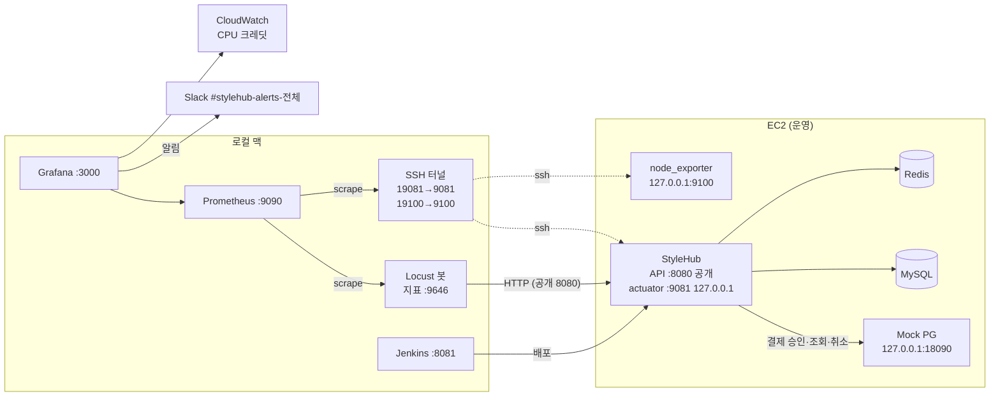

# 운영 트래픽 시뮬레이션 설계

- 작성일: 2026-09-18
- 상태: 1단계 진행 중 — PR A(#112) 운영 반영, PR B 로컬 검증 완료, 실서버 연결 확인 대기
- 범위: 트래픽 봇(로컬 맥), 관측(Prometheus + Grafana), Mock PG, 장애 대응 루프와 하네스

## 1. 목적

지금까지의 Locust 측정은 API 하나에 몇 분 동안 부하를 걸어 한계를 재는 방식이었다. 이 작업은 질문이 다르다. 여러 종류의 사용자가 섞인 트래픽을 몇 시간에서 며칠 동안 흘리고, 그 사이에 배포도 하면서 무엇이 깨지는지 찾는다.

찾으려는 것은 짧은 부하 테스트로는 드러나지 않는 문제다. 배포 중 요청 실패, 버스트형 인스턴스의 CPU 크레딧 소진, 데이터가 쌓이면서 느려지는 쿼리, 외부 결제 지연이 DB 커넥션을 붙잡는 현상 같은 것들이다.

이 작업의 결과물은 봇 자체가 아니라 장애 기록이다. 각 장애마다 탐지, 원인, 재현, 수정, 검증(Before/After)을 남긴다.

### 성공 기준

1. 대시보드에서 봇이 본 품질(사용자 관점)과 서버 지표를 같은 시간축으로 볼 수 있다.
2. 봇이 맥이 켜져 있는 동안 계속 돌고, 시간대 곡선과 쿠폰 오픈 스파이크를 재현한다.
3. 부하가 걸린 상태에서 배포를 해서, 배포 한 번에 실패하는 요청 수를 잰다.
4. 발견한 장애마다 `docs/traffic-sim/incidents/`에 기록과 수정 PR이 있다.

### 하지 않는 것

- 실제 사용자 행동을 정확히 재현하는 것. 이건 가정에 기반한 모델이고, 가정은 이 문서에 남긴다.
- 멀티 인스턴스, 로드밸런서, 쿠버네티스. 지금 운영 구성(EC2 한 대)을 그대로 대상으로 한다.
- 로그 수집 스택(Loki 등). 서버 메모리가 작아서 로그는 필요할 때 SSH로 읽는다.
- 봇 분산 실행. 목표 부하가 낮아 맥 한 대로 충분하다.

## 2. 전체 구성



봇, Prometheus, Grafana는 모두 맥에서 돈다. 운영 서버에 새로 올리는 것은 node_exporter와 Mock PG 두 프로세스뿐이다.

### 2.1 관측 구성 방식 비교

| 방식 | 장점 | 단점 |
|---|---|---|
| **A. 맥에 Prometheus + Grafana, SSH 터널로 수집 (선택)** | 서버 메모리를 거의 쓰지 않음. 비용 없음. actuator를 외부에 열 필요가 없음 | 맥이 잠들면 수집도 멈춤 |
| B. EC2에 Prometheus, 맥에 Grafana | 맥이 꺼져도 서버 지표가 남음 | 1GiB 서버에서 Prometheus가 메모리를 많이 차지함 |
| C. Grafana Cloud로 원격 전송 | 항상 수집되고 알림도 항상 동작 | 서버에 수집 에이전트가 필요하고, 외부 계정과 무료 한도에 묶임 |

A를 고른 이유: 봇도 맥에서 돌기 때문에 맥이 잠들면 트래픽 자체가 없다. 수집이 비는 구간과 트래픽이 없는 구간이 겹치므로 A의 단점이 실제로는 문제가 되지 않는다.

### 2.2 서버 쪽 변경

- **actuator 포트 분리**: `management.server.port=9081`, `management.server.address=127.0.0.1`로 바꿔서 actuator를 서버 내부에서만 열리게 한다. 지금은 인증 없이 8080에 열려 있다(`application-prod.properties` 주석에 남겨둔 과제). 헬스체크 주소를 쓰는 곳 네 군데도 같이 바꾼다.
  - `scripts/deploy-remote.sh`의 헬스체크는 `127.0.0.1:9081`만 본다. 전환 배포 롤백을 대비해 8080도 함께 보던 보조 헬스체크는 전환이 한 번 성공한 뒤 PR #114로 지웠다(develop 병합, 다음 릴리스에 포함).
  - `Jenkinsfile` Verify 단계의 `curl http://localhost:8080/actuator/health`
  - `Dockerfile` HEALTHCHECK, `docker-compose.yml` healthcheck. 컨테이너 안에서 실행되므로 127.0.0.1:9081로 닿는다.
- 운영 반영은 develop → live PR 병합으로 한다(2026-09-18부터 배포 트리거가 live 브랜치).
- **지연 분포 지표**: `management.metrics.distribution.percentiles-histogram.http.server.requests=true`. 이게 있어야 Prometheus에서 p95/p99를 계산할 수 있다.
- **Tomcat 스레드 지표**: `server.tomcat.mbeanregistry.enabled=true`. Spring Boot 문서상 이 설정이 켜져야 Tomcat 스레드 지표가 나온다. 4.x에서 다시 확인한다.
- **node_exporter**: Ubuntu 패키지로 설치하고 `127.0.0.1:9100`에만 바인딩한다.

맥의 8081은 Jenkins가 쓰고 있어서, 터널의 로컬 포트는 19081과 19100을 쓴다.

### 2.3 맥 쪽 구성

```
monitoring/
  docker-compose.yml          # prometheus, grafana
  prometheus/prometheus.yml   # 수집 대상: 봇, 터널 두 개, (선택) 로컬 docker-compose 앱
  grafana/provisioning/       # 데이터소스, 대시보드, 알림 규칙을 파일로 관리
  grafana/dashboards/*.json
  tunnel.sh                   # 재접속 루프로 SSH 터널 유지 (autossh 없이)
  server/install-node-exporter.sh  # 운영 서버에서 한 번 실행
  tools/check_queries.py      # 대시보드 쿼리를 실제 Prometheus에 던져 이름 오류·빈 결과 확인
  .env.example                # Slack 웹훅, CloudWatch 키 자리 (실제 값은 .env, gitignore)
```

- Prometheus 보존 기간은 30일, 수집 주기는 15초로 한다.
- 수집 대상에는 `env` 라벨(`ec2`, `local`)을 붙인다. 같은 대시보드로 운영과 로컬 재현 환경을 비교하기 위해서다.
- 대시보드, 알림 규칙, 데이터소스는 전부 저장소의 파일로 관리한다. Grafana 화면에서 바꾼 내용은 JSON으로 내보내서 커밋한다. 시크릿(Slack 웹훅 URL, AWS 키)은 `.env`에만 두고 사용자가 직접 입력한다.

### 2.4 대시보드

| 대시보드 | 내용 |
|---|---|
| 사용자 관점 (봇) | 엔드포인트별 요청 수, p50/p95/p99, 응답 분류별 비율, 남은 에러 버짓 |
| 애플리케이션 | 서버 측 URI별 p95, Hikari active/pending/timeout, Tomcat busy 스레드, JVM 힙과 GC 멈춤, 프로세스 CPU |
| 호스트 | CPU, 가용 메모리, 스왑, 디스크 사용량, 네트워크, CloudWatch CPU 크레딧 잔량 |

사용자 관점 대시보드가 따로 필요한 이유가 있다. 배포 중 서버가 내려가 있으면 서버 지표에는 아무것도 찍히지 않는다. 그 구간의 실패는 봇만 볼 수 있다.

CloudWatch 쿼리는 `InstanceId: "*"`를 쓴다. 그래서 리전·계정에 있는 T 인스턴스를 전부 보여준다(인스턴스마다 한 줄, 알림도 인스턴스마다 하나씩). 계정에 다른 T 인스턴스가 있으면 인스턴스 ID를 하나로 고정해야 한다.

### 2.5 알림 (Grafana → Slack)

| 규칙 | 조건(초기값) |
|---|---|
| 가용성 | 봇 기준 나쁨 비율 > 1%, 5분 지속 |
| 조회 지연 | 조회 API p95 > 300ms, 10분 지속 |
| 서버 수집 끊김 | `up{job=~"stylehub|node"} < 1`, 2분 지속 (정상 배포는 2분 안에 끝난다는 가정) |
| 메모리 | 가용 메모리 < 10%, 5분 지속 |
| 디스크 | 사용률 > 80%, 5분 지속 |
| 봇 멈춤 | 봇 지표가 5분간 없음 |
| CPU 크레딧 | 잔량 < 30, 5분마다 평가·10분 지속 |

Slack 채널은 Jenkins 알림과 같은 `#stylehub-alerts-전체`를 쓴다. Grafana 연락처에 넣을 웹훅 URL은 사용자가 입력한다.

## 3. Mock PG

봇 트래픽을 토스 샌드박스로 보낼 수는 없다. 결제 흐름을 끝까지 돌리려면 가짜 PG가 필요하다.

### 3.1 방식 비교

| 방식 | 장점 | 단점 |
|---|---|---|
| **A. EC2 로컬에 작은 Mock PG HTTP 서버 + URL만 환경변수로 교체 (선택)** | 자바 코드 변경 없음. 실제 `RestTemplate`, 타임아웃, 예외 처리 경로를 그대로 탄다 | 서버에 프로세스가 하나 늘어남 |
| B. 자바에 `MockPaymentClient` 구현 추가 | 프로세스 추가 없음 | HTTP 계층을 건너뛰어서 타임아웃 경로를 흉내만 냄. `PaymentService`가 `"TOSS"`를 하드코딩하고 있어 수정 필요. 운영 코드에 가짜 구현이 들어감 |

A를 고른 이유는 두 가지다.

1. `TossPaymentProperties`가 `@ConfigurationProperties(prefix = "toss.payments")`라서, 환경변수 `TOSS_PAYMENTS_CONFIRMURL`, `TOSS_PAYMENTS_CANCELURL`, `TOSS_PAYMENTS_FINDBYORDERIDURL`만 바꾸면 호출 대상이 바뀐다.
2. 검증하고 싶은 핵심 위험이 HTTP 호출 경로에 있다. **live(운영)** 코드의 `PaymentService.confirmPayment`는 아직 `@Transactional` 안에서 PG를 호출한다. `PaymentConfig` 주석에 적어둔 대로, 그동안 DB 커넥션과 행 락을 잡고 있다. 수정 체인(#86~#98)이 이 호출을 트랜잭션 밖으로 뺐고 develop(93e0f3d)에는 병합됐지만, live에는 아직 나가지 않았다(다음 릴리스에 포함, 6장 가설 2). 진짜 HTTP 클라이언트로 지연과 타임아웃을 줘야 병합 전과 후를 같은 조건에서 비교할 수 있다.

### 3.2 동작

`traffic-sim/mock-pg/mock_pg.py`를 Python 표준 라이브러리(`ThreadingHTTPServer`)로 만들고, systemd 유닛으로 `127.0.0.1:18090`에 띄운다.

| 요청 | 응답 |
|---|---|
| `POST /v1/payments/confirm` | 확률에 따라 성공 200, 거절 4xx, 응답 유실 중 하나 |
| `POST /v1/payments/{paymentKey}/cancel` | 200 |
| `GET /v1/payments/orders/{orderId}` | 승인 기록이 있으면 `{"status":"DONE","paymentKey":…,"totalAmount":…}`, 없으면 404 |

응답 유실은 승인을 기록한 뒤 서버의 읽기 타임아웃(10초)보다 길게 멈추는 방식으로 흉내 낸다. PG는 승인했는데 우리 서버는 실패로 처리하는 상황이다. 이때 주문 만료 스케줄러의 `reconcileIfApproved`(09-08 추가)가 실제로 이 주문을 살려내는지 확인할 수 있다.

설정값(환경변수)과 초기값은 다음과 같다. 전부 **가정**이다. 토스의 실제 승인 응답 시간 분포는 측정한 적이 없다(`PaymentConfig` 주석에도 적혀 있음).

| 항목 | 초기값 |
|---|---|
| 승인 지연 | 로그정규분포, 중앙값 300ms, p99 2초 |
| 거절 비율 | 2% |
| 응답 유실 비율 | 0.2% |

승인 기록은 메모리에만 두고, 최대 개수를 제한해 오래된 것부터 버린다. Mock PG가 재시작되면 기록이 사라지는데, 이때는 유실 흉내로 승인된 주문도 만료된다. 이 영향은 유실 비율만큼으로 작으니 받아들인다.

### 3.3 위험

Mock 모드에서는 주문의 `pgOrderId`와 금액만 알면 누구나 결제를 완료할 수 있다. 실제 상품이 나가지 않는 포트폴리오 서버라 이 위험은 받아들인다. 대신 이 사실을 문서에 남기고, 진짜 토스 결제를 시연할 때는 환경변수를 되돌린다.

## 4. 트래픽 봇

### 4.1 원칙

- **API만 쓴다.** 기존 Locust 스크립트는 `pymysql`로 DB를 직접 읽어 구매자와 옵션 ID를 얻었다. 운영 DB는 외부에 열지 않으므로, 봇은 실제 클라이언트처럼 공개 API만으로 필요한 정보를 얻는다.
- **봇 데이터는 따로 식별된다.** 봇 계정 이메일은 `@sim.stylehub.test`, 봇 스토어 이름은 `[SIM]`으로 시작한다. 기존 데모 상품의 재고는 건드리지 않는다. 주문은 봇 스토어 상품에만 넣는다.
- **데이터는 지우지 않는다.** 쌓이는 것 자체가 실험 대상이다. 정리가 필요해지면 그때 사용자 승인을 받아 스크립트를 만든다.

### 4.2 준비 단계 (한 번만, `traffic-sim/setup/provision.py`)

운영 서버에는 입점한 스토어가 하나도 없고, 그래서 상품도 0건이다(7장 0단계 확인). 준비 단계에서 입점 신청부터 전부 API로 만든다.

1. 봇 스토어 5개가 입점 신청을 한다: `POST /api/v1/users/sign-up/store` (이름, 이메일, 비밀번호, 스토어 이름, 스토어 설명)
2. 관리자로 로그인해 입점을 승인한다: `PATCH /api/v1/admin/stores/{storeId}/status` (본문 `{"status": "APPROVED"}`). 관리자 이메일과 비밀번호는 실행할 때 사용자가 환경변수로 넣는다.
3. 승인된 스토어로 로그인해 상품을 스토어마다 40개(옵션 포함) 등록한다: `POST /api/v1/stores/me/products`
4. 스토어마다 쿠폰 이벤트를 7일치 만든다. 매일 한국 시간 20:00에 시작하고, 발급 수량은 제한한다. 서버 JVM이 UTC로 보이므로 `startedAt`은 UTC 11:00으로 보낸다(0단계에서 확인한 뒤 확정). 7일이 지나면 `provision.py --coupons-only`로 다시 채운다.
5. 구매자 2,000명을 가입시킨다. 회원가입은 BCrypt 비용이 크므로 초당 몇 건으로 천천히 보낸다.
6. 구매자마다 주소를 하나 등록한다. 주문에 `addressId`가 필수다.

결과(계정, 주소 ID, 스토어 ID, 상품 ID)는 `traffic-sim/.state/`에 저장하고 gitignore한다. 이미 만든 것은 건너뛰도록 해서, 중간에 실패해도 다시 실행할 수 있게 한다.

#### 관리자 계정 (선행 조건)

코드에는 관리자 계정을 만드는 경로가 없다. 초기화 코드도 API도 없다. 그래서 운영 서버에 관리자가 없으면 2번(입점 승인)을 할 수 없다. 서버에 관리자가 있는지 먼저 확인하고, 없으면 아래처럼 한 번만 만든다.

| 방법 | 장점 | 단점 |
|---|---|---|
| **A. 회원가입 API로 계정을 만든 뒤, 서버에서 SQL 한 줄로 역할을 ADMIN으로 바꾼다 (선택)** | 코드 변경이 없다. 비밀번호는 앱이 BCrypt로 해시한다. 실제 서비스에서도 관리자는 보통 운영 절차로 만든다 | 서버 DB에 한 번 직접 접근해야 한다(사용자가 실행) |
| B. 기동 시 환경변수로 관리자를 만드는 코드 추가 | 서버를 새로 만들어도 자동으로 생긴다 | 운영 코드에 관리자 생성 경로가 생기고, 그만큼 관리할 것이 는다 |

A의 절차(사용자, 운영 서버에서):

```sql
-- 먼저 POST /api/v1/users/sign-up 으로 관리자로 쓸 계정을 만든 뒤 실행한다
SELECT user_id, email, role FROM users WHERE role = 'ADMIN';
UPDATE users SET role = 'ADMIN' WHERE email = '<관리자로 쓸 이메일>';
```

#### 주소 API

주소 API는 PR #126(`98-feature-배송지-api`)으로 develop(93e0f3d)에 이미 병합됐다. 경로는 `/api/v1/users/me/addresses`이고 등록, 목록, 기본 배송지 변경, 삭제가 있다. 봇은 이 중 등록(`POST`)과 목록(`GET`)만 쓴다. live에는 아직 나가지 않았으니, 2단계에서 EC2로 배포할 때 이 API가 반영된 릴리스인지 먼저 확인한다.

### 4.3 페르소나

봇의 사용자 한 명은 방문자 한 명의 방문 한 번이다. 들어와서 몇 가지 행동을 하고 나간다. 행동 사이 대기 시간은 2~8초로 한다.

| 페르소나 | 기본 비율 | 로그인 | 행동 |
|---|---|---|---|
| 둘러보기 | 70% | 안 함 | 목록(카테고리 필터, 커서로 1~3페이지) → 상세 2~5개 → 나감 |
| 구매 | 20% | 함 | 둘러보기 → 주문(옵션 1~2개, 수량 1~2) → 80%는 결제, 20%는 이탈(10분 뒤 만료) → 가끔 내 주문 조회 |
| 쿠폰 | 5% (20:00 스파이크 때 대부분) | 함 | 진행 중 쿠폰 조회 → 발급 → 일부는 쿠폰 적용 주문 |
| 판매자 | 5% | 봇 스토어 | 자기 상품 재고 확인 → 부족한 옵션 재입고 → 결제된 주문 배송 상태 변경 |

- 상품 인기는 봇 카탈로그 위의 Zipf 분포(s=1.1)로 고른다. 인기 상품에 주문이 몰리면서 비관적 락 경합이 자연스럽게 생긴다.
- 로그인한 방문자의 30%는 나갈 때 로그아웃하고, 나머지는 세션 만료(30분)에 맡긴다.
- 결제는 주문 응답의 `pgOrderId`와 `finalAmount`로 `GET /api/v1/payments/success?paymentKey=mock_{uuid}&orderId=…&amount=…`를 호출한다. 토스 결제창이 끝나고 브라우저가 이동하는 것과 같은 요청이다.
- 위 비율, 전환율, 대기 시간은 모두 가정이다. 바꿀 때마다 이유를 이 문서에 남긴다.

### 4.4 시간대 곡선

Locust의 `LoadTestShape`로 한국 시간 기준 곡선을 만든다. 기준 사용자 수 N에 아래 배율을 곱한다.

| 시간 | 배율 |
|---|---|
| 02–07 | 0.1 |
| 07–09, 00–02 | 0.4 |
| 09–12, 13–18 | 0.6 |
| 12–13 | 0.9 |
| 18–20 | 0.8 |
| **20:00–20:10 (쿠폰 오픈)** | **3.0, 대부분 쿠폰 페르소나** |
| 20:10–23 | 1.0 |
| 23–24 | 0.7 |

스파이크 구간에 페르소나 구성을 바꾸려면 `tick()`에서 사용자 클래스도 함께 돌려줘야 한다. 이 기능은 설치한 Locust 버전에서 되는지 먼저 확인한다.

### 4.5 응답 분류

기존 Locust 스크립트는 409를 성공으로 세었다. 그래서 "실패 0"이 실제로는 "예상 못 한 오류 0"이라는 뜻이었다. 봇은 처음부터 응답을 분류한다.

| 분류 | 조건 | SLO에서 |
|---|---|---|
| `ok` | 2xx | 좋음 |
| `expected` | 엔드포인트별로 미리 정한 (상태코드, errorCode). 예: 재고 부족, 쿠폰 소진, 중복 발급 409 | 좋음 (따로 집계) |
| `unexpected_4xx` | 그 외 4xx. 예: 로그인한 상태인데 401 | 나쁨 |
| `server_error` | 5xx | 나쁨 |
| `conn_error` | 연결 거부, 연결 리셋 | 나쁨 |
| `timeout` | 봇 타임아웃(15초) 초과 | 나쁨 |

봇 타임아웃을 서버의 PG 읽기 타임아웃(10초)보다 길게 잡는다. 그래야 서버가 PG 타임아웃을 어떻게 처리하는지 봇 쪽에서 볼 수 있다.

**봇 쪽 문제와 서버 문제를 구분하는 규칙**: 봇에 `conn_error`가 늘었는데 같은 시간에 서버 요청 수가 정상이고 배포도 없었다면, 맥의 네트워크 문제로 보고 장애에서 뺀다.

### 4.6 봇 지표

봇 프로세스 안에서 `prometheus_client`로 `:9646`에 지표를 노출한다.

- `sim_request_duration_seconds{endpoint, outcome}` 히스토그램
- `sim_funnel_total{step}`: 둘러보기 → 상세 → 주문 → 결제 → 배송 단계별 수
- `sim_target_users`: 곡선이 목표로 하는 사용자 수

`locust_exporter`로 Locust 웹 UI를 긁는 방법도 있지만, 응답 분류 라벨을 직접 붙일 수 없어서 쓰지 않는다.

### 4.7 안전장치

- **대상 허용 목록**: 설정에 적힌 호스트(EC2 주소, `localhost`)가 아니면 시작하지 않는다.
- **상한**: 최대 사용자 수와 초당 요청 수에 코드상 상한을 둔다. 곡선이 잘못 계산돼도 넘지 못한다.
- **정지 스위치**: `traffic-sim/STOP` 파일이 생기면 곡선이 `None`을 돌려주고 봇이 멈춘다.
- **외부 호출 없음**: 서버의 PG 대상이 Mock으로 바뀌었는지 먼저 확인한 뒤 결제 페르소나를 켠다.
- **맥 잠자기**: `caffeinate -is`로 감싸서 실행한다. 노트북 뚜껑을 닫으면 외부 모니터와 전원이 연결된 경우가 아니면 잠든다.

### 4.8 디렉터리

```
traffic-sim/
  README.md          # 실행 방법
  locustfile.py      # 진입점
  sim/
    config.py        # 허용 호스트, 상한, 비율
    personas.py
    catalog.py       # API로 모은 상품·옵션 목록, Zipf 선택
    shape.py         # 시간대 곡선, 스파이크
    outcome.py       # 응답 분류
    metrics.py       # prometheus_client
  setup/provision.py
  mock-pg/mock_pg.py
  mock-pg/mock-pg.service
```

## 5. SLO와 부하 수준

### 5.1 SLO 초기값

기준을 먼저 정해야 무엇이 장애인지 판단할 수 있다. 아래 값은 측정 전 초기값이다. 캘리브레이션 뒤에 확정하고, 바꾼 이유를 여기에 남긴다.

| 대상 | 지표 (봇 기준) | 초기 목표 |
|---|---|---|
| 조회 (`GET /products`, `/products/{id}`, `/coupon-events`) | p95 | 300ms 이하 |
| 주문 생성 (`POST /orders`) | p95 | 800ms 이하 |
| 결제 승인 (`GET /payments/success`) | p95 | 2,000ms 이하 (Mock PG 지연 포함) |
| 전체 | 하루 나쁨 비율 | 0.1% 이하 (99.9%) |

에러 버짓 예시: 평균 5 RPS면 하루 432,000건이고, 0.1%는 432건이다. 배포 한 번에 20초 동안 요청이 실패하면 약 100건, 하루 버짓의 4분의 1을 쓴다. 무중단 배포가 필요한 이유를 이런 숫자로 보여줄 수 있다.

### 5.2 캘리브레이션

부하 수준은 짐작으로 정하지 않고 재서 정한다.

1. EC2를 대상으로 사용자 5 → 10 → 20 → 40명을 5분씩 건다.
2. 단계마다 RPS, 서버 CPU, p95, 평균 응답 크기를 기록한다.
3. 기준 사용자 수 N을 정한다. 곡선을 적용했을 때 하루 평균 CPU가 t3.micro 기준치(vCPU당 10%, AWS 문서로 재확인)를 넘지 않게 한다. 피크 때는 크레딧을 쓰고, 한가한 시간에 다시 쌓이는 구조가 된다.
4. 평균 응답 크기 × 하루 요청 수로 월간 전송량을 계산하고, EC2 인터넷 전송 무료 한도와 비교한다.
5. 맥이 15초마다 터널로 서버 지표를 긁어가는 것도 EC2 인터넷 전송이다. 실서버 연결을 처음 확인할 때 스크레이프 한 번의 크기를 재고(`curl -s localhost:19081/actuator/prometheus | wc -c`), 월간 전송량 계산에 더한다(터널은 압축을 켜 뒀다).
   - 2026-09-19 첫 실연결에서 잰 값은 이렇다.
     - 한 번 수집할 때 actuator는 84KB(gzip 7KB), node_exporter는 182KB(gzip 19KB)다. 서버 지표가 앱 지표보다 두 배 크다.
     - 15초 주기로 맥을 계속 켜 두면, 압축하지 않을 때 월 약 47GB, 압축하면 월 약 4.7GB다. ssh 압축(zlib)이 gzip과 비슷하게 줄인다고 가정한 추정이다.
     - 압축이 없으면 수집만으로 봇 트래픽 못지않은 송신이 생긴다. 더 줄여야 하면 node_exporter에서 쓰지 않는 수집기를 끈다.

## 6. 예상 문제 (가설)

코드와 설정을 읽고 세운 가설이다. 아직 확인된 것은 없다.

| # | 가설 | 근거 | 확인할 지표 |
|---|---|---|---|
| 1 | 배포할 때마다 요청이 실패한다 | `deploy-remote.sh`가 인스턴스 한 대를 `systemctl restart`한다. **부하 없는 상태 첫 실측(2026-09-18, #112 배포): 약 24초 동안 연결 거부**(1초 간격 측정, 22회 실패) | 봇 `conn_error`, `up{job="stylehub"}` |
| 2 | PG 지연이 DB 커넥션을 붙잡아 결제와 무관한 API까지 느려진다 | live 코드는 아직 `confirmPayment`가 트랜잭션 안에서 PG를 호출한다. 체인(#86~#98)이 트랜잭션 밖으로 뺐고 develop(93e0f3d)에는 병합됐다. 다음 develop→live 릴리스는 이 측정 때문에 미루지 않는다(#114와 보안 수정 #89 IDOR·#92 OAuth state가 함께 나가야 한다). 그래서 "전"은 로컬에서 develop 74c9fc4(트랜잭션 안에서 PG 호출)로, "후"는 93e0f3d로, 같은 로컬 docker-compose·Mock PG·봇 시나리오로 비교한다 | Hikari active/pending, 조회 API p95 |
| 3 | 승인 응답이 유실되면 결제된 주문이 만료될 수 있다 | `reconcileIfApproved`가 실제 유실 상황에서 검증된 적 없음. 체인은 여기에 IN_PROGRESS 상태를 더했다 | Mock 유실 주입 뒤 결제 승인 기록이 있는데 만료된 주문 수 |
| 4 | 몇 시간 지속 부하에서 CPU 크레딧이 바닥난다 | t3 버스트형 | CloudWatch `CPUCreditBalance`, 같은 부하에서 p95 변화 |
| 5 | 1GiB 메모리에서 JVM·MySQL·Redis가 경쟁하고, 힙이 작다 | 세 프로세스가 한 서버에 있음. 힙 최대 약 231MB, Serial GC(7장 0단계 확인). Hikari 100 / Tomcat 400이 이 크기에 맞는지 검증된 적 없음 | 가용 메모리, 스왑, JVM 힙, GC 멈춤, OOM kill 로그 |
| 6 | 주문이 쌓이면 내 주문 조회가 느려진다 | 인덱스가 엔티티 코드에도 저장소 SQL 파일에도 없음(DB에만 존재) | `/orders` p95 추이와 주문 수 |
| 7 | 재고가 바닥나서 `expected`가 계속 늘어난다 | 판매자 재입고가 모자라면 생기는 봇 모델 문제 | `expected` 비율, 재고 |
| 8 | 배포 직후 한동안 응답이 느리다 | 재시작 뒤 첫 요청 0.89초(09-18 1차)와 1.51초(#112 배포 직후). 다만 이미 떠 있던 이전 버전에 보낸 측정 첫 요청도 1.55초였다. 맥 쪽 첫 연결 비용일 수 있어 아직 근거가 약하다 | 배포 시점 전후 p95, 봇 기준 지연 |

7번은 서버 문제가 아니다. 봇 모델의 문제도 이렇게 드러날 수 있다는 예시로 둔다.

## 7. 단계별 계획

단계마다 따로 구현 계획을 쓰고, 앞 단계의 완료 조건을 채운 뒤 다음으로 넘어간다.

### 0단계: 사전 확인

Claude가 SSH로 운영 서버를 읽기 전용 조회하려던 명령은 권한 분류기에서 막혔다. 그래서 서버 안에서 확인해야 하는 항목은 사용자가 확인한다. 공개 8080 포트로 확인할 수 있는 것은 2026-09-18에 확인했다.

**2026-09-18, 공개 엔드포인트로 확인한 사실**

- `/actuator/health`와 `/actuator/prometheus` 모두 서버 밖에서 인증 없이 200이 온다. 지표 전체(JVM 버전, 디스크 경로 포함)가 공개돼 있다. 1단계 Task 1의 근거다.
- `http_server_requests_seconds_bucket` 0개, `tomcat_threads_*` 0개. 히스토그램과 Tomcat 지표 설정이 필요하다.
- `system_cpu_count` 2
- JVM 힙 최대는 약 231MB(Eden 64MB, Survivor 8MB, Tenured 159MB)이고, 영역 이름을 보면 Serial GC다. 물리 메모리 1GiB급에서 JVM이 스스로 고르는 기본값(Serial GC, 힙 최대 = 메모리의 4분의 1)과 맞는다. `Dockerfile`의 `-XX:MaxRAMPercentage=75.0 -XX:+UseG1GC`는 systemd 네이티브 실행에는 적용되지 않는 것으로 보인다. systemd 유닛의 실행 옵션은 서버에서 확인해야 한다.
- 디스크는 전체 약 30GB, 여유 약 23GB(`/home/ubuntu/stylehub` 기준)다.
- Java 17.0.20, Ubuntu 26.04 빌드
- 상품 목록이 비어 있다(`items: []`). 지켜야 할 데모 데이터가 없으니, 봇 준비 단계에서 스토어·상품을 전부 만든다.
- 오류 응답의 `timestamp`가 한국 시간보다 9시간 이르다. 서버 JVM 시간대가 UTC로 보인다. 쿠폰 이벤트의 `startedAt`(`LocalDateTime`)은 서버 시간대 기준으로 보내야 한다(4.2 3번).
- 재시작 약 14분 뒤에 보낸 첫 상품 목록 요청은 0.89초였고, 바로 이어진 요청 다섯 번은 21~26ms였다. 한 번 관찰한 것이라 가설 8로만 둔다.

**2026-09-19, node_exporter를 설치하면서 확인한 사실**

- 서버 OS는 Ubuntu 26.04(`resolute`)다. 설치된 node_exporter는 1.10.2이고, `127.0.0.1:9100`에서만 수신한다. 권장 패키지(`prometheus-node-exporter-collectors`)는 설치하지 않았다.
- node_exporter의 메모리 사용량(RSS)은 약 22MB다.
- 부하가 없을 때 가용 메모리(`node_memory_MemAvailable_bytes`)는 약 390MiB다. JVM·MySQL·Redis가 다 떠 있는 상태의 값이다(가설 5의 출발점).
- CloudWatch `CPUCreditBalance`가 288이다(최근 3시간 36개 점, 최소 287.9). 288은 t3.micro가 쌓을 수 있는 최댓값(시간당 12 × 24시간)이라, 인스턴스가 t3.micro이고 지금 크레딧이 꽉 차 있다는 뜻이다. standard 모드로 바꿨는지는 콘솔에서 따로 확인한다.
- 실연결 확인(2026-09-19): 수집 대상 `stylehub`, `node` 둘 다 up이다. 대시보드 쿼리 22개가 모두 실데이터를 돌려준다. Tomcat 커넥터 이름은 `http-nio-8080`이다. 알림 규칙 4개는 모두 정상 상태다.
- 적용되지 않은 패키지 업데이트가 58개 있고, needrestart가 dbus와 logind 등의 재시작을 보류 중이다. 이번 설치 때문이 아니라 그 전부터 쌓인 것이다.

- [ ] 인스턴스 타입 확인, CPU 크레딧 모드를 standard로 전환(사용자, AWS 콘솔)
- [ ] CloudWatch 읽기 전용 IAM 사용자와 액세스 키 생성(사용자). 키는 `monitoring/.env`에만 넣는다.
- [ ] 스왑 (가용 메모리는 위, 디스크는 앞에서 확인)
- [ ] systemd 유닛의 Java 실행 옵션(`-Xmx`, GC 옵션이 있는지)
- [ ] 열린 포트와 보안 그룹(8080만 공개인지), 9081·9100·18090이 비어 있는지
- [ ] systemd 서비스가 환경변수를 어디서 읽는지(`EnvironmentFile` 경로)
- [ ] MySQL `max_connections`와 Hikari 최대 100의 관계
- [ ] 서버에 `python3`가 있는지
- [ ] EC2 인터넷 전송 요금과 무료 한도, CloudWatch 조회 API 요금
- [ ] 맥: Docker Desktop, 전원, 잠자기 설정

완료 조건: 체크리스트가 모두 채워지고, 결과를 이 문서에 반영한다.

### 1단계: 관측

- 서버: actuator 포트 분리, 히스토그램, Tomcat 지표, node_exporter. `deploy-remote.sh`와 Jenkinsfile의 헬스체크 주소를 수정한다.
- 맥: `monitoring/` 구성, 터널, 대시보드 2개(애플리케이션, 호스트), 서버 쪽 알림 규칙(수집 끊김, 메모리, 디스크, CPU 크레딧). 사용자 관점 대시보드와 봇 기준 알림(가용성, 조회 지연, 봇 멈춤)은 봇 지표가 생기는 3단계에서 만든다.
- CloudWatch 데이터소스(CPU 크레딧 잔량). 0단계에서 사용자가 만든 읽기 전용 키를 쓴다. Grafana OSS는 패널별 새로고침 주기를 따로 줄 수 없다. 그래서 조회 요금은 이렇게 줄인다: 크레딧 조회 간격(period)은 5분, 크레딧 알림은 5분마다 평가한다. 대시보드는 브라우저에서 열어 둔 동안에만 조회한다.

완료 조건: 수동 요청만 흘린 상태에서 대시보드 2개에 EC2 지표가 1시간 이어서 찍힌다. 테스트 알림이 Slack에 도착한다. 배포 후 Jenkins Verify 단계가 통과한다.

### 2단계: 봇이 쓸 서버 준비

- Mock PG와 systemd 유닛, 환경변수 전환
- 운영 서버 관리자 계정 준비(4.2 관리자 계정, 사용자)
- `provision.py`

완료 조건: 로컬 docker-compose 환경(Mock PG도 맥에서 띄우고 같은 환경변수로 연결)에서 API만으로 가입 → 주문 → Mock 결제 → 배송 상태 변경이 끝난다. EC2에서 토스로 나가는 요청이 0건임을 로그로 확인한다.

### 3단계: 봇

- 페르소나, Zipf, 곡선, 응답 분류, 지표, 안전장치
- 캘리브레이션, SLO 확정

완료 조건: 로컬에서 1시간, 그다음 EC2에서 2시간을 돌린다. 장애가 없으면 그렇다고 기록하고, 있으면 장애로 기록한다.

### 4단계: 연속 운영

- 맥이 켜져 있는 동안 계속 돌린다. 부하가 걸린 상태에서 배포를 일주일에 한 번 이상 한다.
- (선택) Jenkins 배포가 끝나면 Grafana에 주석(annotation)을 남겨, 배포 시점을 그래프 위에 표시한다.
- 장애가 나면 **사람이 직접** 처리하고 `docs/traffic-sim/incidents/YYYY-MM-DD-제목.md`에 기록한다.

장애 기록 항목: 탐지(알림 또는 대시보드, 시간 범위) → 영향(쓴 에러 버짓) → 원인 → 로컬 재현 → 수정 PR → 검증(같은 시나리오로 Before/After) → 재발 방지(테스트, 알림, 하네스 중 무엇으로 막았는지)

완료 조건: 장애 기록 3건 이상. 각 기록에 수정 PR과 Before/After가 있다.

### 5단계: 하네스

4단계에서 장애를 두 건 이상 직접 처리한 뒤, 반복된 절차만 자동화한다. 한 번도 일어나지 않은 일에 자동화를 먼저 만들지 않는다.

- **저장소 안의 지도**: `CLAUDE.md`를 짧게 만들고, 이 문서와 봇 실행 방법, SLO, 장애 기록 양식, 수치 인용 규칙의 위치만 가리킨다.
- **좁은 도구**
  - `traffic-sim/tools/promq.sh`: 맥의 Prometheus HTTP API에 PromQL을 조회한다. 로컬 조회라 운영 서버 권한이 필요 없다.
  - `traffic-sim/tools/server-logs.sh`: 정해진 읽기 전용 명령만 SSH로 실행한다. 스크립트 하나로 묶어두면 좁은 권한 규칙 하나로 허용할 수 있다.
- **완료 정의**: 수정 PR 템플릿에 세 가지를 체크 항목으로 넣는다. 실패하던 테스트가 통과할 것, 같은 봇 시나리오를 다시 돌려 SLO를 만족할 것, Before/After 수치(PromQL과 시간 범위)가 붙어 있을 것.
- **장애 대응 스킬**: 수동 처리에서 반복된 절차(지표 확인 → 로그 확인 → 가설 → 로컬 재현 → 실패 테스트 → 수정 → 재측정 → 기록)를 스킬로 만든다. 커밋, 머지, 배포는 계속 사람이 승인한다.
- **규칙을 자동 검사로**: 도메인 경계는 ArchUnit으로, wildcard import 금지는 Checkstyle로, push 전 시크릿 스캔은 hook으로 검사한다. 이 항목은 봇과 상관없어서 어느 단계에서든 할 수 있다.

## 8. 결정 사항 (2026-09-18)

| # | 항목 | 결정 | 이유 |
|---|---|---|---|
| 1 | 주소 등록 | API로 한다(SQL 시드 안 씀). #98 브랜치에 이미 구현된 주소 API를 병합해서 쓰고, 봇은 등록과 목록만 쓴다 | 처음에는 새로 최소 구현하기로 했다. 계획을 쓰다가 #98에 이미 구현돼 있는 것을 확인해서 새로 만들지 않기로 바꿨다. |
| 2 | CPU 크레딧 모드 | standard | 크레딧이 바닥나면 추가 요금 대신 느려지는 쪽으로 드러나서 관찰할 수 있다. 전환은 사용자가 한다. |
| 3 | CloudWatch 연동 | 한다 | 6장 가설 4(크레딧 소진)는 서버 지표만으로는 확인할 수 없다. |
| 4 | 서버 로그 읽기 권한 | `server-logs.sh` 하나에 한해 허용 | 스크립트 안에서 정해진 읽기 전용 명령만 돌게 해서 권한 범위를 좁힌다. 규칙은 5단계에서 스크립트를 만든 뒤 사용자가 추가한다. |
| 5 | SLO | 5.1의 초기값으로 시작 | 캘리브레이션 뒤 다시 정하고 이유를 남긴다. |

## 9. 기록 원칙

- 수치는 Prometheus 쿼리와 시간 범위, 또는 Grafana 스냅샷에서만 인용한다. Locust 화면의 현재 RPS 같은 실행 중 스냅샷은 쓰지 않는다.
- 어디서든 "실사용자 트래픽"이 아니라 "트래픽 모델 기반 시뮬레이션"이라고 쓴다.
- `expected`와 `ok`를 합쳐 "성공"이라고 쓰지 않는다.
- 봇 모델을 바꾸면(비율, 곡선, 대기 시간) 바꾼 날짜와 이유를 이 문서에 남긴다. 바꾸기 전과 후의 수치는 직접 비교하지 않는다.
